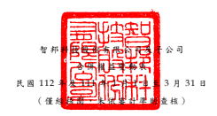
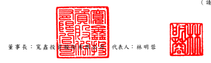

單位: 新 台幣仟元

|       | 其                                            | 他          | 權                                  | 益                                                                             |             |           |             |             |          |           |           |          |     |          |             |
|-------|-----------------------------------------------|-------------|-------------------------------------|--------------------------------------------------------------------------------|-------------|-----------|-------------|-------------|----------|-----------|-----------|----------|-----|----------|-------------|
|       | 透 過 其 他 綜 合                             |             |                                     |                                                                                |             |           |             |             |          |           |           |          |     |          |             |
|       | 國 外 營 運 機 構 損益按公允                  |             |                                     |                                                                                |             |           |             |             |          |           |           |          |     |          |             |
| 保    | 留                                            | 盈          | 餘 財 務 報 表 換 算 價值衡量之金融 |                                                                                |             |           |             |             |          |           |           |          |     |          |             |
| 代 碼 | 普 通 股 股 本 資                             | 本          | 公                                  | 積 法 定 盈 餘 公 積 特 別 盈 餘 公 積 未分配盈餘 之兌換差額 資產未實現損益 庫 | 藏          | 股        | 票 權 益 總 | 計          |          |           |           |          |     |          |             |
| A1    | 111 年 1 月 1 日餘額                          | $ 5,599,204 | $                                   | 843,580                                                                        | $ 2,347,651 | $         | 473,221     | $ 6,834,835 | ( $      | 493,628 ) | ( $       | 913 )    | ( $ | 50,999 ) | $15,552,951 |
| D1    | 111 年 1 月 1 日至 3 月 31 日淨利             | -           | -                                   | -                                                                              | -           | 1,287,213 | -           | -           | -        | 1,287,213 |           |          |     |          |             |
| D3    | 111 年 1 月 1 日至 3 月 31 日其他綜合損益     | -           | -                                   | -                                                                              | -           | -         | 196,185     | (           | 22,905 ) | -         | 173,280   |          |     |          |             |
| D5    | 111 年 1 月 1 日至 3 月 31 日綜合損益總額     | -           | -                                   | -                                                                              | -           | 1,287,213 | 196,185     | (           | 22,905 ) | -         | 1,460,493 |          |     |          |             |
| N1    | 股份給付基礎交易                              | 1,280       | 448                                 | -                                                                              | -           | -         | -           | -           | -        | 1,728     |           |          |     |          |             |
| Z1    | 111 年 3 月 31 日餘額                         | $ 5,600,484 | $                                   | 844,028                                                                        | $ 2,347,651 | $         | 473,221     | $ 8,122,048 | ( $      | 297,443 ) | ( $       | 23,818 ) | ( $ | 50,999 ) | $17,015,172 |
| A1    | 112 年 1 月 1 日餘額                          | $ 5,601,399 | $                                   | 857,568                                                                        | $ 2,818,364 | $         | 494,541     | $11,169,304 | ( $      | 371,447 ) | ( $       | 90,569 ) | ( $ | 50,999 ) | $20,428,161 |
| D1    | 112 年 1 月 1 日至 3 月 31 日淨利             | -           | -                                   | -                                                                              | -           | 2,037,165 | -           | -           | -        | 2,037,165 |           |          |     |          |             |
| D3    | 112 年 1 月 1 日至 3 月 31 日其他綜合損益     | -           | -                                   | -                                                                              | -           | -         | 17,904      | 51,398      | -        | 69,302    |           |          |     |          |             |
| D5    | 112 年 1 月 1 日至 3 月 31 日綜合損益總額     | -           | -                                   | -                                                                              | -           | 2,037,165 | 17,904      | 51,398      | -        | 2,106,467 |           |          |     |          |             |
| N1    | 股份給付基礎交易                              | 190         | 59                                  | -                                                                              | -           | -         | -           | -           | -        | 249       |           |          |     |          |             |
| Q1    | 處分透過其他綜合損益按公允價值衡量 之權益工具 | -           | -                                   | -                                                                              | -           | 834       | -           | (           | 834 )    | -         | -         |          |     |          |             |
| Z1    | 112 年 3 月 31 日餘額                         | $ 5,601,589 | $                                   | 857,627                                                                        | $ 2,818,364 | $         | 494,541     | $13,207,303 | ( $      | 353,543 ) | ( $       | 40,005 ) | ( $ | 50,999 ) | $22,534,877 |

後附之附註係本 合併 財務 報告 之一部分 。

(請 參 閱 勤 業 眾 信 聯 合 會 計 師 事 務 所 民國 112 年 5 月 11 日 核閱 報 告 )

董事長:寬鑫投資股份有限公司 代表人: 林明蓉 經理人: 馬思睿 會計主 管: 陳芳儀

