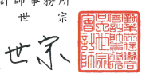
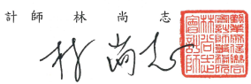

1073 台北市体费區松

Tel :+886 (2) 2725-999 Fax:+886 (2) 4051-6888 www.deloltte.com.tw 會計師核閱報告 台灣積體電路製造股份有限公司 公鑒:

## 前 言

台灣積體電路製造股份有限公司及其子公司(以下簡稱台積公司及其子 公司)民國 112年及 111年 3 月 31 日之合併資產負債表,暨民國 112 年及 111 年1月1日至3月 31 日之合併綜合損益表、合併權益變動表與合併現金 流量表,以及合併財務報表附註(包括重大會計政策彙總),業經本會計師核 閒竣事。依證券發行人財務報告編製準則及經金融監督管理委員會認可並發 布生效之國際會計準則第 34 號「期中財務報導」編製允當表達之財務報表係 管理層之責任,本會計師之責任係依據核閱結果對合併財務報表作成結論。

範 团 本會計師係依照核閱準則 2410 號「財務報表之核閱」執行核閱工作。核 閱合併財務報表時所執行之程序包括查詢(主要向負責財務與會計事務之人 員查詢)、分析性程序及其他核閱程序。核閱工作之範圍明顯小於查核工作之 範圍,因此本會計師可能無法察覺所有可藉由查核工作辨認之重大事項,故無 法表示查核意見。 結 論 依本會計師核閱結果,並未發現上開合併財務報表在所有重大方面有未 依照證券發行人財務報告編製準則及經金融監督管理委員會認可並發布生效 之國際會計準則第 34 號「期中財務報導」編製,致無法允當表達台積公司及 其子公司民國 112年及 111年 3月 31 日之合併財務狀況,暨民國 112 年及 111年1月1日至3月31日之合併財務績效及合併現金流量之情事。

勤業眾信聯合會計師事務所 會 計 師 吳

金融監督管理委員會核准文號 金管證審字第 1010028123 號 中

$$\mathbf{\hat{\Psi}}_{\pm}^{\pm}$$
$$\mathbb{R}$$
$$1\ 1\ 2$$
$$\nleftarrow{\mathrm{�}}$$

$$\mathbf{\bar{\partial}}$$
$\mathcal{B}$
$\emptyset$. 
$\mathrm{d}$. 

金融監督管理委員會核准文號 金管證審字第 1090347472 號

$$\mathbb{R}_{\times}$$
