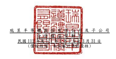
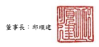
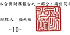
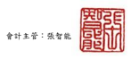

單位:新台幣仟元

| 歸                                                    | 屬                                                                                  | 於          | 母                     | 公          | 司           | 業             | 主          | 之           | 權           | 益        |              |              |           |       |
|-------------------------------------------------------|-------------------------------------------------------------------------------------|-------------|------------------------|-------------|--------------|----------------|-------------|--------------|--------------|-----------|--------------|--------------|-----------|-------|
| 保                                                    | 留                                                                                  | 盈          | 餘 其                  | 他          | 權           | 益             |             |              |              |           |              |              |           |       |
|                                                       | 透 過 其 他 綜 合 損 益 按 公 允 價                                                 |             |                        |             |              |                |             |              |              |           |              |              |           |       |
|                                                       | 國 外 營 運 機 構 值 衡 量 之 金 融 財 務 報 表 換 算 資產未實現                    |             |                        |             |              |                |             |              |              |           |              |              |           |       |
| 附                                                    | 註 普通股股本 資本公積 法 定 盈 餘 公 積 特 別 盈 餘 公 積 未分配盈餘 之兌換差額 損 | 益 總       | 計 非控制權益 權益總額 |             |              |                |             |              |              |           |              |              |           |       |
| 111 年 1 月 1 日至 3 月 31 日 111 年 1 月 1 日餘額    | $ 5,106,849                                                                         | $ 1,101,079 | $ 5,577,083            | $ 1,556,049 | $ 27,377,681 | ($ 4,156,871 ) | $ 2,380,781 | $ 38,942,651 | $            | 9,673     | $ 38,952,324 |              |           |       |
| 本期淨利                                              | -                                                                                   | -           | -                      | -           | 5,186,268    | -              | -           | 5,186,268    | 14           | 5,186,282 |              |              |           |       |
| 本期其他綜合損益                                      | 六(二十)                                                                            | -           | -                      | -           | -            | -              | 1,681,693   | (            | 342,438 )    | 1,339,255 | -            | 1,339,255    |           |       |
| 本期綜合損益總額                                      | -                                                                                   | -           | -                      | -           | 5,186,268    | 1,681,693      | (           | 342,438 )    | 6,525,523    | 14        | 6,525,537    |              |           |       |
| 員工酬勞轉增資                                        | 六(十八)(十九)                                                                      | 21,787      | 969,551                | -           | -            | -              | -           | -            | 991,338      | -         | 991,338      |              |           |       |
| 非控制權益變動                                        | -                                                                                   | -           | -                      | -           | -            | -              | -           | -            | (            | 46 ) (    | 46 )         |              |           |       |
| 111 年 3 月 31 日餘額                                 | $ 5,128,636                                                                         | $ 2,070,630 | $ 5,577,083            | $ 1,556,049 | $ 32,563,949 | ($ 2,475,178 ) | $ 2,038,343 | $ 46,459,512 | $            | 9,641     | $ 46,469,153 |              |           |       |
| 112 年 1 月 1 日至 3 月 31 日 112 年 1 月 1 日餘額    | $ 5,128,636                                                                         | $ 1,045,147 | $ 7,262,359            | $ 1,776,089 | $ 28,854,826 | $ 1,294,358    | $ 1,391,817 | $ 46,753,232 | $            | 9,718     | $ 46,762,950 |              |           |       |
| 本期淨利                                              | -                                                                                   | -           | -                      | -           | 1,793,368    | -              | -           | 1,793,368    | 27           | 1,793,395 |              |              |           |       |
| 本期其他綜合損益                                      | 六(二十)                                                                            | -           | -                      | -           | -            | -              | (           | 438,526 ) (  | 12,686 ) (   | 451,212 ) | -            | (            | 451,212 ) |       |
| 本期綜合損益總額                                      | -                                                                                   | -           | -                      | -           | 1,793,368    | (              | 438,526 ) ( | 12,686 )     | 1,342,156    | 27        | 1,342,183    |              |           |       |
| 採用權益法認列之關聯企業之變動數                      | 六(十八)                                                                            | -           | (                      | 923 )       | -            | -              | -           | -            | -            | (         | 923 )        | -            | (         | 923 ) |
| 處分透過其他綜合損益按公允價值衡量之權益工具 六(二十) | -                                                                                   | -           | -                      | -           | 16,445       | -              | (           | 16,445 )     | -            | -         | -            |              |           |       |
| 112 年 3 月 31 日餘額                                 | $ 5,128,636                                                                         | $ 1,044,224 | $ 7,262,359            | $ 1,776,089 | $ 30,664,639 | $              | 855,832     | $ 1,362,686  | $ 48,094,465 | $         | 9,745        | $ 48,104,210 |           |       |

後附合併財務報表附註為本合併財務報告之一部分,請併同參閱。

董事長:邱順建 經理人:顏光裕 會計主管:張智能

