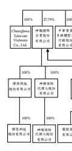
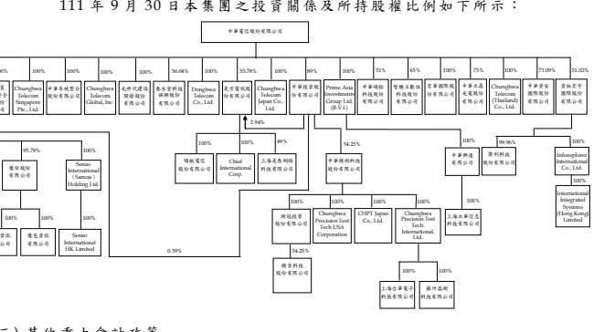

## 三 、 重大 會 計政 策 之彙 總說 明

 除 下列 說 明外 ,請 參閱 110 年度 合併 財 務報 告 之重 大會 計 政策 彙 總 說明 。

(一 ) 遵循 聲 明 本 合 併 財 務 報 告 係 依 照 證 券 發 行 人 財 務 報 告 編 製 準 則 及 經 金 融 監 督管 理 委員 會( 以 下稱「 金 管會 」)認 可並 發 布生 效 之 國 際會 計 準則 第 34 號 「期 中 財務 報 導」 編 製 。 本 合併 財務 報 告並 未 包含 整份 年 度財 務 報告 所 規定 之 所有 國際 財 務報 導 準則( IFRS)、國 際 會 計 準 則( IAS)、 解釋 (IFRIC) 及解 釋公 告 ( SIC)(以 下 稱 IFRSs) 揭露 資 訊。

(二 ) 合併 基 礎 列 入合 併 財務 報告 之 子公 司 :

|                            | 所                                                       | 持                       | 股    | 權   | 百   | 分   | 比   |    |    |    |    |    |    |    |         |          |         |       |
|----------------------------|----------------------------------------------------------|--------------------------|-------|------|------|------|------|----|----|----|----|----|----|----|---------|----------|---------|-------|
|                            | 111年                                                    | 110年                    | 110年 |      |      |      |      |    |    |    |    |    |    |    |         |          |         |       |
| 投                         | 資                                                       | 公                       | 司    | 名   | 稱   | 子   | 公   | 司 | 名 | 稱 | 業 | 務 | 性 | 質 | 9月30日 | 12月31日 | 9月30日 | 說 明 |
| 中華電信股份有限公司       | 神腦國際企業股份有限公司                                 | 行動電話及週邊配件銷售、 | 28    | 28   | 28   | 1.   |      |    |    |    |    |    |    |    |         |          |         |       |
| 代理中華電信門號銷售       |                                                          |                          |       |      |      |      |      |    |    |    |    |    |    |    |         |          |         |       |
| 光世代建設開發股份有限公   | 不動產及綠建築業務之規                                   | 100                      | 100   | 100  |      |      |      |    |    |    |    |    |    |    |         |          |         |       |
| 司                         | 劃、整合開發及物業管理                                   | 100                      | 100   | 100  | 2.   |      |      |    |    |    |    |    |    |    |         |          |         |       |
| 提供國際數據專線、IP 虛擬  |                                                          |                          |       |      |      |      |      |    |    |    |    |    |    |    |         |          |         |       |
| Donghwa Telecom Co.,  Ltd. | 企業網路、網路轉接服務 等業務                            | 100                      | 100   | 100  |      |      |      |    |    |    |    |    |    |    |         |          |         |       |
| Chunghwa Telecom           | 提供國際數據專線、IP 虛擬                                |                          |       |      |      |      |      |    |    |    |    |    |    |    |         |          |         |       |
| Singapore Pte., Ltd.       | 企業網路、網路轉接服務 等業務                            |                          |       |      |      |      |      |    |    |    |    |    |    |    |         |          |         |       |
| 中華系統整合股份有限公司   | 提供客戶資訊整合服務及通                                 | 100                      | 100   | 100  |      |      |      |    |    |    |    |    |    |    |         |          |         |       |
| 信終端設備                 | 56                                                       | 56                       | 56    | 3.   |      |      |      |    |    |    |    |    |    |    |         |          |         |       |
| 中華投資股份有限公司       | 一般投資業務                                             | 89                       | 89    | 89   |      |      |      |    |    |    |    |    |    |    |         |          |         |       |
| 是方電訊股份有限公司       | 網路整合服務、IDC 機房服 務、通信整合服務及雲端 應用服務 |                          |       |      |      |      |      |    |    |    |    |    |    |    |         |          |         |       |
| 中華黃頁多媒體整合行銷股   | 電子資訊供應服務業、一般                                 | 100                      | 100   | 100  |      |      |      |    |    |    |    |    |    |    |         |          |         |       |
| 份有限公司                 | 廣告服務業                                               |                          |       |      |      |      |      |    |    |    |    |    |    |    |         |          |         |       |
| Prime Asia Investments     | 一般投資業務                                             | 100                      | 100   | 100  |      |      |      |    |    |    |    |    |    |    |         |          |         |       |
| Group Ltd. (B.V.I.)        |                                                          |                          |       |      |      |      |      |    |    |    |    |    |    |    |         |          |         |       |
| 春水堂科技娛樂股份有限公   | 資訊軟體服務、網路內容製                                 |                          |       |      |      |      |      |    |    |    |    |    |    |    |         |          |         |       |
| 司                         | 作及播放、電影影片製作 及發行等業務                      | 56                       | 56    | 56   |      |      |      |    |    |    |    |    |    |    |         |          |         |       |
|                            | 100                                                      | 100                      | 100   |      |      |      |      |    |    |    |    |    |    |    |         |          |         |       |
| Chunghwa Telecom           | 提供跨國企業數據服務、網                                 |                          |       |      |      |      |      |    |    |    |    |    |    |    |         |          |         |       |
| Global, Inc.               | 際網路服務及轉接服務 等業務                              |                          |       |      |      |      |      |    |    |    |    |    |    |    |         |          |         |       |
| Chunghwa Telecom           | iEN 節能服務、國際電路、                                 | 100                      | 100   | 100  |      |      |      |    |    |    |    |    |    |    |         |          |         |       |
| Vietnam Co., Ltd.          | ICT 業務                                                 |                          |       |      |      |      |      |    |    |    |    |    |    |    |         |          |         |       |
| 智趣王數位科技股份有限公   | 提供多樣化親子家庭教育數                                 | 65                       | 65    | 65   |      |      |      |    |    |    |    |    |    |    |         |          |         |       |
| 司                         | 位服務                                                   | 100                      | 100   | 100  |      |      |      |    |    |    |    |    |    |    |         |          |         |       |
| Chunghwa Telecom Japan     | 提供國際數據專線、IP 虛擬                                |                          |       |      |      |      |      |    |    |    |    |    |    |    |         |          |         |       |
| Co., Ltd.                  | 企業網路、網路轉接服務 等業務                            |                          |       |      |      |      |      |    |    |    |    |    |    |    |         |          |         |       |
| 中華碩銓科技股份有限公司   | 車牌辨識產品及軟體之設                                   | 51                       | 51    | 51   |      |      |      |    |    |    |    |    |    |    |         |          |         |       |
| 計、生產開發               |                                                          |                          |       |      |      |      |      |    |    |    |    |    |    |    |         |          |         |       |
| 宏華國際股份有限公司       | 電信工程、電信業務門號代                                 | 100                      | 100   | 100  |      |      |      |    |    |    |    |    |    |    |         |          |         |       |
| 辦及其他工商服務           |                                                          |                          |       |      |      |      |      |    |    |    |    |    |    |    |         |          |         |       |
| 中華立鼎光電股份有限公司   | 電子零組件及成品之製造及                                 | 75                       | 75    | 75   |      |      |      |    |    |    |    |    |    |    |         |          |         |       |
| 買賣                       |                                                          |                          |       |      |      |      |      |    |    |    |    |    |    |    |         |          |         |       |

|                                                                | 所                                                                                                                        | 持                                                 | 股    | 權    | 百   | 分   | 比   |    |    |    |    |    |    |    |         |          |         |       |
|----------------------------------------------------------------|---------------------------------------------------------------------------------------------------------------------------|----------------------------------------------------|-------|-------|------|------|------|----|----|----|----|----|----|----|---------|----------|---------|-------|
|                                                                | 111年                                                                                                                     | 110年                                              | 110年 |       |      |      |      |    |    |    |    |    |    |    |         |          |         |       |
| 投                                                             | 資                                                                                                                        | 公                                                 | 司    | 名    | 稱   | 子   | 公   | 司 | 名 | 稱 | 業 | 務 | 性 | 質 | 9月30日 | 12月31日 | 9月30日 | 說 明 |
|                                                                | 100                                                                                                                       | 100                                                | 100   |       |      |      |      |    |    |    |    |    |    |    |         |          |         |       |
| Chunghwa Telecom                                               | 國際數據專線、IP 虛擬企業                                                                                                 |                                                    |       |       |      |      |      |    |    |    |    |    |    |    |         |          |         |       |
| (Thailand) Co., Ltd.                                           | 網路、ICT、雲端加值服 務等                                                                                                | 73                                                 | 77    | 77    | 4.   |      |      |    |    |    |    |    |    |    |         |          |         |       |
| 中華資安國際股份有限公司                                       | 電腦設備安裝、電腦及事務 性機器設備批發零售、資 訊軟體批發零售、管理顧 問服務、資料處理服務、 電子供應服務、網路認證 服務 | 51                                                 | 51    | 51    | 5.   |      |      |    |    |    |    |    |    |    |         |          |         |       |
| 資拓宏宇國際股份有限公司                                       | 資訊系統發展及維運、產業 解決方案之開發與銷 售、資訊管理顧問諮詢、 相關產品代理與銷售                                     |                                                    |       |       |      |      |      |    |    |    |    |    |    |    |         |          |         |       |
| 神腦國際企業股份有限                                           | Senao International                                                                                                       | 國際投資業務                                       | 100   | 100   | 100  | 6.   |      |    |    |    |    |    |    |    |         |          |         |       |
| 公司                                                           | (Samoa) Holding Ltd.                                                                                                      |                                                    |       |       |      |      |      |    |    |    |    |    |    |    |         |          |         |       |
| 優仕股份有限公司                                               | 資通訊產品之買賣                                                                                                          | 96                                                 | 96    | 96    |      |      |      |    |    |    |    |    |    |    |         |          |         |       |
| 暐固科技股份有限公司                                           | 資通訊產品之買賣                                                                                                          | 100                                                | 100   | 100   |      |      |      |    |    |    |    |    |    |    |         |          |         |       |
| 神揚保險代理人股份有限公                                       | 財產保險代理業務                                                                                                          | 100                                                | 100   | 100   |      |      |      |    |    |    |    |    |    |    |         |          |         |       |
| 司                                                             |                                                                                                                           |                                                    |       |       |      |      |      |    |    |    |    |    |    |    |         |          |         |       |
| 優仕股份有限公司                                               | 優銳資訊有限公司                                                                                                          | 資通訊產品之買賣                                   | 100   | 100   | 100  |      |      |    |    |    |    |    |    |    |         |          |         |       |
| 優邑資訊有限公司                                               | 資通訊產品之維修                                                                                                          | 100                                                | 100   | 100   |      |      |      |    |    |    |    |    |    |    |         |          |         |       |
| 暐固科技股份有限公司                                           | 暐恩科技股份有限公司                                                                                                      | 資通訊產品之買賣                                   | 100   | 100   | 100  |      |      |    |    |    |    |    |    |    |         |          |         |       |
| 神揚保險代理人股份有                                           | 神暘保險代理人股份有限公                                                                                                  | 人身保險代理業務                                   | 100   | 100   | 100  |      |      |    |    |    |    |    |    |    |         |          |         |       |
| 限公司                                                         | 司                                                                                                                        |                                                    |       |       |      |      |      |    |    |    |    |    |    |    |         |          |         |       |
| 是方電訊股份有限公司                                           | 領航電信股份有限公司                                                                                                      | 電信及網路服務                                     | 100   | 100   | 100  |      |      |    |    |    |    |    |    |    |         |          |         |       |
| Chief International Corp.                                      | 電信及網路服務                                                                                                            | 100                                                | 100   | 100   |      |      |      |    |    |    |    |    |    |    |         |          |         |       |
| 上海是泰網絡科技有限公司                                       | 電信及網路服務                                                                                                            | 49                                                 | 49    | 49    | 7.   |      |      |    |    |    |    |    |    |    |         |          |         |       |
| 中華投資股份有限公司                                           | 中華精測科技股份有限公司                                                                                                  | 半導體測試零組件及印刷電                           | 34    | 34    | 34   | 8.   |      |    |    |    |    |    |    |    |         |          |         |       |
| 路板等電子產品之產銷                                           | 100                                                                                                                       | 100                                                | 100   | 9.    |      |      |      |    |    |    |    |    |    |    |         |          |         |       |
| 中華精測科技股份有限                                           | Chunghwa Precision Test                                                                                                   | 半導體測試零組件及印刷電                           |       |       |      |      |      |    |    |    |    |    |    |    |         |          |         |       |
| 公司                                                           | Tech USA Corporation                                                                                                      | 路板之接案設計及售後 服務                          |       |       |      |      |      |    |    |    |    |    |    |    |         |          |         |       |
| CHPT Japan Co., Ltd.                                           | 電子零件、機械加工品、印                                                                                                  | 100                                                | 100   | 100   |      |      |      |    |    |    |    |    |    |    |         |          |         |       |
| 刷電路板相關服務                                               |                                                                                                                           |                                                    |       |       |      |      |      |    |    |    |    |    |    |    |         |          |         |       |
| 電子材料批發業、電子材料                                       |                                                                                                                           |                                                    |       |       |      |      |      |    |    |    |    |    |    |    |         |          |         |       |
| Chunghwa Precision Test                                        | 100                                                                                                                       | 100                                                | 100   | 10.   |      |      |      |    |    |    |    |    |    |    |         |          |         |       |
| Tech. International, Ltd.                                      | 零售業及一般投資業務                                                                                                      |                                                    |       |       |      |      |      |    |    |    |    |    |    |    |         |          |         |       |
| 測冠投資股份有限公司                                           | 一般投資業務                                                                                                              | 100                                                | -     | -     | 11.  |      |      |    |    |    |    |    |    |    |         |          |         |       |
|                                                                | 54                                                                                                                        | -                                                  | -     | 12.   |      |      |      |    |    |    |    |    |    |    |         |          |         |       |
| 測冠投資股份有限公司                                           | 揚弈科技股份有限公司                                                                                                      | 智慧設備製造、銷售、智慧 工廠軟硬體整合及技術 諮詢 |       |       |      |      |      |    |    |    |    |    |    |    |         |          |         |       |
| Senao International HK                                         | 國際投資業務                                                                                                              | 100                                                | 100   | 100   | 13.  |      |      |    |    |    |    |    |    |    |         |          |         |       |
| Limited                                                        |                                                                                                                           |                                                    |       |       |      |      |      |    |    |    |    |    |    |    |         |          |         |       |
| Senao International  (Samoa) Holding  Ltd. Senao International | 神璽商貿(上海)有限公司                                                                                                  | 資通訊產品之買賣                                   | -     | -     | -    | 14.  |      |    |    |    |    |    |    |    |         |          |         |       |
| HK Limited                                                     | 中華興達有限公司                                                                                                          | 一般投資業務                                       | 100   | 100   | 100  |      |      |    |    |    |    |    |    |    |         |          |         |       |
| Prime Asia  Investments Group  Ltd. (B.V.I.) 中華興達有限公司  | 上海立華信息科技有限公司                                                                                                  | 企業客戶資通訊整體解決方                           | 100   | 100   | 100  | 15.  |      |    |    |    |    |    |    |    |         |          |         |       |
| 案、iEN 智慧節能服務                                           |                                                                                                                           |                                                    |       |       |      |      |      |    |    |    |    |    |    |    |         |          |         |       |
| 上海台華電子科技有限公司                                       | 印刷電路板的設計及提供技                                                                                                  | 100                                                | 100   | 100   |      |      |      |    |    |    |    |    |    |    |         |          |         |       |
| 術諮詢和技術服務                                               |                                                                                                                           |                                                    |       |       |      |      |      |    |    |    |    |    |    |    |         |          |         |       |
| Chunghwa Precision  Test Tech.  International, Ltd.            | 100                                                                                                                       | 100                                                | 100   | 16.   |      |      |      |    |    |    |    |    |    |    |         |          |         |       |
| 蘇州晶測科技有限公司                                           | 電路板組裝加工銷售、印刷 電路板的設計及提供技 術諮詢和技術服務                                                            |                                                    |       |       |      |      |      |    |    |    |    |    |    |    |         |          |         |       |
| 資拓宏宇國際股份有限                                           | Infoexplorer International                                                                                                | 一般投資業務                                       | 100   | 100   | 100  | 17.  |      |    |    |    |    |    |    |    |         |          |         |       |
| 公司                                                           | Co., Ltd.                                                                                                                 |                                                    |       |       |      |      |      |    |    |    |    |    |    |    |         |          |         |       |
| IISI Investment Co., Ltd.                                      | 一般投資業務                                                                                                              | -                                                  | 100   | 100   | 18.  |      |      |    |    |    |    |    |    |    |         |          |         |       |
| 榮利科技股份有限公司                                           | 資訊系統發展及維運業務                                                                                                    | 99.96                                              | 99.96 | 99.96 |      |      |      |    |    |    |    |    |    |    |         |          |         |       |
| Infoexplorer  International Co.,  Ltd.                         | 一般投資業務及技術諮詢服                                                                                                  | 100                                                | 100   | 100   | 17.  |      |      |    |    |    |    |    |    |    |         |          |         |       |
| 務                                                             |                                                                                                                           |                                                    |       |       |      |      |      |    |    |    |    |    |    |    |         |          |         |       |
| International Integrated  Systems (Hong Kong)  Limited         |                                                                                                                           |                                                    |       |       |      |      |      |    |    |    |    |    |    |    |         |          |         |       |

|                        | 所                        | 持                     | 股    | 權   | 百   | 分   | 比   |    |    |    |    |    |    |    |         |          |         |       |
|------------------------|---------------------------|------------------------|-------|------|------|------|------|----|----|----|----|----|----|----|---------|----------|---------|-------|
|                        | 111年                     | 110年                  | 110年 |      |      |      |      |    |    |    |    |    |    |    |         |          |         |       |
| 投                     | 資                        | 公                     | 司    | 名   | 稱   | 子   | 公   | 司 | 名 | 稱 | 業 | 務 | 性 | 質 | 9月30日 | 12月31日 | 9月30日 | 說 明 |
| IISI Investment Co.,   | Leading Tech Co., Ltd.    | 一般投資業務           | -     | 100  | 100  | 18.  |      |    |    |    |    |    |    |    |         |          |         |       |
| Ltd.                   |                           |                        |       |      |      |      |      |    |    |    |    |    |    |    |         |          |         |       |
| Leading Tech Co., Ltd. | Leading Systems Co., Ltd. | 一般投資業務           | -     | 100  | 100  | 18.  |      |    |    |    |    |    |    |    |         |          |         |       |
| Leading Systems Co.,   | 資拓宏宇(上海)信息科技  | 資訊系統發展及維運業務 | -     | -    | -    | 19.  |      |    |    |    |    |    |    |    |         |          |         |       |
| Ltd.                   | 有限公司                  |                        |       |      |      |      |      |    |    |    |    |    |    |    |         |          |         |       |

1. 中華 電 信公 司 透過 神腦 國 際大 股 東支 持持 續 控制 該 公 司 13 席董事 席次 中 之 7 席 ,故 將其 列 為子 公 司。

2. 子公 司 Donghwa Telecom Co., Ltd.於 110 年 3 月 現金 減 資 退回 股 款, 本 集團 對 其持 股比 例 不變 。

3. 子公 司 是方 電 訊 於 110 年 3 月 及 12 月 暨 111 年 3 月 發行 新股 供 員 工依 認 股計 畫 行使 認股 權 利, 致 110 年 9 月 30 日 、110 年 12 月 31 日 及 111 年 9 月 30 日 本 集 團對是方電訊持股比例下降為 58.90%、58.89%及 58.72%。

4. 子公 司 中華 資 安國 際 於 110 年 2 月 暨 111 年 2 月 及 5 月 發行 新 股 供員 工 依認 股 計畫 行使 認 股權 利,致 110 年 9 月 30 日、110 年 12 月 31 日 及 111 年 9 月 30 日本 集 團對 中 華資 安 國際 持 股比 例下 降 為 77.46%、77.46%及 73.09%。

5. 子公 司 資拓 宏 宇國 際 於 110 年 1 月發 行新 股 供員 工 依認 股計 畫 行 使認 股 權利 , 致本 集團 對 資拓 宏 宇國 際持 股 比例 下 降 為 51.02%。

6. 子公 司 Senao International (Samoa) Holding Ltd.於 109 年 11 月 及 110 年 7 月 現金 減資 退 回股 款,並 於 110 年 2 月 及 10 月減 資 彌 補虧 損 ,減 資 比例 分別 為 8.14%及 48.15%,本 集 團對 其 持股 比 例 不變 。

7. 是方 電 訊依 股 東間 之書 面 協議 取 得上 海是 泰 公司 3 席董 事席 次 中 之 2 席 ,對 該 公司 具控 制 ,故 將 其列 為子 公 司。

8. 雖本集團對中華精測之持股比例未超過 50%,惟經考量相對於其 他 股 東 所 持 有 表 決 權 之 絕 對 多 寡 、 相 對 大 小 及 分 佈 , 判 斷 本 集 團 具主 導 中華 精 測攸 關活 動 之實 質 能力 ,故 將 其列 為 子公 司。

9. 子 公 司 中 華 精 測 於 110 年 8 月 按 原 持 股 比 例 增 資 Chunghwa Precision Test Tech USA Corporation, 本 集團 對 其持 股 比例 不 變。

10. 子 公 司 中 華 精 測 於 110 年 4 月 按 原 持 股 比 例 增 資 Chunghwa Precision Test Tech. International, Ltd.,本 集 團對 其 持股 比例 不 變。

11. 子公 司 中華 精 測 於 111 年 3 月 投資 成 立測 冠 投資 公 司, 持股 比 例 為 100%。

12. 子公 司 測冠 投 資 於 111 年 5 月 投資 成 立揚 弈 科技 公 司, 持股 比 例 為 54.25%。

13. 子公 司 Senao International HK Limited 於 109 年 11 月 及 110 年 5 月 現 金減 資 退回 股 款,並 於 110 年 1 月 及 8 月減 資 彌補 虧損,減 資 比 例 為 8.15%及 47.79%, 本 集 團 對 其 持 股 比 例 不 變 。 子公司 Senao International HK Limited 於 111 年 8 月 決 議結 束 營 業辦 理 清算 , 清算 程 序尚 在進 行 中。

14. 子公 司 神璽 商 貿( 上海 ) 已 於 110 年 4 月 清 算完 結 。

15. 子公 司 上海 立 華 於 109 年 8 月 決議 結 束營 業 辦理 清 算, 清算 程 序 尚在 進 行中 。

16. 子公 司 Chunghwa Precision Test Tech. International, Ltd.於 110 年 7 月 按原 持 股比 例增 資 蘇州 晶 測科 技, 本 集團 對 其持 股比 例 不 變。

17. 子 公 司 資 拓 宏 宇 國 際 決 議 結 束 Infoexplorer International Co., 
Ltd.及 International Integrated Systems (Hong Kong) Limited 營業 辦 理清 算 , 清 算程 序 尚在 進 行中 。

18. 子公司 IISI Investment Co., Ltd.、 Leading Tech Co., Ltd.及 Leading Systems Co., Ltd.已 於 111 年 9 月 完 成註 銷 。

19. 子公 司 資拓 宏 宇( 上海 ) 信息 科 技已 於 110 年 8 月 清算 完結 。

優銳資訊 有限公司

## (三 ) 其他 重 大會 計 政策 1. 確定 福 利退 職 後福 利

 期 中 期 間 之 退 休 金 成 本 係 採 用 前 一 年 度 結 束 日 依 精 算 決 定 之 退 休 金 成 本 率 , 以 年 初 至 當 期 期 末 為 基 礎 計 算 , 並 針 對 本 期 之 重 大市 場 波動 及 其他 重大 一 次性 事 項加 以調 整 。

2. 所得 稅 所得稅費用 係 當 期 所 得 稅 及 遞 延 所 得 稅 之 總 和 。 期 中 期 間 之 所 得 稅 係 以 年 度 為 基 礎 進 行 評 估 , 以 預 期 年 度 總 盈 餘 所 適 用 之 稅 率, 就 期中 稅 前利 益予 以 計算 。 遞 延 所 得 稅 資 產 及 負 債 之 衡 量 係 反 映 本 集 團 於 資 產 負 債 表 日 預 期 回 收 或 清 償 其 資 產 及 負 債 帳 面 金 額 之 方 式 所 產 生 之 租 稅 後 果。

## 四 、 重大 會 計判 斷 、估 計及 假 設不 確 定性 之主 要 來源

 本集團 於 採 用 會 計 政 策 時 , 對 於 不 易 來 自 其 他 來 源 取 得 相 關 資 訊 者 , 管 理 階 層 必 須 基 於 歷 史 經 驗 及 其 他 攸 關 之 因 素 作 出 相 關 之 判 斷 、 估 計及 假 設。 實 際結 果可 能 與估 計 有所 不同 。