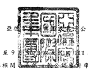
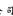
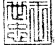
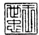
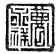

公司

月1 日至9月30日 民國111年及110年 7月1日至9 ; 1年及110年1
(僅經核閱电 公宓*寧噂t準則查核)

單位:新台幣仟元,惟

每股盈餘為元

|                                                                                          | 每股盈餘為元                                               |                      |                      |                      |             |             |             |             |     |    |    |
|------------------------------------------------------------------------------------------|------------------------------------------------------------|----------------------|----------------------|----------------------|-------------|-------------|-------------|-------------|-----|----|----|
| 代碼                                                                                     | m年7月1日至9月30日                                         | 110年7月1日至9月30日 | 111年1月1日至9月30日 | 110年1月1日至9月30日 |             |             |             |             |     |    |    |
| 金                                                                                       | 額                                                         | %                   | 金                   | 額                   | %          | 金          | 額          | %          | 金  | 額 | % |
| 營業收入 銷貨收入(附註二十及三四)                                                      | $ 6,077,173                                                | 100                  | $                    | 6,663,429            | 100         | $19,808,521 | 100         | $19,632,353 | 100 |    |    |
| 營業成本 銷貨成本(附註十及二-*)                                                        |                                                            |                      |                      |                      |             |             |             |             |     |    |    |
| 4100 5110                                                                                | 3,262,883                                                  | 54                   | 3,384,194            | 51                   | 10,820,108  | 55          | 10,021,046  | 51          |     |    |    |
| 5900                                                                                     | 營業毛利                                                   | 2,814,290            | 46                   | 3,279,235            | 49          | 8,988,413   | 45          | 9,611,307   | 49  |    |    |
| 營業費用(附註二…) 推銷費用 管理費用 研究發展費用 預期信用減損損失(利益) 營業費用合計 |                                                            |                      |                      |                      |             |             |             |             |     |    |    |
| 6100 6200 6300 6450 6000                                                                 | 626,899                                                    | 10                   |                      |                      |             |             |             |             |     |    |    |
| 305,934                                                                                  | 5                                                          |                      |                      |                      |             |             |             |             |     |    |    |
| 184,819                                                                                  | 3                                                          |                      |                      |                      |             |             |             |             |     |    |    |
| 6,376)                                                                                   | -                                                          |                      |                      |                      |             |             |             |             |     |    |    |
| L11L276                                                                                  | 18                                                         | 585,804              | 9                    |                      |             |             |             |             |     |    |    |
|                                                                                          | 505,533                                                    | 8                    |                      |                      |             |             |             |             |     |    |    |
|                                                                                          | 152,205                                                    | 2                    |                      |                      |             |             |             |             |     |    |    |
|                                                                                          | 6,809                                                      | -                    |                      |                      |             |             |             |             |     |    |    |
|                                                                                          | 1,250,351                                                  | 19                   |                      |                      |             |             |             |             |     |    |    |
| 6900                                                                                     | 1,898,833                                                  | 9                    | 1,705,148            | 9                    |             |             |             |             |     |    |    |
|                                                                                          | 821,844                                                    | 4                    | 1,015,791            | 5                    |             |             |             |             |     |    |    |
|                                                                                          | 543,778                                                    | 3                    | 441,850              | 2                    |             |             |             |             |     |    |    |
|                                                                                          | 17,549                                                     | 33,455               | -                    |                      |             |             |             |             |     |    |    |
|                                                                                          | 3,282,004                                                  | 16                   | 3,196,244            | 16                   |             |             |             |             |     |    |    |
| 營業淨利                                                                                 | 1,703,014                                                  | 2,028,884            | 30                   | 5,706,409            | 29          |             |             |             |     |    |    |
| 營業外收入及支出(附註二一) 利息收入 其他利益及損失 財務成本                            | (-                                                         |                      |                      |                      |             |             |             |             |     |    |    |
| 營業外收入及支出合計                                                                     | 6,415,063                                                  | 33                   |                      |                      |             |             |             |             |     |    |    |
|                                                                                          | 2                                                          |                      |                      |                      |             |             |             |             |     |    |    |
| 7100 7020 7050 7000                                                                      | 28,369 105,275 34,424) 99,220                              | 1 2                  |                      |                      |             |             |             |             |     |    |    |
| (且) 2                                                                                   | 22,947 83,470                                              |                      |                      |                      |             |             |             |             |     |    |    |
| (                                                                                        | 54,164) 52,253                                             | 1 1                  |                      |                      |             |             |             |             |     |    |    |
|                                                                                          | (顼 1                                                      | 76,133 386,070       |                      |                      |             |             |             |             |     |    |    |
|                                                                                          | (                                                          | 103,475) 358,728     | 73,262               | -                    |             |             |             |             |     |    |    |
|                                                                                          | (                                                          | 19,210)              | .                    |                      |             |             |             |             |     |    |    |
|                                                                                          | (                                                          | 149439)              | (                    | 1)                   |             |             |             |             |     |    |    |
|                                                                                          | (                                                          | 95,087)              | (__1)                |                      |             |             |             |             |     |    |    |
|                                                                                          | 2                                                          |                      |                      |                      |             |             |             |             |     |    |    |
| 7900                                                                                     | 繼績營業單位稅前淨利                                       | 30                   | 2,081,137            | 31                   | 6,065,137   | 31          | 6,319,976   | 32          |     |    |    |
| 1,802,234                                                                                |                                                            |                      |                      |                      |             |             |             |             |     |    |    |
| 所得稅費用(附註四及二二)                                                               |                                                            |                      |                      |                      |             |             |             |             |     |    |    |
| 7950                                                                                     | 411,201                                                    | 7                    | 480,532              | 7                    | 1,394,306   | 7           | 1,484,268   | 7           |     |    |    |
| 8200                                                                                     | 本期淨利                                                   | 1,391,033            | 23                   | 1,600,605            | 24          | 4,670,831   | 24          | 4,835,708   | 25  |    |    |
| 8310 8341 8360 8361                                                                      | (                                                          | 400,927)             | (                    | 2)                   |             |             |             |             |     |    |    |
|                                                                                          | 13,085                                                     | -                    |                      |                      |             |             |             |             |     |    |    |
| 8300 8500                                                                                | 其他綜合損益 不重分類至損益之項目: 換算表達貨幣之兌換差額 | 305,956              | 5                    | (                    | 21,206)     | 1,083,920   | 5           |             |     |    |    |
| 後續可能重分類至損益之項目: 國外營運機構財務報表換算 之兌換差額                         | (一                                                       | 55,612)              | (且)               | (一                 | 3,541)      | (—          | )           | (1)         |     |    |    |
| 本期其他綜合損益(稅後淨 額)                                                            | 250,344                                                    | 4                    | (-                   | 24,747)              | —二         | 879,438     | 4           |             |     |    |    |
| 本期綜合損益總額                                                                         | $                                                          | L641,377             | 27                   | U£75,858             | 24          | ^=5x550/262 | 堡          |             |     |    |    |
| 淨利歸屬於: 本公司業主                                                                  | $ 1,391,166                                                | 23                   | $ 1,600,763          | 24                   | $ 4,671,193 | 24          |             |             |     |    |    |
| 非控制權益                                                                               | (—                                                         | 133)                 | __ Z                 | (—                   | 158)        | ___z        | ( ;_______ | )           | -   |    |    |
| £ L39L033                                                                                | 23                                                         | 1 1,600,605          | 24                   | $ 4,670,831          | 24          |             |             |             |     |    |    |
| 綜合損益總額歸屬於: 本公司業主                                                          | $ 1,641,519                                                | 27                   | $ 1,576,015          | 24                   | $ 5,550,662 | 28          |             |             |     |    |    |
| 非控制權益                                                                               | (—                                                         | 142)                 | __ 二                | (—                   | 157)        | I:____      | )           | -           |     |    |    |
| L64L377                                                                                  | 27                                                         | 1 L575.858           | $ 5550269            | (                    | 387,842)(顼 |             |             |             |     |    |    |
|                                                                                          | ( $ 4,836,237                                              | 25                   |                      |                      |             |             |             |             |     |    |    |
|                                                                                          | )                                                          | __z                  |                      |                      |             |             |             |             |     |    |    |
|                                                                                          | $                                                          | 4,835,708            | 25                   |                      |             |             |             |             |     |    |    |
| 8600 8610 8620 8700 8710 8720                                                            | (                                                          | )二                  |                      |                      |             |             |             |             |     |    |    |
|                                                                                          | $                                                          | 4,448,377            | 23                   |                      |             |             |             |             |     |    |    |
|                                                                                          | $                                                          | 4,447,866            | 23                   |                      |             |             |             |             |     |    |    |
| 每股盈餘(附註二三) 基 本                                                               | $                                                          | 6.96                 | $                    | 23.36                |             |             |             |             |     |    |    |
| 稀                                                                                       | 釋                                                         | $                    | 6.95                 | 23.34                |             |             |             |             |     |    |    |
| 9710 9810                                                                                |                                                            |                      |                      |                      |             |             |             |             |     |    |    |

後附之附註係本合併財務報告之一部分。

:王世忠 II 經理人:王世忠

會計主管:曹永祥
-5 -

