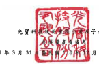

子公司

民居 111年 3月 31
月 31 日及 3 月 31 日

|                                      | 單位:新台醫护元                                    |                      |               |              |               |               |               |             |               |      |
|--------------------------------------|----------------------------------------------------|----------------------|---------------|--------------|---------------|---------------|---------------|-------------|---------------|------|
| 111年3月31日(経核間)                 | 110年12月31日(経変核)                              | 110年3月31日(経柱間) |               |              |               |               |               |             |               |      |
| 代                                   | ત્વે                                                 | _資                  | 重            | 查           | - %           | 金            | । ক           |             |               |      |
|                                      | 第一次                                             | 第一次               |               |              |               |               |               |             |               |      |
| 滇動賣產                             |                                                    |                      |               |              |               |               |               |             |               |      |
| 1100                                 | 現金及約當現金(附放六)                             | $ 68,517,225         | 37            | $ 68,275,835 | 37            | $ 71,299,807  | 41            |             |               |      |
| 1110                                 | 选過損益按公允價值街量之会融資產《財誌七)          | 7,630,388            | 4             | 775,988      | .             | 899,847       | 1             |             |               |      |
| 1136                                 | 换抛病接成本倒量之全融资産(附近九)                 | 3,210                | 3,209         | .            | 89,246        |               |               |             |               |      |
| 1140                                 | 合約實產                                           | 585,370              | 654,423       | .            | 1,938,584     | 1             |               |             |               |      |
| 1150                                 | 恩收票據一净願(開註十一)                           | 625,284              | 458,316       | 265,373      |               |               |               |             |               |      |
| 1170                                 | 應收帳款一浮鍍(附註十一)                           | 38,098,764           | 20            | 41,245,921   | 23            | 33.362.096    | 19            |             |               |      |
| 1180                                 | 應收帳款一開條人(所該三十)                         | 12,035               | -             | 12,139       | -             | 12.156        | .             |             |               |      |
| 1200                                 | 其他應收數(附註十一)                               | 1,009,242            | 1             | 817,564      | 1             | 622,260       | .             |             |               |      |
| 1210                                 | 其他應收款一副係入(附註三十)                       | 3,265                | 5,203         |              |               |               |               |             |               |      |
| 130X                                 | 存货一净额(附註十二)                               | 31,307,062           | 17            | 32,299,343   | 18            | 26,651,952    | 15            |             |               |      |
| 1470                                 | 其他流处黄産(附班十九)                             | 2,813,798            | 2             | 2,564,888    | 1             | 2,539,271     | 2             |             |               |      |
| 11XX                                 | 流動買產總計                                       | 150,602,378          | 81            | 147,110,891  | 82            | 79            |               |             |               |      |
|                                      | 137,685,795                                        |                      |               |              |               |               |               |             |               |      |
| 非波動管產                           |                                                    |                      |               |              |               |               |               |             |               |      |
| 1510                                 | 透過攝益按公允價值街量之盒融資產(附註七)           | 1,114,359            | 1             | 2,090,852    | 1             | 2,723,876     | N             |             |               |      |
| 1517                                 | 透過其他综合損益按公允價值街景文会融買產《附該入》 | 2,088,578            | 2,013,586     |              |               |               |               |             |               |      |
| 1                                    | l                                                  | 1,670,518            | 1             |              |               |               |               |             |               |      |
| 1535                                 | 291,604                                            | 289,411              |               |              |               |               |               |             |               |      |
| 按键编模成本做量之会融资產〔附近九〕 | 297,967                                            |                      |               |              |               |               |               |             |               |      |
| 1550                                 | 1,904,643                                          | 1                    | 1.847.579     | 1            |               |               |               |             |               |      |
| 採用機益活之投資(附註十四)           | 2,590,977                                          | 1                    |               |              |               |               |               |             |               |      |
| 1600                                 | 不動產、廠房及投險一净額(附缺十五及三十)           | 19,313,388           | 10            | 18,889,587   | 30            | 18,440,640    | 10            |             |               |      |
| 1755                                 | 使用爆资產一净額(附註十六)                         | 1,732,553            | 1             | 1,717,650    | 1             | 1,431,543     | 1             |             |               |      |
| 1760                                 | 视實性不動產一淨額(附註十七)                       | 1,286,816            | l             | 1,246,465    | 1,255,727     | 1             |               |             |               |      |
| 1780                                 | 無形寶產一浮領(附註十八)                           | 3,667,019            | 2             | 3,675,676    | N             | 4,594,045     | 3             |             |               |      |
| 1840                                 | 通延所将规资及                                     | 3,557,706            | 2             | 4.244.276    | 3             | 4.209.319     | 2             |             |               |      |
| 1920                                 | 存出保增会                                         | 277,771              | .             | 278,995      | 260,703       |               |               |             |               |      |
|                                      | ...                                                | .                    |               |              |               |               |               |             |               |      |
| 1975                                 | 泽確定福利實產(附註二二)                           | 40,958               | -             | 37,932       | 9,266         |               |               |             |               |      |
| 1995                                 | 其他非滇到資產(附該十九)                           | 103,765              | 100.519       | 120,742      |               |               |               |             |               |      |
| 15XX                                 | 非消费资源计                                       | 35.379.160           | - Ta          | 36.432.528   | -20           | 37,605,323    | _21           |             |               |      |
| 1XXXX                                | 试                                                 | 直                   | 烧            | 科           | $_185,981,538 | _100          | $_183.543.419 | _100        | $_175.291.118 | _100 |
| 代                                   | હ                                                  | A                    | 律            | 及           | 维            | ম             |               |             |               |      |
| 流動負債                             |                                                    |                      |               |              |               |               |               |             |               |      |
| 2100                                 | 短期借款(附註二十)                                 | $ 27,303,888         | 15            | ડે            | 28,385,043    | 16            | $ 18,411,646  | 10          |               |      |
| 2120                                 | 透過損益按公允價值對臺之会融員債(所註七)           | 477,633              | 373,960       | 754,571      | .             |               |               |             |               |      |
| 2130                                 | 合约負債                                           | 233                  | -             | 98           | .             | .             |               |             |               |      |
| 2150                                 | 應付業讓                                           | 13                   | વન            | 13,033       |               |               |               |             |               |      |
| 2170                                 | 息付顿被                                           | 44,646,325           | 24            | 46,659,415   | 25            | 43,916,269    | 25            |             |               |      |
| 2180                                 | 應付帳货一開條人(附班三十)                         | 707                  | 38,342        | 86,821       |               |               |               |             |               |      |
| 2219                                 | 其他應付扳                                         | 26,245,897           | 14            | 20,683,867   | 8 1           | 27,489,757    | 16            |             |               |      |
| 2220                                 | 其他應付款一間係人(附註三十)                       | 493                  | .             | 1,705        | .             | 12,146        | .             |             |               |      |
| 2230                                 | 本期所得就負債                                     | 7,471,418            | 4             | 7,263,027    | 4             | 7,177,861     | 4             |             |               |      |
| 2250                                 | 身情异倫(刷糖二一)                                 | 1,118,782            | 1             | 1,152,812    | 1             | 1,191,490     | 1             |             |               |      |
| 2280                                 | 租賃負債(附註十六)                                 | 426,057              | .             | 400,877      | 225,986       |               |               |             |               |      |
| 2310                                 | 预收获项                                           | 3,305,947            | 2             | 2,955,935    | 2             | 2.653,270     | 2             |             |               |      |
| 21XX                                 | 流野鼻候鸡叶                                       | 110,997,393          | 60            | 107,915,125  | 59            | _ 101,932,850 | 58            |             |               |      |
| 非演動員債                           |                                                    |                      |               |              |               |               |               |             |               |      |
| 2570                                 | 透延所得我身策                                     | 1,915,754            | 1             | 1,878,663    | 1             | 1,562,734     | 1             |             |               |      |
| 2580                                 | 纽黄角馈(附註十六)                                 | 722,289              | 743,516       | 551,558      |               |               |               |             |               |      |
| 2645                                 | 存入保管合                                         | 146,614              | 132,588       | 96,694       |               |               |               |             |               |      |
| 25XX                                 | 非消费负债绝计                                     | רו                   |               |              |               |               |               |             |               |      |
| 2,784,657                            | 2754.767                                           | 7                    | 2,210,986     | | |          |               |               |               |             |               |      |
| 2XXX                                 | 負債總計                                           | 113.782.050          | __61          | 110.669.892  | _ 60          | 104.143,836   |               |             |               |      |
| 跨屬於母公司實主權益                 |                                                    |                      |               |              |               |               |               |             |               |      |
| 股                                   | 永                                                 |                      |               |              |               |               |               |             |               |      |
| 3110                                 | 鲁通股本                                           | 23,508,670           | 13            | 23,508,670   | 13            | 23,508,670    |               |             |               |      |
| 3200                                 | 贤本公積                                           | 21,932,661           | 12            | 21,836,342   | 12            | 21,613,574    | 12            |             |               |      |
| 保留股价                             |                                                    |                      |               |              |               |               |               |             |               |      |
| 3310                                 | 法定盈综公積                                       | 15,613,679           | 9             | 15,613,679   | 9             | 13,789,553    | 8             |             |               |      |
| 3320                                 | 特别盈龄公核                                       | 5,940,218            | 3             | 5.940.218    | 3             | 4,732,075     | 3             |             |               |      |
| 3350                                 | 来分配置给                                         | 11,527,692           | 6             | 15,199,955   | 8             | 13.295.164    | 7             |             |               |      |
| 3300                                 | 保留盈综绝计                                       | 33,081,589           | 18            | 36,753,852   | 20            | 31,816,792    | _18           |             |               |      |
| 其他报经                             |                                                    |                      |               |              |               |               |               |             |               |      |
| 3410                                 | 图外梦迷晚梯财陪极表换第之父换是朝                 | 2,993,805 )          | (             | 2 )          | 5,820,080 )   | (             | 3 )           | 4,860,311 ) | (             | 3 )  |
| 3420                                 | 透過其他綜合攝滋按公元價值街量之会融資產未實現領夫 | 227,695 )            | 236,908 )     | 215,362 )    |               |               |               |             |               |      |
| 3400                                 | 其他想当统时                                       | 3,221,500 )          | ﺭ 2)          | 6,056,988 )  | ﺭﻳ            | 5,075,673 )   | (_            |             |               |      |
| 3500                                 | 車議股票                                           | 3,700,806 )          | 2)            | 2)           |               |               |               |             |               |      |
| (-                                   | 3,700,808 )                                        | (.                   | 1,271,314 )   | (-           | 1)            |               |               |             |               |      |
| 31XX                                 | 母公司第三建造地时                                 | 39                   | 40            |              |               |               |               |             |               |      |
| 71,600,612                           | 72,341,068                                         | 70,592,049           | 40            |              |               |               |               |             |               |      |
| 36XX                                 | 非控制渡召                                         | 598.876              | 532.459       | 555:233      |               |               |               |             |               |      |
| 1.                                   | =                                                  | 1                    |               |              |               |               |               |             |               |      |
| 3XXX                                 | 椒虽绝对                                           | 72,199,488           | - ব্ৰহ         | 72,873,52Z   | ----------    | 71,147,282    | --------      |             |               |      |
| 负债 织 据 益 炮 計                  | $ 185,981,538                                      | -100                 | S_183,543,419 | -100         | $_175,291.118 | _100          |               |             |               |      |
| 後開之間往係本合併財務報告之一部分"  |                                                    |                      |               |              |               |               |               |             |               |      |

(靖多聞勤憲不信聯合會計師事務所民國 111年4月28日植蘭報告 >

经理人:邱森树

會計生管:周與災

