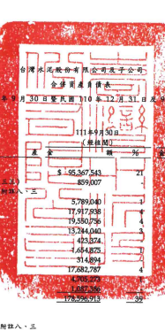

氏 - 111

30 日 單位:新台梦仟元

| 50 E                                                          | 110年12月31日                                       | 110年9月30日   |             |               |               |               |               |               |
|---------------------------------------------------------------|-----------------------------------------------------|----------------|-------------|---------------|---------------|---------------|---------------|---------------|
| 是桂阳0                                                       | (經查班)                                            | (經植聞)       |             |               |               |               |               |               |
| 代                                                            | ন্দ্র                                                 | 黄             | 8           | 频            | જેર            | रु             | 第            | જેર            |
| 流動質產                                                      |                                                     |                |             |               |               |               |               |               |
| 1100                                                          | 1                                                   |                |             |               |               |               |               |               |
| 现会及的需现金(附註六)                                        | $ - 95,367,543                                      | 91,121,942     | 21          | $ 59,958,809  | 15            |               |               |               |
| 1110                                                          | 逸過攝益按公允價值街量之全融資產(附註七             | 24             | -859,007    | 363,813       | 335,314       |               |               |               |
| 1120                                                          | 透過其他综合攝磁按公允價值购量之会融資產《附注      |                |             |               |               |               |               |               |
| 三及三五)                                                     | 5,789,040                                           | 6,387,543      | 1           | 6,180,994     | 2             |               |               |               |
| 1136                                                          | 按排编得使成本街量之会融资產(附註六及三互           | 17,917,938     | 15,508,688  | 4             | 15,157,115    | 4             |               |               |
| 1150                                                          | 應收票據(所該丸及二四)                              | 19,550,756     | 25,639,724  | 6             | 26,811,806    | 7             |               |               |
| 1170                                                          | 應收帳款(附註九、十及二四)                          | 13,244,040     | 9,844,002   | 2             | 9,264,477     | 2             |               |               |
| 1180                                                          | 應收票據及帳款一關係人(附註三四)                    | 4 423,374.     | 457,203     | 417,657       |               |               |               |               |
|                                                               | .                                                   | .              |             |               |               |               |               |               |
| 1200                                                          | 其他患收款                                          | 1 654,875      | 1,499,322   | 1,075,939     | .             |               |               |               |
| 1210                                                          | 其他應收款一副偽人(附註十三及三四)                  | 314,894        | 388,968     | 254,633       |               |               |               |               |
| 130X                                                          | 存货(附註十二)                                      | 17,682,787     | 13.412.511  | 3             | 11,238,700    | 3             |               |               |
| 1410                                                          | 预付款项                                            | 14,705,273,44  | 3,935,575   | 1             | 4,003,221     | 1             |               |               |
| 1479                                                          | 其他渡勤資産                                        | 11-05736       | 794,144     | 603,009       |               |               |               |               |
| 11XX                                                          | 渡動資產總計                                        | While with     | 169,353,435 | 38            | 135,301,674   | 34            |               |               |
| 非液動資產                                                    |                                                     |                |             |               |               |               |               |               |
| 1517                                                          | 速過其他綜合損益按公允價值街量之金融資產(所放入、三 |                |             |               |               |               |               |               |
| 三及三五)                                                     | 22,180,763                                          | 5              | 27,835,864  | 6             | 28,145,542    | 7             |               |               |
| 1535                                                          | 按拂躺後成本街量之会融資產(附近六及三五)            | 11,646,126     | 2           | 15,468,807    | 4             | 16,360,700    | 4             |               |
| 1550                                                          | 採用機益法之投資(附該十四及三五)                    | 48,944,177     | 11          | 46,781,575    | 11            | 47,538,476    | 12            |               |
| 1600                                                          | 不動産、廠房及設備(附該十五、二五、三四及三五)      | 112,934,189    | 25          | 98,196,032    | 22            | 94,726,660    | 24            |               |
| 1755                                                          | 使用握資產(附註十六·二五及三四)                     | 15,697,201     | 3           | 14,992,784    | 3             | 14,102,007    | 3             |               |
| 1760                                                          | 投資性不動産(附拉十七、二直及三五)                  | 5,410,610      | 1           | 5,425,680     | 1             | 5,427,593     |               |               |
| 1780                                                          | l                                                   |                |             |               |               |               |               |               |
| 無形實產(附近十八及二五)                                      | 27,997,866                                          | ર્              | 27,650,861  | б             | 24,714,757    | б             |               |               |
| 1915                                                          | 预付饭偷款(附进十五及三四)                          | 8,435,855      | 2           | 7,762,010     | 2             | 6,146,593     | 2             |               |
| 194D                                                          | 應收融管組實數(附流十)                              | 22,101,820     | 5           | 24,334,423    | 6             | 24,928,581    | �             |               |
| 1975                                                          | 浮確定福利實產(附班四)                              | 1,856,632      | .           | 1,850,315     | .             | 1,569,767     |               |               |
| 1995                                                          | 其他非液動質產(附註三四及三五)                      | 2,931,447      | 2,032,773   | 1             | 2,418,287     |               |               |               |
| 15XX                                                          | 非液動質產總計                                      | 280,136,686    | 61          | 272,331,124   | 62            | 266,078,963   | -66           |               |
| 1XXX                                                          | ★                                                   | ,麦            | 岛          | st            | $ 458.733,599 | 100           | $ 441.684,559 | $ 401,380,637 |
|                                                               | 100                                                 | _100           |             |               |               |               |               |               |
| વ્ય                                                            | গ্র                                                  | A              | 債          | 及            | 报            | ダ            |               |               |
| 流動負債                                                      |                                                     |                |             |               |               |               |               |               |
| 2100                                                          | 频期借款(附註十九、三一及三五)                      | $ 44,217,526   | 10          | $ 48,440,514  | 11            | $ 35,643,323  | 0             |               |
| 2110                                                          | 應付短期業券(附註十九)                              | 4,108,056      | 6,769,046   |               |               |               |               |               |
|                                                               | 1                                                   | 2              | 6,895,773   | 2             |               |               |               |               |
| 2120                                                          | 速過損益按公允價值街量之会融資債(附註七及三三)      | 703,682        | 213,062     | .             |               |               |               |               |
| 2130                                                          | 合约負債(附近二四)                                  | 2,507,559      | 1           | 1,439,222     | 2,410,942     | 1             |               |               |
| 2170                                                          | 應付黑據及帳款(附班三四)                            | 13,906,734     | 3           | 10,023,071    | 2             | 8,274,800     | 2             |               |
| 2219                                                          | 其他應付數(則註二一)                                | 8,675,845      | 2           | 10,238,196    | 2             | 9,394,608     | 2             |               |
| 2220                                                          | 其他患付款一周像人(附註三四)                        | 454,103        | -           | 1,391,057     | 5,023         |               |               |               |
| 2230                                                          | .                                                   |                |             |               |               |               |               |               |
| 本期所得稅負債(附誌四)                                        | 875,099                                             | .              | 2,490,823   | 1             | 2,132,292     | .             |               |               |
| 2280                                                          | 租賃貸債(附註十六及三四)                            | 396,335        | .           | 407,652       | 364,352       |               |               |               |
| 2320                                                          | 一年內到期之長期借款(附註十九、三一及三五)          | 432,766        | .           | 7,091,417     | 2             | 8,202,250     | 2             |               |
| 2399                                                          | 其他流動自債                                        | 204,126        | 183,908     | 181,978       |               |               |               |               |
| 21XX                                                          | 流動自債總計                                        | 76,481,831     | 17          | 88,687,968    | 20            | 73,505,341    | 18            |               |
| 和流動負債                                                    |                                                     |                |             |               |               |               |               |               |
| 2530                                                          | 應付公司債(附註二十)                                | 89,535,110     | 20          | 81,526,445    | 18            | 61,114,332    | 15            |               |
| 2540                                                          | 長期借款(附註十九,三一及三五)                       | 39,019,996     | 8           | 16,695,836    | 4             | 18,610,026    | 5             |               |
| 2580                                                          | 租賃負債(肘セ十六及三四)                            | 3,359,660      | 1           | 3,261,791     | 1             | 2,594,630     | 1             |               |
| 2570                                                          | 遮延所得就負債(附加四)                              | 12,209,194     | 3           | 11,922,865    | 3             | 11,613,094    | 3             |               |
| 2610                                                          | 長期應付票據(附班十九)                              | 15,063,137     | 3           | 12,680,086    | 3             | 11,977,104    | 3             |               |
| 2640                                                          | 淨確定揭利負債(附註四)                              | 79,610         | .           | 143,201       | 87,586        | -             |               |               |
| 2670                                                          | 其他非波動身債(附近十四及十五)                      | 1,314,615      | 1,111,694   | 957,835       |               |               |               |               |
| 25XX                                                          | 非液動負債總計                                      | 160,581,322    | 35          | 127,341,918   | - 29          | 106,954,607   | _ 27          |               |
| 2XXX                                                          | 奥债總計                                            | 237,063,153    | 52          | 216,029,886   | নৃত্            | 180,459,948   | - 45          |               |
| 本公司案主權益總計(附註二三)                                  |                                                     |                |             |               |               |               |               |               |
| 3110                                                          | 普通股股本                                          | 67,361,817     | 15          | 61,252,340    | 14            | 61,235,800    | 15            |               |
| 3120                                                          | 特别股股本                                          | 2,000,000      | 1           | 2,000,000     | -             | 2,000,000     | .             |               |
| 3130                                                          | 債券換股權利証書                                    | 6,203          |             |               |               |               |               |               |
| 3200                                                          | 買本公積                                            | 56,817,103     | 12          | 56,757,470    | 13            | 55,390,739    | 14            |               |
| 3300                                                          | 保留意绘                                            | 64,275,022     | 14          | 73,939,852    | 17            | 68,643,905    | 17            |               |
| 3400                                                          | 其他握益                                            | 11,131,654     | 2           | 10,920,014    | 2             | 14,830,503    | 4             |               |
| 3500                                                          | 庫議股票                                            | 171,600 )      | 392,343 )   | 392,343 )     |               |               |               |               |
| 31XX                                                          | 本公司震主催益總計                                  | 201,413,996    | 44          | 204,477,333   | 46            | 201,714,807   | 50            |               |
| 36XX                                                          | 非控制模益(附近二三)                                | 20,256,450     | ন           | 21,177,340    | 5             | 19,205,882    | 5             |               |
| 3XXX                                                          | 棋互地址                                            | 221,670,446    | - 48        | 225,654,673   | 51            | 220,920,689   | __            |               |
| A                                                             | 债 奥 程 益 炮 計                                   | $ 458,733,599  | .100        | $ 441,684,559 | _100          | $ 401,380,637 | 100           |               |
| 後附之附註係本合併財務採告之一部分                            |                                                     |                |             |               |               |               |               |               |
| (靖參閱對黨眾信聯合會計師事務所民國 111年 11月 10日法局報告》 |                                                     |                |             |               |               |               |               |               |

董事長:领安平

组理人:强安平 會計生管:兼國家

- 5

