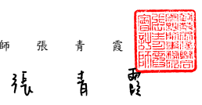
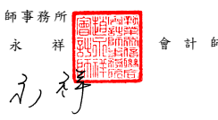

會 計 師 核 閱 報告

國巨 股 份有 限 公司 公鑒:

## 前 言

 國 巨股 份 有限 公司 及 其子公司( 國巨 集 團) 民 國 112 年及 111 年 3 月 31 日之 合 併資 產 負債 表,暨民 國 112 年 及 111 年 1 月 1 日 至 3 月 31 日之合併綜 合損益表、合併權益變動表 、 合 併 現 金 流 量 表 , 以 及 合 併 財 務 報 表 附 註 ( 包 括重 大 會計 政 策彙 總),業 經 本會 計 師 核閱 竣 事。依 證券 發行 人 財務 報 告編 製 準則及經 金融 監 督 管理 委 員會 認 可並 發布 生 效之 國 際會 計準 則 第 34 號「 期 中 財務報導」 編 製 允 當 表 達 之 合 併 財 務 報 表 係 管 理 階 層 之 責 任 , 本 會 計 師 之 責 任係 依 據核 閱 結果 對合 併 財務 報 表作 成結 論 。

## 範 圍

 除 保留 結 論之 基礎 段 所述 者 外,本會 計 師係 依 照 核 閱準 則 2410 號「 財 務 報表 之 核閱 」執行 核閱 工 作。核 閱合 併財 務 報表 時 所執 行之 程 序包 括 查詢( 主 要向 負 責財 務 與會 計事 務 之人 員 查詢 )、分 析性 程 序 及其 他核 閱 程序。核 閱 工 作之範圍明顯小於查核工作之範圍,因此本會計師可能無法察覺所有可藉由 查核 工 作辨 認 之重 大事 項 ,故 無 法表 示查 核 意見 。

## 保 留 結 論 之 基礎

 如 合 併 財 務 報 表 附 註 十 三 所 述 , 列 入 上 開 合 併 財 務 報 表 之 部 分 非 重 要 子 公司 之 同期 間 財務 報表 未 經會 計 師核 閱,其民 國 112 年 及 111 年 3 月 31 日 之 資產 總 額分 別 為新 台幣(以下同 )55,572,724 仟 元及 20,120,449 仟元,分別 占 合 併 資 產 總 額 之 19.41%及 7.89%; 負 債 總 額 共 計 分 別 為 10,668,696 仟 元 及 2,827,283 仟 元,分 別佔 合 併負 債 總額 之 6.47%及 1.88%;其民 國 112 年 及 111 年 1 月 1 日至 3 月 31 日之 綜 合損 益 總額 分別 為 684,837 仟 元 及 567,183 仟 元, 分別 占 各期 合 併綜 合損 益 總額 之 18.58%及 5.23%。 又 如 合 併財 務 報表 附 註 十 四所 述 ,民 國 112 年 及 111 年 3 月 31 日 採 用權 益 法 之 投資 餘 額共 計 分別 為 3,343,831 仟元 及 1,599,955 仟 元,及其民國 112 年及 111 年 1 月 1 日至 3 月 31 日 認列 之 關 聯企 業損 益 份 額 共 計分 別為 (24,759)仟 元 及 45,254 仟 元,暨合 併財務報表附註三 七 附 註 揭 露 事 項 所 述 轉 投 資 事 業 相 關 資 訊 , 係 依 據 被 投 資 公司 同 期間 未 經會 計師 核 閱之 財 務報 表認 列 與揭 露 。

## 保留結論

 依 本 會 計 師 核 閱 結 果 , 除 保 留 結 論 之 基 礎 段 所 述 部 分 非 重 要 子 公 司 及 關 聯企業 之財務報表倘經會計師核閱,對合併財務報表可能有所調整之影響 外,並未發現上開合併財務報表在所有重大方面有未依照證券發行人財務報 告編 製 準則及經 金 融監 督 管理 委 員會 認可 並 發布 生 效之 國際 會 計準 則 第 34 號
「期 中 財務 報 導」 編 製 , 致無 法 允當 表達 國 巨集 團 民 國 112 年 及 111 年 3 月 31 日之 合 併財 務 狀 況,暨 民 國 112 年 及 111 年 1 月 1 日 至 3 月 31 日之 合 併 財 務績 效 及合 併 現金 流量 之 情事 。

* [30] M. C. Gonzalez-Garcia, M. C. Gonzalez-Garcia, M.  
$$\begin{array}{c c c c}{{\bigstar}}&{{\bigstar}}&{{\bigstar}}&{{\bigstar}}\\ {{\bigstar}}&{{\bigstar}}&{{\bigstar}}&{{\bigstar}}\end{array}$$
$${\mathfrak{H}}{}_{\mathbb{H}}$$

$${\mathcal{I}}_{\emptyset}$$

$\blacksquare$
會 計 師 趙 永 祥 會 計 師 張 青 霞
金融監督管理委員會核准文號 金 管 證審 字 第 1050024633 號 金融監督管理委員會核准文號 金 管 證審 字 第 1090347472 號
中 華 民 國 1 1 2 年 4 月 2 0 日
