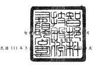
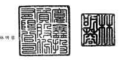
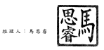
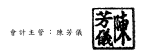

單位:新台幣仟元

|                                                                     | ni年3月31 a                                    | 110 年 12 月 31 a   | 110年3月31 a   |             |              |              |              |     |          |    |    |    |    |
|---------------------------------------------------------------------|------------------------------------------------|---------------------|----------------|-------------|--------------|--------------|--------------|-----|----------|----|----|----|----|
|                                                                     | (經核閱)                                     | (經查核)          | (經核閲)     |             |              |              |              |     |          |    |    |    |    |
| 代碼 1100 1110 1120                                                 | 代碼負                                         | 債                  | 及             | 權          | 益金         | 額           | %            | 金  | 額       | %  | 金 | 額 | %  |
|                                                                     | 流動負債                                       |                     |                |             |              |              |              |     |          |    |    |    |    |
| 2130                                                                | 合約負債一流動(附註二四)                     | S                   | 799,518        | 2           | $            | 841,636      | 3            | $   | 895,990  | 3  |    |    |    |
| 2170                                                                | 應付票據及帳款(附註三一)                     | 10,590,923          | 29             | 11,567,228  | 33           | 10,479,272   | 31           |     |          |    |    |    |    |
| 2206                                                                | 應付員工及董事酬勞(附註二五)                 | 1,294,371           | 4              | 1,053,040   | 3            | 1,232,708    | 4            |     |          |    |    |    |    |
| 2213                                                                | 應付工程及設備款(附註三一)                   | 71,779              | 110,169        | -           | 70,005       |              |              |     |          |    |    |    |    |
| 2219                                                                | 其他應付款(附誑二十及三一)                   | 2,283,065           | 6              | 2,295,178   | 7            | 1,900,567    | 6            |     |          |    |    |    |    |
| 2220                                                                | 其他應付款一關係人(附註三一及三二)           | 3,081               | -              | -           | -            | 3,037        |              |     |          |    |    |    |    |
| 2230                                                                | 本期所得稅負債(附註四及二六)                 | 1,459,753           | 4              | 1,168369    | 3            | 1^24,521     | 5            |     |          |    |    |    |    |
| 2250                                                                | 負債準備一流動(附註二一)                     | 99,847              | -              | 102,430     | 76,451       |              |              |     |          |    |    |    |    |
| 2280                                                                | 租賃負债一流動(附註十五)                     | 216,031             | 1              | 213367      | 1            | 167,950      |              |     |          |    |    |    |    |
| 2313                                                                | 遞延收入一流動(附註十九及二九)               | 10,594              | -              | 11,075      | -            | 10,360       |              |     |          |    |    |    |    |
| 2320                                                                |                                                |                     |                |             |              |              |              |     |          |    |    |    |    |
| 1136                                                                | 111年3月31 0                                   | 110 年 12 月 31 a   | 1W年3月31 a    |             |              |              |              |     |          |    |    |    |    |
| (經核閲)                                                          | (經查核)                                     | (經核閱)          |                |             |              |              |              |     |          |    |    |    |    |
| 資                                                                  | 產 金                                          | 額                  | %              | 金          | 額           | %            | 金           | 額  | %        |    |    |    |    |
| 流動資產 現金及約當現金(附註六及三一)                             | $ 6,669,623                                    | 18                  | $ 6,257,744    | 18          | $ 5,733,649  | 17           |              |     |          |    |    |    |    |
| 透過損益按公允價值衡量之金融資產--流動 (附註七及三一)             | 35,032                                         | -                   | 140,012        | -           | 2^44,521     | 7            |              |     |          |    |    |    |    |
| 透過其他綜合損益按公允價值衡量之金融資產 -流動(附註八及三一)      | 232,071                                        | 1                   | 250,405        | 1           | 199,376      | 1            |              |     |          |    |    |    |    |
| 按攤銷後成本衡量之金融資產一流動(附註九 及三一)                   | 391,274                                        | 1                   | 943,630        | 3           | 4,169,835    | 12           |              |     |          |    |    |    |    |
| 應收票據及帳款淨額(附註十及三一)                                  | 10,264,884                                     | 28                  | 10,316,266     | 29          | 7,475,676    | 22           |              |     |          |    |    |    |    |
| 應收帳款一關係人淨額(附註三一及三二)                              | -                                              | -                   | 39             | -           | 138          | -            |              |     |          |    |    |    |    |
| 其他應收款(咐誌十及三一)                                          | 374,643                                        | 1                   | 405,586        | 1           | 276,926      | 1            |              |     |          |    |    |    |    |
| 其他應收款一關係人(附註三一及三二)                                | 8,922                                          | -                   | 9,078          | -           | 9,765        | -            |              |     |          |    |    |    |    |
| 存貨(附註十一)                                                    | 14,543,626                                     | 40                  | 13,245,641     | 38          | 10,076,929   | 30           |              |     |          |    |    |    |    |
| 頻付款項(附註十八及三二)                                          | 160,160                                        | 1                   | [95,793        | 1           | 698,338      | 2            |              |     |          |    |    |    |    |
| 其他流動資產一其他                                                  | 12,650                                         | -                   | 18,039         | 86,314      | -            |              |              |     |          |    |    |    |    |
| 流動資產總計                                                        | 32,692,885                                     | 90                  | 31,782,233     | 31,071,467  | 92           |              |              |     |          |    |    |    |    |
| 1170 1180 1200 1210 130X 1410 1470 11XX                             | 一年內到期之長期借款(附註十九、二九及三 _)   | 250,465             | 1              | [75325      | 1            |              |              |     |          |    |    |    |    |
|                                                                     | 退款負債一流動(附註二四)                     | 100,448             | 105,639        | 58,323      |              |              |              |     |          |    |    |    |    |
| 21XX                                                                | 流動負債總計                                   | 17,179,875          | 47             | 17,643,456  | 51           | 16,419,184   | 育           |     |          |    |    |    |    |
| 2365                                                                |                                                |                     |                |             |              |              |              |     |          |    |    |    |    |
| 1510                                                                | 非流動負債                                     |                     |                |             |              |              |              |     |          |    |    |    |    |
| 2540                                                                | 長期借款(附鮭十九、二九及三一)               | 935,871             | 3              | 1,003,418   | 3            | 1,167,808    | 3            |     |          |    |    |    |    |
| 2580                                                                | 租賃負債一非流動(附註十五)                   | 1,188,826           | 3              | 753,927     | 2            | 541,965      | 2            |     |          |    |    |    |    |
| 2630                                                                | 遞延收入一非流動(附註十九及二九)             | 31,617              | -              | 37,019      | 46,040       | -            |              |     |          |    |    |    |    |
| 2640                                                                | 淨確定福利負債一非流動(附註四及二二)         | 28,816              | -              | 29,782      | 28,720       |              |              |     |          |    |    |    |    |
| 2645                                                                | 存入保證金(咐註三一)                         | 816                 | -              | 816         | 816          |              |              |     |          |    |    |    |    |
| 25XX                                                                | 非流動負債總計                                 | 2,185,946           | _6             | 1,824,962   | _5           | 1,785,349    | _5           |     |          |    |    |    |    |
| 非流動資產 透過損益按公允價值衡量之金融資產-非流動 (附註七及三一) | 230,749                                        | 1                   | 195,145        | 1           | 179,187      | 1            |              |     |          |    |    |    |    |
| 採用權益法之投資(附註十三)                                        | 11,299                                         | -                   | 11,526         | -           | 12,561       | -            |              |     |          |    |    |    |    |
| 不動產、廠房及設備(附註十四)                                      | 1,442,170                                      | 4                   | 1,487,456      | 4           | 1,457,607    | 4            |              |     |          |    |    |    |    |
| 使用權資產(附註十五)                                              | 1,654,089                                      | 5                   | 1,069,801      | 3           | 712,968      | 2            |              |     |          |    |    |    |    |
| 南譽(附註十六)                                                    | 1,930                                          | -                   | 1,930          | 1,930       |              |              |              |     |          |    |    |    |    |
| 無形資產(附註十七)                                                | 108,401                                        | -                   | 107,351        | 91,334      |              |              |              |     |          |    |    |    |    |
| 遞延所得稅資產(附註四及二六)                                      | 52,532                                         | -                   | 22,531         | 32,863      |              |              |              |     |          |    |    |    |    |
| 預付設備款                                                          | 34,965                                         | -                   | 24,683         | 10,578      |              |              |              |     |          |    |    |    |    |
| 存出保證金(附註三一)                                              | 72,554                                         | 84,298              | 67,771         |             |              |              |              |     |          |    |    |    |    |
| 其他非流動資產~其他(附註十八'三一及三 三)                         | 79您9                                          | 234,415             | 1              | 157,689     | 1            |              |              |     |          |    |    |    |    |
| 非流動資產總計                                                      | 3,688,108                                      | 10                  | 3,239,136      | __9         | 2,724,488    | _8           |              |     |          |    |    |    |    |
| 1550 1600 1755 1805 1821 1840 1915 1920 1990                        | 2XXX                                           | 負價總計            | 均365,821      | 53          | 19,468,418   | 56           | 18,204,533   | 54  |          |    |    |    |    |
|                                                                     | 歸屬於母公司業主之權益(附註二三及二八) 股 本 |                     |                |             |              |              |              |     |          |    |    |    |    |
| 3110                                                                | 普通股股本                                     | 5,600,484           | 16             | 5,599,204   | 16           | 5方94,674    | 16           |     |          |    |    |    |    |
| 3200                                                                | 資本公積                                       | 844,028             | 2              | 843,580     | 2            | 827,658      | 2            |     |          |    |    |    |    |
| 15XX                                                                | 保留盈餘                                       |                     |                |             |              |              |              |     |          |    |    |    |    |
| 3310                                                                | 法定盈餘公積                                   | 2,347,651           | 7              | 2,347,651   | 7            | 1,843,206    | 5            |     |          |    |    |    |    |
| 3320                                                                | 特別盈餘公積                                   | 473,221             | 1              | 473,221     | 1            | 538,244      | 2            |     |          |    |    |    |    |
| 3350                                                                | 未分配盈餘                                     | 8,122,048           | 22             | 6,834,835   | 19           | 7,326,599    | 22           |     |          |    |    |    |    |
| 3300                                                                | 保留盈餘總計                                   | 10,942,920          | 30             | 9,655,707   | 27           | 9,708,049    | 29           |     |          |    |    |    |    |
| 3400                                                                | 其他權益                                       | (                   | 321,261)       | )           | (            | 494541)      | ___ )        | (   | 487,960) | —) |    |    |    |
| 3500                                                                | 庫藏股票                                       | 50,999)            | (              | 50,999)     | (            | 50,999)      |              |     |          |    |    |    |    |
| 31XX                                                                | 本公司業主權益總計                             | 17涸5,172           | 47             | 15,552,951  | 44           | 15,591,422   | 46           |     |          |    |    |    |    |
| 3XXX                                                                | 權益總計                                       | 17,015,172          | 47             | 15,552,951  | 44           | 15,591,422   | 46           |     |          |    |    |    |    |
|                                                                     | 負 債與權益總計                                | $ 36,380,993        | 100            | $ 35,021369 | 100          | $ 33,795,955 | 100          |     |          |    |    |    |    |
| 1XXX                                                                | 資                                             | 產                  | 總             | 計          | $ 36,380,993 | 100          | $ 35,021,369 | 100 |          |    |    |    |    |

後附之附註係本合併財務報告之一部分。

(請參閱勤業眾信聯合會計師事務所民國111年5月12日核閱報告)
:寬鑫投資股份有限公司 代表人:林明蓉

董事長

經理人:馬思睿 會計主管:陳芳儀

-5

