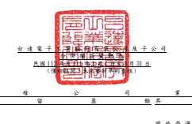
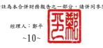
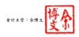

單位:新台幣仟元

歸 屬 於 母 公 司 業 主 之 權 益

保留盈餘 其他權益

附 註 普通股股本 資本公積 法定盈餘公積 特別盈餘公積 未分配盈餘

國外營運機構 財務報表換算 之兌換差額

透過其他綜合

損益按公允價

值衡量之金融 資產未實現 損 益

避 險 工 具 之 損 益 總 計 非控制權益 權益總額

| 111 年  111 年 1 月 1 日餘額               | $ 25,975,433     | $ 49,114,151   | $ 29,697,752   | $ 12,543,208   | $ 53,622,701   | ($ 15,520,287 ) ($   | 776,353 )      | $ 129,917   | $          | 154,786,522   | $ 31,338,136   | $            | 186,124,658   |             |           |
|--------------------------------------------|------------------|----------------|----------------|----------------|----------------|----------------------|----------------|-------------|------------|---------------|----------------|--------------|---------------|-------------|-----------|
|                                            | 本期合併總損益   | -              | -              | -              | -              | 6,058,622            | -              | -           | -          | 6,058,622     | 772,168        | 6,830,790    |               |             |           |
|                                            | 本期其他綜合損益 | -              | -              | -              | -              | 128,613              | 5,767,906      | 33,959      | -          | 5,930,478     | 1,175,330      | 7,105,808    |               |             |           |
| 本期綜合損益總額                           | -                | -              | -              | -              | 6,187,235      | 5,767,906            | 33,959         | -           | 11,989,100 | 1,947,498     | 13,936,598     |              |               |             |           |
| 對子公司所有權權益變動                     | -                | (              | 171,583 )      | -              | -              | -                    | -              | -           | -          | (             | 171,583 )      | -            | (             | 171,583 )   |           |
| 實際取得或處分子公司股權價格與帳面價值差異 | 六(三十二)       | -              | 2,393          | -              | -              | -                    | -              | -           | -          | 2,393         | (              | 38,862 ) (   | 36,469 )      |             |           |
| 111 年 3 月 31 日餘額                      | $ 25,975,433     | $ 48,944,961   | $ 29,697,752   | $ 12,543,208   | $ 59,809,936   | ($                   | 9,752,381 ) ($ | 742,394 )   | $ 129,917  | $             | 166,606,432    | $ 33,246,772 | $             | 199,853,204 |           |
| 112 年  112 年 1 月 1 日餘額               | $ 25,975,433     | $ 49,321,767   | $ 32,386,305   | $ 16,166,722   | $ 65,907,358   | ($                   | 2,530,216 ) ($ | 568,379 )   | $ 129,917  | $             | 186,788,907    | $ 38,578,278 | $             | 225,367,185 |           |
|                                            | 本期合併總損益   | -              | -              | -              | -              | 6,907,725            | -              | -           | -          | 6,907,725     | 1,063,356      | 7,971,081    |               |             |           |
|                                            | 本期其他綜合損益 | -              | -              | -              | -              | 19,187               | (              | 993,637 )   | 553,492    | -             | (              | 420,958 )    | 135,602       | (           | 285,356 ) |
| 本期綜合損益總額                           | -                | -              | -              | -              | 6,926,912      | (                    | 993,637 )      | 553,492     | -          | 6,486,767     | 1,198,958      | 7,685,725    |               |             |           |
| 非控制權益增加                             | -                | -              | -              | -              | -              | -                    | -              | -           | -          | 786,069       | 786,069        |              |               |             |           |
| 112 年 3 月 31 日餘額                      | $ 25,975,433     | $ 49,321,767   | $ 32,386,305   | $ 16,166,722   | $ 72,834,270   | ($                   | 3,523,853 ) ($ | 14,887 )    | $ 129,917  | $             | 193,275,674    | $ 40,563,305 | $             | 233,838,979 |           |

後附合併財務報表附註為本合併財務報告之一部分,請併同參閱。

董事長:海英俊 經理人:鄭平 會計主管:余博文

