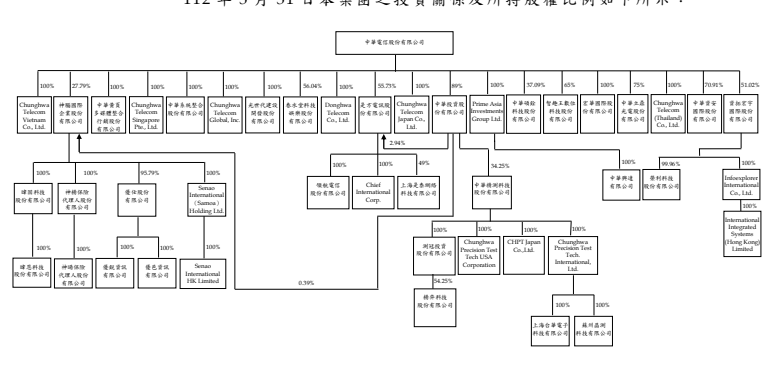

## 三 、 重大 會 計政 策 之彙 總說 明

 除 下列 說 明外 ,請 參 閱 111 年 度 合併 財 務報 告 之重 大會 計 政策 彙 總 說明 。

(一 ) 遵循 聲 明 本 合 併 財 務 報 告 係 依 照 證 券 發 行 人 財 務 報 告 編 製 準 則 及 經 金 融 監 督管 理 委員 會(以 下稱「 金管 會」)認 可並 發 布生 效 之 國 際會 計 準則 第 34 號「 期 中財 務 報 導」 編 製 。 本 合併 財務 報 告並 未 包含 整份 年 度財 務 報告 所 規定 之 所有 國際 財 務報 導 準 則( IFRS)、國 際 會 計 準 則( IAS)、
解釋 (IFRIC) 及解 釋公 告 (SIC)(以 下 稱 IFRSs) 揭露 資 訊。

(二 ) 合併 基 礎 列 入合 併 財務 報告 之 子公 司 :

|                          | 列 入合 併 財務 報告 之 子公 司 :                       | 所                       | 持    | 股   | 權   | 百   | 分   | 比   |    |    |    |    |    |    |         |          |         |       |
|--------------------------|----------------------------------------------------------|--------------------------|-------|------|------|------|------|------|----|----|----|----|----|----|---------|----------|---------|-------|
|                          | 112年                                                    | 111年                    | 111年 |      |      |      |      |      |    |    |    |    |    |    |         |          |         |       |
| 投                       | 資                                                       | 公                       | 司    | 名   | 稱   | 子   | 公   | 司   | 名 | 稱 | 業 | 務 | 性 | 質 | 3月31日 | 12月31日 | 3月31日 | 說 明 |
| 中華電信股份有限公司     | 神腦國際企業股份有限公司                                 | 行動電話及週邊配件銷售、 | 28    | 28   | 28   | 1.   |      |      |    |    |    |    |    |    |         |          |         |       |
| 代理中華電信門號銷售     |                                                          |                          |       |      |      |      |      |      |    |    |    |    |    |    |         |          |         |       |
| 光世代建設開發股份有限公 | 不動產及綠建築業務之規                                   | 100                      | 100   | 100  |      |      |      |      |    |    |    |    |    |    |         |          |         |       |
| 司                       | 劃、整合開發及物業管理                                   | 100                      | 100   | 100  |      |      |      |      |    |    |    |    |    |    |         |          |         |       |
| Donghwa Telecom Co.,     | 提供國際數據專線、IP 虛擬                                |                          |       |      |      |      |      |      |    |    |    |    |    |    |         |          |         |       |
| Ltd.                     | 企業網路、網路轉接服務 等業務                            | 100                      | 100   | 100  |      |      |      |      |    |    |    |    |    |    |         |          |         |       |
| Chunghwa Telecom         | 提供國際數據專線、IP 虛擬                                |                          |       |      |      |      |      |      |    |    |    |    |    |    |         |          |         |       |
| Singapore Pte., Ltd.     | 企業網路、網路轉接服務 等業務                            |                          |       |      |      |      |      |      |    |    |    |    |    |    |         |          |         |       |
| 中華系統整合股份有限公司 | 提供客戶資訊整合服務及通                                 | 100                      | 100   | 100  |      |      |      |      |    |    |    |    |    |    |         |          |         |       |
| 信終端設備               | 56                                                       | 56                       | 56    | 2.   |      |      |      |      |    |    |    |    |    |    |         |          |         |       |
| 中華投資股份有限公司     | 一般投資業務                                             | 89                       | 89    | 89   |      |      |      |      |    |    |    |    |    |    |         |          |         |       |
| 是方電訊股份有限公司     | 網路整合服務、IDC 機房服 務、通信整合服務及雲端 應用服務 |                          |       |      |      |      |      |      |    |    |    |    |    |    |         |          |         |       |
| 中華黃頁多媒體整合行銷股 | 電子資訊供應服務業、一般                                 | 100                      | 100   | 100  |      |      |      |      |    |    |    |    |    |    |         |          |         |       |
| 份有限公司               | 廣告服務業                                               |                          |       |      |      |      |      |      |    |    |    |    |    |    |         |          |         |       |
| Prime Asia Investments   | 一般投資業務                                             | 100                      | 100   | 100  |      |      |      |      |    |    |    |    |    |    |         |          |         |       |
| Group Ltd.               |                                                          |                          |       |      |      |      |      |      |    |    |    |    |    |    |         |          |         |       |
| 春水堂科技娛樂股份有限公 | 資訊軟體服務、網路內容製                                 |                          |       |      |      |      |      |      |    |    |    |    |    |    |         |          |         |       |
| 司                       | 作及播放、電影影片製作 及發行等業務                      | 56                       | 56    | 56   |      |      |      |      |    |    |    |    |    |    |         |          |         |       |
|                          | 100                                                      | 100                      | 100   |      |      |      |      |      |    |    |    |    |    |    |         |          |         |       |
| Chunghwa Telecom         | 提供跨國企業數據服務、網                                 |                          |       |      |      |      |      |      |    |    |    |    |    |    |         |          |         |       |
| Global, Inc.             | 際網路服務及轉接服務 等業務                              |                          |       |      |      |      |      |      |    |    |    |    |    |    |         |          |         |       |
| Chunghwa Telecom         | iEN 節能服務、國際電路、                                 | 100                      | 100   | 100  |      |      |      |      |    |    |    |    |    |    |         |          |         |       |
| Vietnam Co., Ltd.        | ICT 業務                                                 |                          |       |      |      |      |      |      |    |    |    |    |    |    |         |          |         |       |
| 智趣王數位科技股份有限公 | 提供多樣化親子家庭教育數                                 | 65                       | 65    | 65   |      |      |      |      |    |    |    |    |    |    |         |          |         |       |
| 司                       | 位服務                                                   | 100                      | 100   | 100  |      |      |      |      |    |    |    |    |    |    |         |          |         |       |
| Chunghwa Telecom Japan   | 提供國際數據專線、IP 虛擬                                |                          |       |      |      |      |      |      |    |    |    |    |    |    |         |          |         |       |
| Co., Ltd.                | 企業網路、網路轉接服務 等業務                            |                          |       |      |      |      |      |      |    |    |    |    |    |    |         |          |         |       |
| 中華碩銓科技股份有限公司 | 車牌辨識產品及軟體之設                                   | 37                       | 37    | 51   | 3.   |      |      |      |    |    |    |    |    |    |         |          |         |       |
| 計、生產開發             |                                                          |                          |       |      |      |      |      |      |    |    |    |    |    |    |         |          |         |       |
| 宏華國際股份有限公司     | 電信工程、電信業務門號代                                 | 100                      | 100   | 100  |      |      |      |      |    |    |    |    |    |    |         |          |         |       |
| 辦及其他工商服務         |                                                          |                          |       |      |      |      |      |      |    |    |    |    |    |    |         |          |         |       |
| 中華立鼎光電股份有限公司 | 電子零組件及成品之製造及                                 | 75                       | 75    | 75   |      |      |      |      |    |    |    |    |    |    |         |          |         |       |
| 買賣                     |                                                          |                          |       |      |      |      |      |      |    |    |    |    |    |    |         |          |         |       |

|                                                        | 所                                                                                                                        | 持                                                 | 股    | 權    | 百   | 分   | 比   |    |    |    |    |    |    |    |         |          |         |       |
|--------------------------------------------------------|---------------------------------------------------------------------------------------------------------------------------|----------------------------------------------------|-------|-------|------|------|------|----|----|----|----|----|----|----|---------|----------|---------|-------|
|                                                        | 112年                                                                                                                     | 111年                                              | 111年 |       |      |      |      |    |    |    |    |    |    |    |         |          |         |       |
| 投                                                     | 資                                                                                                                        | 公                                                 | 司    | 名    | 稱   | 子   | 公   | 司 | 名 | 稱 | 業 | 務 | 性 | 質 | 3月31日 | 12月31日 | 3月31日 | 說 明 |
|                                                        | 100                                                                                                                       | 100                                                | 100   |       |      |      |      |    |    |    |    |    |    |    |         |          |         |       |
| Chunghwa Telecom                                       | 國際數據專線、IP 虛擬企業                                                                                                 |                                                    |       |       |      |      |      |    |    |    |    |    |    |    |         |          |         |       |
| (Thailand) Co., Ltd.                                   | 網路、ICT、雲端加值服 務等                                                                                                | 71                                                 | 73    | 75    | 4.   |      |      |    |    |    |    |    |    |    |         |          |         |       |
| 中華資安國際股份有限公司                               | 電腦設備安裝、電腦及事務 性機器設備批發零售、資 訊軟體批發零售、管理顧 問服務、資料處理服務、 電子供應服務、網路認證 服務 | 51                                                 | 51    | 51    |      |      |      |    |    |    |    |    |    |    |         |          |         |       |
| 資拓宏宇國際股份有限公司                               | 資訊系統發展及維運、產業 解決方案之開發與銷 售、資訊管理顧問諮詢、 相關產品代理與銷售                                     |                                                    |       |       |      |      |      |    |    |    |    |    |    |    |         |          |         |       |
| 神腦國際企業股份有限                                   | Senao International                                                                                                       | 國際投資業務                                       | 100   | 100   | 100  | 5.   |      |    |    |    |    |    |    |    |         |          |         |       |
| 公司                                                   | (Samoa) Holding Ltd.                                                                                                      |                                                    |       |       |      |      |      |    |    |    |    |    |    |    |         |          |         |       |
| 優仕股份有限公司                                       | 資通訊產品之買賣                                                                                                          | 96                                                 | 96    | 96    |      |      |      |    |    |    |    |    |    |    |         |          |         |       |
| 暐固科技股份有限公司                                   | 資通訊產品之買賣                                                                                                          | 100                                                | 100   | 100   |      |      |      |    |    |    |    |    |    |    |         |          |         |       |
| 神揚保險代理人股份有限公                               | 財產保險代理業務                                                                                                          | 100                                                | 100   | 100   |      |      |      |    |    |    |    |    |    |    |         |          |         |       |
| 司                                                     |                                                                                                                           |                                                    |       |       |      |      |      |    |    |    |    |    |    |    |         |          |         |       |
| 優仕股份有限公司                                       | 優銳資訊有限公司                                                                                                          | 資通訊產品之買賣                                   | 100   | 100   | 100  |      |      |    |    |    |    |    |    |    |         |          |         |       |
| 優邑資訊有限公司                                       | 資通訊產品之維修                                                                                                          | 100                                                | 100   | 100   |      |      |      |    |    |    |    |    |    |    |         |          |         |       |
| 暐固科技股份有限公司                                   | 暐恩科技股份有限公司                                                                                                      | 資通訊產品之買賣                                   | 100   | 100   | 100  |      |      |    |    |    |    |    |    |    |         |          |         |       |
| 神揚保險代理人股份有                                   | 神暘保險代理人股份有限公                                                                                                  | 人身保險代理業務                                   | 100   | 100   | 100  | 6.   |      |    |    |    |    |    |    |    |         |          |         |       |
| 限公司                                                 | 司                                                                                                                        |                                                    |       |       |      |      |      |    |    |    |    |    |    |    |         |          |         |       |
| 是方電訊股份有限公司                                   | 領航電信股份有限公司                                                                                                      | 電信及網路服務                                     | 100   | 100   | 100  |      |      |    |    |    |    |    |    |    |         |          |         |       |
| Chief International Corp.                              | 電信及網路服務                                                                                                            | 100                                                | 100   | 100   |      |      |      |    |    |    |    |    |    |    |         |          |         |       |
| 上海是泰網絡科技有限公司                               | 電信及網路服務                                                                                                            | 49                                                 | 49    | 49    | 7.   |      |      |    |    |    |    |    |    |    |         |          |         |       |
| 中華投資股份有限公司                                   | 中華精測科技股份有限公司                                                                                                  | 半導體測試零組件及印刷電                           | 34    | 34    | 34   | 8.   |      |    |    |    |    |    |    |    |         |          |         |       |
| 路板等電子產品之產銷                                   | 100                                                                                                                       | 100                                                | 100   |       |      |      |      |    |    |    |    |    |    |    |         |          |         |       |
| 中華精測科技股份有限                                   | Chunghwa Precision Test                                                                                                   | 半導體測試零組件及印刷電                           |       |       |      |      |      |    |    |    |    |    |    |    |         |          |         |       |
| 公司                                                   | Tech USA Corporation                                                                                                      | 路板之接案設計及售後 服務                          |       |       |      |      |      |    |    |    |    |    |    |    |         |          |         |       |
| CHPT Japan Co., Ltd.                                   | 電子零件、機械加工品、印                                                                                                  | 100                                                | 100   | 100   |      |      |      |    |    |    |    |    |    |    |         |          |         |       |
| 刷電路板相關服務                                       |                                                                                                                           |                                                    |       |       |      |      |      |    |    |    |    |    |    |    |         |          |         |       |
| Chunghwa Precision Test                                | 電子材料批發業、電子材料                                                                                                  | 100                                                | 100   | 100   |      |      |      |    |    |    |    |    |    |    |         |          |         |       |
| Tech. International, Ltd.                              | 零售業及一般投資業務                                                                                                      |                                                    |       |       |      |      |      |    |    |    |    |    |    |    |         |          |         |       |
| 測冠投資股份有限公司                                   | 一般投資業務                                                                                                              | 100                                                | 100   | 100   | 9.   |      |      |    |    |    |    |    |    |    |         |          |         |       |
|                                                        | 54                                                                                                                        | 54                                                 | -     | 10.   |      |      |      |    |    |    |    |    |    |    |         |          |         |       |
| 測冠投資股份有限公司                                   | 揚弈科技股份有限公司                                                                                                      | 智慧設備製造、銷售、智慧 工廠軟硬體整合及技術 諮詢 |       |       |      |      |      |    |    |    |    |    |    |    |         |          |         |       |
| Senao International HK                                 | 國際投資業務                                                                                                              | 100                                                | 100   | 100   | 11.  |      |      |    |    |    |    |    |    |    |         |          |         |       |
| Limited                                                |                                                                                                                           |                                                    |       |       |      |      |      |    |    |    |    |    |    |    |         |          |         |       |
| Senao International  (Samoa) Holding  Ltd.             | 中華興達有限公司                                                                                                          | 一般投資業務                                       | 100   | 100   | 100  |      |      |    |    |    |    |    |    |    |         |          |         |       |
| Prime Asia  Investments Group  Ltd. 中華興達有限公司   | 上海立華信息科技有限公司                                                                                                  | 企業客戶資通訊整體解決方                           | -     | -     | 100  | 12.  |      |    |    |    |    |    |    |    |         |          |         |       |
| 案、iEN 智慧節能服務                                   |                                                                                                                           |                                                    |       |       |      |      |      |    |    |    |    |    |    |    |         |          |         |       |
| 上海台華電子科技有限公司                               | 印刷電路板的設計及提供技                                                                                                  | 100                                                | 100   | 100   |      |      |      |    |    |    |    |    |    |    |         |          |         |       |
| 術諮詢和技術服務                                       |                                                                                                                           |                                                    |       |       |      |      |      |    |    |    |    |    |    |    |         |          |         |       |
| Chunghwa Precision  Test Tech.  International, Ltd.    | 100                                                                                                                       | 100                                                | 100   |       |      |      |      |    |    |    |    |    |    |    |         |          |         |       |
| 蘇州晶測科技有限公司                                   | 電路板組裝加工銷售、印刷 電路板的設計及提供技 術諮詢和技術服務                                                            |                                                    |       |       |      |      |      |    |    |    |    |    |    |    |         |          |         |       |
| 資拓宏宇國際股份有限                                   | Infoexplorer International                                                                                                | 一般投資業務                                       | 100   | 100   | 100  | 13.  |      |    |    |    |    |    |    |    |         |          |         |       |
| 公司                                                   | Co., Ltd.                                                                                                                 |                                                    |       |       |      |      |      |    |    |    |    |    |    |    |         |          |         |       |
| IISI Investment Co., Ltd.                              | 一般投資業務                                                                                                              | -                                                  | -     | 100   | 14.  |      |      |    |    |    |    |    |    |    |         |          |         |       |
| 榮利科技股份有限公司                                   | 資訊系統發展及維運業務                                                                                                    | 99.96                                              | 99.96 | 99.96 |      |      |      |    |    |    |    |    |    |    |         |          |         |       |
| Infoexplorer  International Co.,  Ltd.                 | 一般投資業務及技術諮詢服                                                                                                  | 100                                                | 100   | 100   | 13.  |      |      |    |    |    |    |    |    |    |         |          |         |       |
| 務                                                     |                                                                                                                           |                                                    |       |       |      |      |      |    |    |    |    |    |    |    |         |          |         |       |
| International Integrated  Systems (Hong Kong)  Limited |                                                                                                                           |                                                    |       |       |      |      |      |    |    |    |    |    |    |    |         |          |         |       |
| IISI Investment Co.,                                   | Leading Tech Co., Ltd.                                                                                                    | 一般投資業務                                       | -     | -     | 100  | 14.  |      |    |    |    |    |    |    |    |         |          |         |       |
| Ltd.                                                   |                                                                                                                           |                                                    |       |       |      |      |      |    |    |    |    |    |    |    |         |          |         |       |
| Leading Tech Co., Ltd.                                 | Leading Systems Co., Ltd.                                                                                                 | 一般投資業務                                       | -     | -     | 100  | 14.  |      |    |    |    |    |    |    |    |         |          |         |       |

1. 中華 電 信公 司 透過 神腦 國 際大 股 東支 持持 續 控 制該公司 13 席董事 席次 中 之 7 席 ,故 將其 列 為子 公 司。

2. 子公 司 是方 電 訊 於 111 年 3 月 及 12 月 發 行新 股 供員 工 依認 股計 畫 行使 認 股權 利 ,致 111 年 3 月 31 日 、111 年 12 月 31 日 及 112 年 3 月 31 日 本 集團 對 是方 電 訊持 股 比例 下降 為 58.72%、58.67%及 58.67%。

3. 中華 電 信公 司 未參 與中 華 碩銓 科 技 111 年 11 月 現金 增 資,致 本 集 團對 中 華碩 銓 科技 持股 比 例下 降 為 37.09%,惟 中 華電 信 公司 持 續 控制 該 公 司 5 席董 事席 次 中 之 3 席, 故將 其 列為 子 公司 。

4. 子公 司 中華 資 安國 際 於 111 年 2 月 及 5 月 暨 112 年 2 月 發行 新 股 供員 工 依認 股 計畫 行使 認 股權 利,致 111 年 3 月 31 日、111 年 12 月 31 日 及 112 年 3 月 31 日 本 集團 對 中 華資 安 國際 持 股比 例下 降 為 74.92%、73.09%及 70.91%。

5. 子公 司 Senao International Samoa. Holding Ltd.於 111 年 11 月 減資 彌 補虧 損 ,減 資比 例 為 96.26%, 本集 團 對其 持 股比 例不 變 。

6. 子公司神揚公司為配合財務 規 劃 及 組 織 資 源 之 調 整 , 決 議通過與 子公司神暘公司合併案,合併後神暘公司為消滅公司。神 揚 公 司 於 112 年 1 月 召開 董事 會 決議 通 過合 併基 準 日 為 112 年 3 月 1 日。 受作 業 程序 影 響, 此合 併 案調 整 變更 合併 基 準日 為 112 年 5 月 1 日。

7. 是方 電 訊依 股 東間 之書 面 協議 取 得上 海是 泰 公 司 3 席 董 事席 次 中 之 2 席 ,對 該 公司 具控 制 ,故 將 其列 為子 公 司。

8. 雖 本 集 團 對 中華 精 測 之 持 股 比 例未 超 過 50%,惟經考量相對於其 他股東所持有表決權之絕對多寡、相對大小及分佈,判斷本集團 具主 導 中華 精 測攸 關活 動 之實 質 能力 ,故 將 其列 為 子公 司。

9. 子公 司 中華 精 測 於 111 年 3 月投 資 成 立測 冠 投資 公 司, 持股 比 例 為 100%。

10. 子公 司 測冠 投 資 於 111 年 5 月投 資 成 立揚 弈 科技 公 司, 持股 比 例 為 54.25%。

11. 子公 司 Senao International HK Limited 於 111 年 8 月 決 議 結束 營 業辦 理 清算 , 清算 程序 尚 在進 行 中。

12. 子公 司 上海 立 華已 於 111 年 10 月 清 算 完結 。 13. 子 公 司 資 拓 宏 宇 國 際 決 議 結 束 Infoexplorer International Co., 
Ltd.及 International Integrated Systems (Hong Kong) Limited 營業 辦 理清 算 ,清 算程 序 尚在 進 行中 。

14. 子 公 司 IISI Investment Co., Ltd.、 Leading Tech Co., Ltd.及 Leading Systems Co., Ltd.已 於 111 年 9 月 完 成註 銷 。

 112 年 3 月 31 日本 集 團之 投 資關 係及 所 持股 權 比例 如下 所 示:

 

## (三 ) 其他 重 大會 計 政策

1. 確定 福 利退 職 後福 利 期 中 期 間 之 退 休 金 成 本 係 採 用 前 一 年 度 結 束 日 依 精 算 決 定 之 退休金成本率,以年初至當期期末為基礎計算,並針對本期之重 大市 場 波動 及 其他 重大 一 次性 事 項加 以調 整 。

2. 所得 稅 所得稅費用 係 當 期 所 得 稅 及 遞 延 所 得 稅 之 總 和 。 期 中 期 間 之 所得稅係以年度為基礎進行評估,以預期年度總盈餘所適用之稅 率, 就 期中 稅 前利 益予 以 計算 。 遞 延 所 得 稅 資 產 及 負 債 之 衡 量 係 反 映 本 集 團 於 資 產 負 債 表 日 預 期 回 收 或 清 償 其 資 產 及 負 債 帳 面 金 額 之 方 式 所 產 生 之 租 稅 後 果。

## 四 、 重大 會 計判 斷 、估 計及假設不 確 定性 之主 要 來源

 本集團 於 採 用 會 計 政 策 時 , 對 於 不 易 來 自 其 他 來 源 取 得 相 關 資 訊 者 , 管 理 階 層 必 須 基 於 歷 史 經 驗 及 其 他 攸 關 之 因 素 作 出 相 關 之 判 斷 、 估 計及 假 設。 實 際結 果可 能 與估 計 有所 不同 。

 管理階層將 持 續 檢 視 估 計 與 基 本 假 設 。 若 估 計 之 修 正 僅 影 響 當 期 ,
則於修正當 期 認 列 。 若 會 計 估 計 之 修 正 同 時 影 響 當 期 及 未 來 期 間 , 則 於 修正 當 期及 未 來期 間認 列 。 本 合 併 財 務 報 告 所 採 用 之 重 大 會 計 判 斷 、 估 計 及 假 設 不 確 定 性 主 要 來源 請 參 閱 111 年 度合 併 財務 報 告。

五 、 新發 布 及修 訂 準則 及解 釋 之適 用
(一 ) 首次 適 用金 管 會認 可並 發 布生 效 之 IFRSs 適 用金 管 會認 可並 發 布生 效 之 IFRSs 不致 對 本集 團 合併 財 務報 告 造成 重 大影 響 。

(二 ) 國 際 會 計 準 則 理 事 會 ( IASB) 已 發 布 但 尚 未 經 金 管 會 認 可 並 發 布 生 效 之 IFRSs

|                          |                                  | I A S B                   | 發布之生效日   |    |    |    |    |    |    |    |    |    |    |    |    |    |    |
|--------------------------|----------------------------------|---------------------------|----------------|----|----|----|----|----|----|----|----|----|----|----|----|----|----|
| 新                       | 發                               | 布                        | /             | 修 | 正 | / | 修 | 訂 | 準 | 則 | 及 | 解 | 釋 | ( | 註 | 1  | ) |
| IFRS 10 及 IAS 28 之修正 | 「投資者與其關聯企業或合資間之資 | 未                        | 定             |    |    |    |    |    |    |    |    |    |    |    |    |    |    |
|                          | 產出售或投入」                   |                           |                |    |    |    |    |    |    |    |    |    |    |    |    |    |    |
| IFRS 16 之修正           | 「售後租回中之租賃負債」         | 2024 年 1 月 1 日(註 2) |                |    |    |    |    |    |    |    |    |    |    |    |    |    |    |
| IAS 1 之修正             | 「負債分類為流動或非流動」       | 2024 年 1 月 1 日         |                |    |    |    |    |    |    |    |    |    |    |    |    |    |    |
| IAS 1 之修正             | 「具合約條款之非流動負債」       | 2024 年 1 月 1 日         |                |    |    |    |    |    |    |    |    |    |    |    |    |    |    |

註 1: 除另註明外,上述新發布/修正/修訂準則或解釋係於各該日 期以 後 開始 之 年度 報導 期 間生 效 。

註 2: 賣方 兼 承租 人 應對 初次 適 用 IFRS 16 日後 簽 訂之 售 後租 回交 易 追溯 適 用 IFRS 16 之修 正 。

 截 至 本 合 併 財 務 報 告 通 過 發 布 日 止 , 本 集 團 仍 持 續 評 估 上 述 準 則、解釋之修正對財務狀況與財務 績 效 之 影 響 , 相 關 影 響 待 評 估 完 成 時予 以 揭露 。