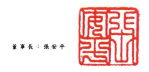
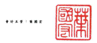

早但:新台餐厅无

| H   | 境                                                                                                            | .                 |                  |              |                      |                |                |                  |                 |                  |                   |                 |               |               |                   |              |               |
|-----|---------------------------------------------------------------------------------------------------------------|-------------------|------------------|--------------|----------------------|----------------|----------------|------------------|-----------------|------------------|-------------------|-----------------|---------------|---------------|-------------------|--------------|---------------|
|     | 进通关地域合                                                                                                  |                   |                  |              |                      |                |                |                  |                 |                  |                   |                 |               |               |                   |              |               |
|     | 颜旦程公允值值                                                                                                |                   |                  |              |                      |                |                |                  |                 |                  |                   |                 |               |               |                   |              |               |
|     | -                                                                                                             | 对 路 组 大 换 里 | 倒景之会贴费品   |              |                      |                |                |                  |                 |                  |                   |                 |               |               |                   |              |               |
| A 4 | 普通 胶 胶 车 特 别 胶 胶 车 宜春镇胶程村设备                                                                 | #                 | 公               | 缘           | 到日出会中国中国出版 | 土 光 换 星 级 | 么實現評價獨立 | 观段工具模型     | R               | 12               | 富 文 和 辽 评 城 | # 板 料 # 具 幅 |               |               |                   |              |               |
| A1  | 110年1月1日給頭                                                                                               | $ 57,414,007      | $ 2,000,000      | 5            | 648,542              | $ 49,122,450   | 3,039,966      | 8- 41,808,25.    | ( 5 9,523,576 ) | $ 30,670,817     | (5                | 250 }           | 15            | 499,697 )     | $ 204,071,817     | $ 14,758,236 | $ 218,830,053 |
| D1  | # #                                                                                                           | 3,328,974         | 3,318,974        | 411,263      | 3,730,237            |                |                |                  |                 |                  |                   |                 |               |               |                   |              |               |
| נם  | 其他综合颜益                                                                                                  | ( __ 1,635,528 )  |                  | 102 238      | 250                  | 497,827 )      | 【_            | -683.024 )       |                 |                  |                   |                 |               |               |                   |              |               |
|     | ৰ মাজত বিশ্ববিদ্যালয় বিশ্ববিদ্যালয় বিশ্ববিদ্যালয় বিশ্ববিদ্যালয় বিশ্ববিদ্যালয় বিশ্ববিদ্যালয় বিশ্ববিদ্যালয় বিশ্ববিদ্যালয় বিশ্ববিদ্যালয় বিশ্ববিদ্যালয় প্ৰথম বিশ্বকাপ কৰ |                   |                  |              |                      |                |                |                  |                 |                  |                   |                 |               |               |                   |              |               |
| 125 | 110年1月1日至3月31日驻会制监测                                                                                | 3.33.974          | ( __ 1,635,571 ) | 937,501      | 252                  | 2,621,142      | -              | 3.037.213        |                 |                  |                   |                 |               |               |                   |              |               |
| M5  | 取得或高分子公司股權價格利领回價值益期                                                                        | :                 | (                | 22,400 )     | 153 782              | .              | 1              | 374.182 ]        | 254,100 ) {     | 628,283 )        |                   |                 |               |               |                   |              |               |
| =   | 可用换公司值利益                                                                                              | 1,542,649         | .                | 70,595 )     | 2,920,077            | 4,391,931      | 4,391,931      |                  |                 |                  |                   |                 |               |               |                   |              |               |
| M7  | 對于公司所有權權益受動                                                                                        | 662 )             | 662 ]            | _234 )       | - $000 )             |                |                |                  |                 |                  |                   |                 |               |               |                   |              |               |
| 21  | 110 年 3 月 31 日動頭                                                                                         | 2                 | 2.020.000        | 2            | ... $17.842          | 5 52019.465    | 4.775.480      | ( = 11.159.154 ) | $ 31.608.318    |                  |                   |                 |               |               |                   |              |               |
|     | 13,039 860                                                                                                    | ( 5 492.651 )     | $ 210.710.051    | 5 14 519.963 | $ 225.632.014        |                |                |                  |                 |                  |                   |                 |               |               |                   |              |               |
| A1  | 111 年 1 月 1 日 份 编                                                                                        | $ 61,252,340      | $ 2,000,000      | 5            | 1                    | $ 56,757,470   | <              | 21.88            | 600-300         | ( $ 16,068,895 } | $ 26,968,509      | ક               | 网            | ( $ 392,343 ) | $ 204,477,333     | $ 21,177,340 | $ 225,654,673 |
| DI  | * *                                                                                                           | .                 | .                | 1,204,144    | 347 (638 )           | 856,506        |                |                  |                 |                  |                   |                 |               |               |                   |              |               |
| DJ  | 其此综合程具                                                                                                  | 3.776 )           | (-               | 1276 )       | 8.481.836            | 635,760        | 9.113.820      | 130,505          | - 9.244.225     |                  |                   |                 |               |               |                   |              |               |
| DS  | 111年1月1日星3月31日综合播放给新                                                                              | 1,200,366         | -- 1,200,168     | - 8.431.836  | - - -                | -10.317.964    | 217,133 )      | -10,100,831      |                 |                  |                   |                 |               |               |                   |              |               |
| ﻛﻠﻴ | 对中公司所有强调且受到                                                                                        | 1.46              | 1                | 1.466        | ... 785              | 2.251          |                |                  |                 |                  |                   |                 |               |               |                   |              |               |
| ZI  | 111 年3月 31 8 投资                                                                                           | 5 61,252,340      | $ 2,000,000      | 5 56,758,936 | 5 21,881,915         | 5 13.039.260   | $ 40.218.445   | 5 22.142.220     | ( $ 2,587,059 ) | 8 27,624,669     | ( 2               | 192.343 )       | $ 214,796,763 | 5 20,960,922  | $ 235,552,757,755 |              |               |

股刑之所以為本合併則過程合之一部分 -
(请参周助言本红明合會計同事務所民國 111年5月 10日在國親者)

- 9 -