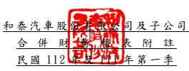

(僅經核閱 ,未依 審計準 則查核 )
單位:新 台幣仟 元 (除特別註 明者外 )

## 一、 公司沿革

和泰汽車 股份有 限公司 (以下簡 稱「 本公 司」)於中華 民國設 立。本公司 及子公 司 (以下統稱「 本集團 」)主 要經營 業務包 括各種車 輛及其 零件之 進口、買賣 及銷 售 維修服務 、 各種車輛 之 分 期 買 賣 及 租 賃 、 中 古 車 買 賣 交 易 與 各 項 產 物 保 險 業 務 等。

## 二、 通過財務 報告之 日期及 程序

本合併財 務報告 已於民國 112 年 5 月 11 日提報董 事會後 發布。

三、 新發布及 修訂準 則及解 釋之適 用
(一)已採用金融監督管理委員會 (以 下 簡 稱 「 金 管 會 」 )認 可 並 發 布 生 效 之 新 發 布、修正 後國際 財務報 導準則 之影響 下表彙列 金管會 認可並 發布生 效之 民 國 112 年 適用之 國際財 務報導準 則之 新發布、 修正及 修訂之 準則及 解釋:

|                          | 國際會計準則理事會             |                 |                 |
|--------------------------|--------------------------------|-----------------|-----------------|
|                          | 新發布/修正/修訂準則及解釋     | 發布之生效日    |                 |
| 國際會計準則第1號之修正  | 「會計政策之揭露」             |                 | 民國112年1月1日 |
| 國際會計準則第8號之修正  | 「會計估計之定義」             |                 | 民國112年1月1日 |
| 國際會計準則第12號之修正 | 「與單一交易所產生之資產及負債 | 民國112年1月1日 |                 |
| 有關之遞延所得稅」       |                                |                 |                 |

本 集 團 經 評 估 上 述 準 則 及 解 釋 對 本 集 團 財 務 狀 況 與 財 務 績 效 並 無 重 大 影 響。

(二)尚未採用 金管會 認可之 新發布 、修正 後 國際財務 報導準 則之影 響 無。