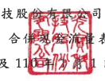
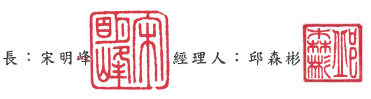

光寶科技股

表
司及子公司 民國 111年及 1 日至 3月 31 日
(僅經核閱,未依一般公認審計準則查核)
單位:新台幣仟元

|                  | 111年1月1日                | 110年1月1日   |             |             |           |
|------------------|----------------------------|---------------|-------------|-------------|-----------|
|                  | 至3月31日                  | 至3月31日     |             |             |           |
| 代 碼            | 營業活動之現金流量         |               |             |             |           |
| A10000           | 税前净利                   | କି             | 2,656,867   | $ 5,487,315 |           |
| A20010           | 收益費損項目               |               |             |             |           |
| A20100           | 折舊費用                   | 1,067,205     | 947,557     |             |           |
| A20200           | 攤銷費用                   | 36,355        | 44,923      |             |           |
| A20300           | 預期信用減損損失           | 1,719         | 537,955     |             |           |
| A20400           | 透過損益按公允價值衡量金融 |               |             |             |           |
| 資產及負債之淨益 | (                          | 292,030 )     | (           | 3,535,394)  |           |
| A20900           | 利息費用                   | 58,749        | 39,506      |             |           |
| A21200           | 利息收入                   | 147,606)      |             |             |           |
|                  | (                          | (             | 167,057 )   |             |           |
| A22300           | 採用權益法認列之關聯企業損 |               |             |             |           |
| 失份額           | 1,581                      | 2,860         |             |             |           |
| A22500           | 處分不動產、廠房及設備淨益 | (             | 5,553 )     | 9,392)      |           |
| A23700           | 非金融資產減損損失         | 195,580       | 139,352     |             |           |
| A24100           | 未實現外幣兌換淨損         | 854,753       | 330,126     |             |           |
| A29900           | 處分子公司淨損             | 24,035        |             |             |           |
| A29900           | 提列(迴轉)負債準備         | (             | 34 )        | 62,365      |           |
| A30000           | 營業資產及負債之淨變動數   |               |             |             |           |
| A31115           | 強制透過損益按公允價值衡量 |               |             |             |           |
| 之金融資產       | 209,749                    | 550,325       |             |             |           |
| A31125           | 合約資產                   | 85,473        | 185,075     |             |           |
| A31130           | 應收票據                   | 148,792 )     | 159,897     |             |           |
|                  | (                          |               |             |             |           |
| A31150           | 應收帳款                   | 3,732,319     | 2,879,787   |             |           |
| A31160           | 應收帳款--關係人           | 104           | 26,204      |             |           |
| A31180           | 其他應收款                 | (             | 155,924 )   | 1,085,685   |           |
| A31190           | 其他應收款一關係人         | 3,265         | 2,157       |             |           |
| A31200           | 存 貨                      | 1,736,912     | 1,649,254 ) |             |           |
| A31240           | 其他流動資產               | 162,938 )     | 375,148)    |             |           |
| A32130           | 應付票據                   | 32)           | 143         |             |           |
| A32150           | 應付帳款                   | 3,407,184 )   | 760,106     |             |           |
| A32160           | 應付帳款一關係人           | (             | 37,635)     | (           | 208,180 ) |
| (接次頁)         |                            |               |             |             |           |

|                      | 111年1月1日                    | 110年1月1日   |             |        |           |
|----------------------|--------------------------------|---------------|-------------|--------|-----------|
|                      | 至3月31日                      | 至3月31日     |             |        |           |
| 代 碼                |                                |               |             |        |           |
| A32180               | 其他應付款                     | ( ਟੇ           | 358,314 )   | ( $    | 516,555 ) |
| A32190               | 其他應付款一關係人             | (             | 1,212)      | 11,224 |           |
| A32200               | 負債準備                       | 40,741 )      | 51,908)     |        |           |
| A32210               | 預收款項                       | 296,940       | 30,713 )    |        |           |
|                      | (                              |               |             |        |           |
| A32240               | 淨確定福利負債                 | 5,131 )       | 2,947)      |        |           |
| A33000               | 營運產生之現金流入             | 6,174,445     | 6,730,049   |        |           |
| A33100               | 收取之利息                     | 123,240       | 178,209     |        |           |
| A33300               | 支付之利息                     | 54,679)       | 42,769)     |        |           |
| A33500               | 支付之所得稅                   | 392,022)      | 216,970)    |        |           |
| 營業活動之淨現金流入 | 5,850,984                      | 6,648,519     |             |        |           |
| AAAA                 | 投資活動之現金流量             |               |             |        |           |
| B00010               | 取得透過其他綜合損益按公允價值 |               |             |        |           |
| 衡量之金融資產       | (                              | 27,647 )      |             |        |           |
| B00100               | 取得透過損益按公允價值衡量之金 |               |             |        |           |
| 融資產               | (                              | 13,107,120)   | -           |        |           |
| B00200               | 處分透過損益按公允價值衡量之金 |               |             |        |           |
| 融資產               | 7,834,277                      | -             |             |        |           |
| B00040               | 取得按攤銷後成本衡量之金融資產 | (             | 2)          | (      | 67,197 )  |
| B00050               | 處分按攤銷後成本衡量之金融資產 | -             | 88,340      |        |           |
| B02700               | 購置不動產、廠房及設備         | (             | 1,048,623 ) | (      | 849,132)  |
| B02800               | 處分不動產、廠房及設備         | 8,105         | 10,298      |        |           |
| B03800               | 存出保證金減少                 | 8,355         | 29,280      |        |           |
|                      | 14,301 )                       |               |             |        |           |
| B04500               | 取得無形資產                   | 22,596)       | (           | 10.052 |           |
| B06700               | 其他非流動資產減少(增加)       | 5,603 )       |             |        |           |
| BBBB                 | 投資活動之淨現金流出           | 6,360,854 )   | 792,660)    |        |           |
| 筹資活動之現金流量   |                                |               |             |        |           |
| C00200               | 短期借款減少                   | 1,217,614 )   | 6,542,329)  |        |           |
|                      | (                              | (             |             |        |           |
| C03000               | 存入保證金增加                 | 9,623         | 3,181       |        |           |
| C04020               | 租賃負債本金償還               | (             | 109,530)    | (      | 65,087 )  |
| C05500               | 處分子公司部分權益價款         | 54,840        | =           |        |           |
| CCCC                 | 筹資活動之淨現金流出           | 1,262,681 )   | 6,604,235)  |        |           |
| DDDD                 | 匯率變動對現金及約當現金之影響 | 2,013,941     | 540,147     |        |           |

|        | 111年1月1日                  | 110年1月1日   |              |    |           |
|--------|------------------------------|---------------|--------------|----|-----------|
| 代 碼  | 至3月31日                    | 至3月31日     |              |    |           |
| EEEE   | 現金及約當現金淨增加(減少)數 | ക്ക            | 241,390      | ($ | 208,229 ) |
| E00100 | 期初現金及約當現金餘額       | 68,275,835    | 71,508,036   |    |           |
| E00200 | 期末現金及約當現金餘額       | $ 68,517,225  | $ 71,299,807 |    |           |

後附之附註係本財務報告之一部分。

(請參閱勤業眾信聯合會計師事務所民國 111年 4 月 28 日核閱報告 )

董事長:宋明此

