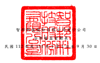

單 位 : 新 台 幣 仟 元

|                                                     | 其                                            | 他          | 權                                   | 益                                                                           |             |           |             |              |          |           |           |             |     |          |              |
|-----------------------------------------------------|-----------------------------------------------|-------------|--------------------------------------|------------------------------------------------------------------------------|-------------|-----------|-------------|--------------|----------|-----------|-----------|-------------|-----|----------|--------------|
|                                                     | 透過其他綜合                                  |             |                                      |                                                                              |             |           |             |              |          |           |           |             |     |          |              |
|                                                     | 國外營運機構 損 益 按 公 允 價 值             |             |                                      |                                                                              |             |           |             |              |          |           |           |             |     |          |              |
| 保                                                  | 留                                            | 盈          | 餘 財務報表換算 衡 量 之 金 融 資 產 |                                                                              |             |           |             |              |          |           |           |             |     |          |              |
| 代 碼                                               | 普 通 股 股 本 資                             | 本          | 公                                   | 積 法定盈餘公積 特別盈餘公積 未 分 配 盈 餘 之 兌 換 差 額 未 實 現 損 益 庫 | 藏          | 股        | 票 權       | 益           | 總       | 計        |           |             |     |          |              |
| A1                                                  | 111 年 1 月 1 日餘額                          | $ 5,599,204 | $                                    | 843,580                                                                      | $ 2,347,651 | $         | 473,221     | $ 6,834,835  | ( $      | 493,628 ) | ( $       | 913 )       | ( $ | 50,999 ) | $ 15,552,951 |
| M1                                                  | 發放予子公司股利調整資本公積                  | -           | 13,256                               | -                                                                            | -           | -         | -           | -            | -        | 13,256    |           |             |     |          |              |
| 110 年度盈餘指撥及分配                              |                                               |             |                                      |                                                                              |             |           |             |              |          |           |           |             |     |          |              |
| B1                                                  | 法定盈餘公積                                  | -           | -                                    | 470,713                                                                      | -           | (         | 470,713 )   | -            | -        | -         | -         |             |     |          |              |
| B3                                                  | 特別盈餘公積                                  | -           | -                                    | -                                                                            | 21,320      | (         | 21,320 )    | -            | -        | -         | -         |             |     |          |              |
| B5                                                  | 股東現金股利                                  | -           | -                                    | -                                                                            | -           | (         | 3,359,576 ) | -            | -        | -         | (         | 3,359,576 ) |     |          |              |
| D1                                                  | 111 年 1 月 1 日至 9 月 30 日淨利             | -           | -                                    | -                                                                            | -           | 5,821,283 | -           | -            | -        | 5,821,283 |           |             |     |          |              |
| D3                                                  | 111 年 1 月 1 日至 9 月 30 日其他綜合損益     | -           | -                                    | -                                                                            | -           | -         | 222,215     | (            | 95,530 ) | -         | 126,685   |             |     |          |              |
| D5                                                  | 111 年 1 月 1 日至 9 月 30 日綜合損益總額     | -           | -                                    | -                                                                            | -           | 5,821,283 | 222,215     | (            | 95,530 ) | -         | 5,947,968 |             |     |          |              |
| N1                                                  | 股份給付基礎交易                              | 1,380       | 479                                  | -                                                                            | -           | -         | -           | -            | -        | 1,859     |           |             |     |          |              |
| Z1                                                  | 111 年 9 月 30 日餘額                         | $ 5,600,584 | $                                    | 857,315                                                                      | $ 2,818,364 | $         | 494,541     | $ 8,804,509  | ( $      | 271,413 ) | ( $       | 96,443 )    | ( $ | 50,999 ) | $ 18,156,458 |
| A1                                                  | 112 年 1 月 1 日餘額                          | $ 5,601,399 | $                                    | 857,568                                                                      | $ 2,818,364 | $         | 494,541     | $ 11,169,304 | ( $      | 371,447 ) | ( $       | 90,569 )    | ( $ | 50,999 ) | $ 20,428,161 |
| M1                                                  | 發放予子公司股利調整資本公積                  | -           | 16,574                               | -                                                                            | -           | -         | -           | -            | -        | 16,574    |           |             |     |          |              |
| 111 年度盈餘指撥及分配                              |                                               |             |                                      |                                                                              |             |           |             |              |          |           |           |             |     |          |              |
| B1                                                  | 法定盈餘公積                                  | -           | -                                    | 818,608                                                                      | -           | (         | 818,608 )   | -            | -        | -         | -         |             |     |          |              |
| B3                                                  | 特別盈餘公積                                  | -           | -                                    | -                                                                            | (           | 32,525 )  | 32,525      | -            | -        | -         | -         |             |     |          |              |
| B5                                                  | 股東現金股利                                  | -           | -                                    | -                                                                            | -           | (         | 4,201,117 ) | -            | -        | -         | (         | 4,201,117 ) |     |          |              |
| D1                                                  | 112 年 1 月 1 日至 9 月 30 日淨利             | -           | -                                    | -                                                                            | -           | 6,667,869 | -           | -            | -        | 6,667,869 |           |             |     |          |              |
| D3                                                  | 112 年 1 月 1 日至 9 月 30 日其他綜合損益     | -           | -                                    | -                                                                            | -           | -         | 146,194     | 79,635       | -        | 225,829   |           |             |     |          |              |
| D5                                                  | 112 年 1 月 1 日至 9 月 30 日綜合損益總額     | -           | -                                    | -                                                                            | -           | 6,667,869 | 146,194     | 79,635       | -        | 6,893,698 |           |             |     |          |              |
| N1                                                  | 股份給付基礎交易                              | 190         | 59                                   | -                                                                            | -           | -         | -           | -            | -        | 249       |           |             |     |          |              |
| Q1                                                  | 處分透過其他綜合損益按公允價值衡量之權益 工具 | -           | -                                    | -                                                                            | -           | 9,546     | -           | (            | 9,546 )  | -         | -         |             |     |          |              |
| Z1                                                  | 112 年 9 月 30 日餘額                         | $ 5,601,589 | $                                    | 874,201                                                                      | $ 3,636,972 | $         | 462,016     | $ 12,859,519 | ( $      | 225,253 ) | ( $       | 20,480 )    | ( $ | 50,999 ) | $ 23,137,565 |
| 後 附 之 附 註 係 本 合 併 財務 報告 之 一 部 分 。 |                                               |             |                                      |                                                                              |             |           |             |              |          |           |           |             |     |          |              |

( 請 參 閱 勤 業 眾 信 聯 合 會 計 師 事 務 所 民 國 112 年 11 月 9 日 核閱 報 告 )

董 事 長 : 寬 鑫 投 資 股 份 有 限 公 司 代表人: 林明蓉 經 理 人 : 石軍 會 計 主 管 : 陳 芳 儀
- 7 -

