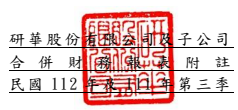

單位:新 台幣仟 元 (除特別註 明者外 )

## 一、 公司沿革

(一)研華 股份有 限公司 (以下簡 稱「 本公 司」)於 民國 70 年 9 月成立,營運 總部 設於台灣 台北內 湖科學 園區。主 要從事 嵌入式板 卡、工業 控制產 品、應用 電 腦及工業 用電腦 之研發 、設計 、製造 與 行銷等業 務。

(二)本公 司股票 自民國 88 年 12 月起 在 台灣證券 交易所 上市交 易 。 (三)研華 為物聯 網智能 系統與 嵌入式 平 台產業之 全球領 導廠商,並以「永 續地球 的智能推 手」作為 企業品 牌願景,依據 客戶需求 區分成 工業物 聯網事 業群、 嵌入式物 聯網平 台事業 群、服務 物聯網 事業群三 大事業 群。為迎 接物聯 網、 大 數 據 與 人 工 智 慧 之 大 趨 勢 , 研 華 提 出 以 工 業 物 聯 網 雲 平 台 為 核 心 之 物 聯 網軟、硬 體解決 方案, 以協助 夥伴客 戶 串接產業 鏈。

## 二、 通過財務 報告之 日期及 程序

本合併財 務報告 已於民國 112 年 10 月 30 日經董事會 通過後 發布 。

三、 新發布及 修訂準 則及解 釋之適 用
(一)已採用金融監督管理委員會 (以 下 簡 稱 「 金 管 會 」 )認 可 並 發 布 生 效 之 新 發 布、修正 後國際 財務報 導準則 之影響 下表彙列 金管會 認可 並 發布生 效之民 國 112 年 適用之 國際財 務報導準 則之 新發布、 修正及 修訂之 準則及 解釋:

|                          | 國際會計準則理事會           |                  |                 |
|--------------------------|------------------------------|------------------|-----------------|
|                          | 新發布/修正/修訂準則及解釋   | 發布之生效日     |                 |
| 國際會計準則第1號之修正  | 「會計政策之揭露」           |                  | 民國112年1月1日 |
| 國際會計準則第8號之修正  | 「會計估計值之定義」         |                  | 民國112年1月1日 |
| 國際會計準則第12號之修正 | 「與單一交易所產生之資產及負 | 民國112年1月1日  |                 |
| 債有關之遞延所得稅」     |                              |                  |                 |
| 國際會計準則第12號之修正 | 「國際租稅變革-支柱二規則範 | 民國112年5月23日 |                 |
| 本」                     |                              |                  |                 |

除 下 列 所 述 者 外 , 本 集 團 經 評 估 上 述 準 則 及 解 釋 對 本 集 團 財 務 狀 況 與 財 務 績效並無 重大影 響: 國際會計 準則第 12 號之 修正「 國際稅 務 變革 -支柱 二規則 範本」 此 修 正 為 認 列 或 揭 露 因 施 行 經 濟 合 作 暨 發 展 組 織 發 布 之 支 柱 二 規 則 範 本 而 已 立 法 或 已 實 質 性 立 法 之 稅 法 產 生 之 遞 延 所 得 稅 提 供 一 暫 時 性 例 外 規 定 , 企 業 既 不 得 認 列 有 關 支 柱 二 所 得 稅 之 遞 延 所 得 稅 資 產 及 負 債 亦 不 得 揭 露 其 相關資訊 。

(二)尚未採用 金管會 認可之 新發布 、修正 後 國際財務 報導準 則之影 響 下表彙列 金管會 認可之 民國 1 13 年適用 之國際財 務報導 準則之 新發布 、修 正及修訂 之準則 及解釋 :

|                                                | 國際會計準則理事會         |                 |                 |
|------------------------------------------------|----------------------------|-----------------|-----------------|
|                                                | 新發布/修正/修訂準則及解釋 | 發布之生效日    |                 |
| 國際財務報導準則第16號之修正                   | 「售後租回中之租賃負債」   |                 | 民國113年1月1日 |
| 國際會計準則第1號之修正                        | 「負債之流動或非流動分類」 |                 | 民國113年1月1日 |
| 國際會計準則第1號之修正                        | 「具合約條款之非流動負債」 |                 | 民國113年1月1日 |
| 國際會計準則第7號及國際財務報導準則第7號之修正 | 「供應                     | 民國113年1月1日 |                 |
| 商融資安排」                                   |                            |                 |                 |

本集團經 評 估 上 述 準 則 及 解 釋 對 本 集 團 財 務 狀 況 與 財 務 績 效 並 無 重 大 影 響。

(三)國際會計準則理事會已發布但尚未經金管會認可之國際財務報導準則之影

## 響

| 導準則之 新發布 、修正 及修訂 之準則 及 解釋:                                            | 國際會計準則理事會         |                    |                 |
|-------------------------------------------------------------------------------------------|----------------------------|--------------------|-----------------|
|                                                                                           | 新發布/修正/修訂準則及解釋 | 發布之生效日       |                 |
| 國際財務報導準則第10號及國際會計準則第28號之修正                                          | 「投                       | 待國際會計準則理事 |                 |
| 資者與其關聯企業或合資間之資產出售或投入」                                                |                            | 會決定             |                 |
| 國際財務報導準則第17號                                                                    | 「保險合約」               |                    | 民國112年1月1日 |
| 國際財務報導準則第17號                                                                    | 「保險合約」之修正         | 民國112年1月1日    |                 |
| 國際財務報導準則第17號之修正                                                              | 「初次適用國際財務報導準   | 民國112年1月1日    |                 |
| 則第17號及國際財務報導準則第9號—比較資訊」                                                |                            |                    |                 |
| 國際會計準則第21號之修正                                                                  | 「缺乏可兌換性」           |                    | 民國114年1月1日 |
| 本 集 團 經 評 估 上 述 準 則 及 解 釋 對 本 集 團 財 務 狀 況 與 財 務 績 效 並 無 重 大 |                            |                    |                 |
|                                                                                           | 影                         |                    |                 |

下 表 彙 列 國 際 會 計 準 則 理 事 會 已 發 布 但 尚 未 納 入 金 管 會 認 可 之 國 際 財 務 報 導準則之 新發布 、修正 及修訂 之準則 及 解釋: 本 集 團 經 評 估 上 述 準 則 及 解 釋 對 本 集 團 財 務 狀 況 與 財 務 績 效 並 無 重 大 影 響。

## 四、 重大會計 政策之 彙總說 明

重大會計 政策除 遵循聲 明、編製基 礎、合併基礎 及新增 部分說 明如下,餘 與民 國 111 年度合併 財務報 表附註 四相同。除 另有說明 外,此等政 策在所 有報導 期間 一 致地適用 。

## (一)遵循聲明

1.本 合 併 財 務 報 告 係 依 照 證 券 發 行 人 財 務 報 告 編 製 準 則 及 經 金 管 會 認 可 並 發布生效 之國際 會計準 則第 34 號「期 中 財務報導 」編製 。