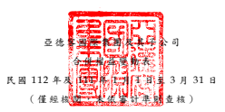

單位 :除 另予 註明 者 外
,係 新台 幣仟 元

| 歸                                            | 屬                                         | 於                                                  | 本          | 公           | 司                              | 業                   | 主        | 之        | 權           | 益           |           |              |              |
|-----------------------------------------------|--------------------------------------------|-----------------------------------------------------|-------------|--------------|---------------------------------|----------------------|-----------|-----------|--------------|--------------|-----------|--------------|--------------|
|                                               | 其                                         | 他                                                  | 權          | 益           | 項                              | 目                   |           |           |              |              |           |              |              |
|                                               | 國外營運機構                               |                                                     |             |              |                                 |                      |           |           |              |              |           |              |              |
| 股                                            | 本 資                                      | 本                                                  | 公 積 保    | 留           | 盈 餘 財務報表換算 確定福利計畫 |                      |           |           |              |              |           |              |              |
| 代碼                                          | 股數(仟股) 金                            | 額 (附註 二 十 ) 未 分 配 盈 餘 之 兌 換 差 額 再 | 衡          | 量           | 數 總                           | 計 非 控 制 權 益 權 | 益        | 總 額     |              |              |           |              |              |
| A1                                            | 111 年 1 月 1 日餘額                       | 200,000                                             | $ 2,000,000 | $ 14,846,145 | $ 19,529,933                    | ( $ 1,238,417 )      | $         | 6,262     | $ 35,143,923 | $            | 7,748     | $ 35,151,671 |              |
| 110 年度盈餘指撥及分配                        |                                            |                                                     |             |              |                                 |                      |           |           |              |              |           |              |              |
| B5                                            | 本公司股東現金股利                         | -                                                   | -           | -            | (                               | 2,662,200 )          | -         | -         | (            | 2,662,200 )  | -         | (            | 2,662,200 )  |
| D1                                            | 111 年 1 月 1 日至 3 月 31 日淨利          | -                                                   | -           | -            | 1,678,310                       | -                    | -         | 1,678,310 | (            | 133 )        | 1,678,177 |              |              |
| D3                                            | 111 年 1 月 1 日至 3 月 31 日其他綜合 損益 | -                                                   | -           | -            | -                               | 1,072,428            | -         | 1,072,428 | (            | 41 )         | 1,072,387 |              |              |
| D5                                            | 111 年 1 月 1 日至 3 月 31 日綜合損益 總額 | -                                                   | -           | -            | 1,678,310                       | 1,072,428            | -         | 2,750,738 | (            | 174 )        | 2,750,564 |              |              |
| Z1                                            | 111 年 3 月 31 日餘額                      | 200,000                                             | $ 2,000,000 | $ 14,846,145 | $ 18,546,043                    | ( $                  | 165,989 ) | $         | 6,262        | $ 35,232,461 | $         | 7,574        | $ 35,240,035 |
| A1                                            | 112 年 1 月 1 日餘額                       | 200,000                                             | $ 2,000,000 | $ 14,846,145 | $ 22,867,172                    | ( $                  | 793,750 ) | $         | 6,262        | $ 38,925,829 | $         | 7,261        | $ 38,933,090 |
| 111 年度盈餘指撥及分配                        |                                            |                                                     |             |              |                                 |                      |           |           |              |              |           |              |              |
| B5                                            | 本公司股東現金股利                         | -                                                   | -           | -            | (                               | 2,690,710 )          | -         | -         | (            | 2,690,710 )  | -         | (            | 2,690,710 )  |
| D1                                            | 112 年 1 月 1 日至 3 月 31 日淨利          | -                                                   | -           | -            | 1,622,682                       | -                    | -         | 1,622,682 | (            | 95 )         | 1,622,587 |              |              |
| D3                                            | 112 年 1 月 1 日至 3 月 31 日其他綜合 損益 | -                                                   | -           | -            | -                               | 159,827              | -         | 159,827   | (            | 6 )          | 159,821   |              |              |
| D5                                            | 112 年 1 月 1 日至 3 月 31 日綜合損益 總額 | -                                                   | -           | -            | 1,622,682                       | 159,827              | -         | 1,782,509 | (            | 101 )        | 1,782,408 |              |              |
| Z1                                            | 112 年 3 月 31 日餘額                      | 200,000                                             | $ 2,000,000 | $ 14,846,145 | $ 21,799,144                    | ( $                  | 633,923 ) | $         | 6,262        | $ 38,017,628 | $         | 7,160        | $ 38,024,788 |
| 後附 之附 註係 本合 併 財務 報告 之一 部分 。 |                                            |                                                     |             |              |                                 |                      |           |           |              |              |           |              |              |
| 董事 長: 王世 忠                             | 經理 人: 王世 忠                          | 會計 主管 : 曹 永祥                                |             |              |                                 |                      |           |           |              |              |           |              |              |

- 7 -

