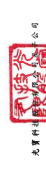
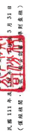
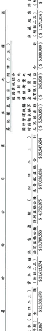

出

| 976                                | 2,895 |                        | 28,284                     | 30,549                   | 4,822     | 60,948     |    |    |    |    |    |    |    |    |    |    |    |
|------------------------------------|--------------------------------|----------------------------|--------------------------|-----------|------------|----|----|----|----|----|----|----|----|----|----|----|
| 7,991,377                          | 4,275,197                      | 723,867                    | 5,776,013 ]              | 2,112,214 |            |    |    |    |    |    |    |    |    |    |    |    |
| ৰ ১৯৯১ চন                          | $ 71,147,282                   | $ 72,873,527               | _2,865,157               | 4,977,371 |            |    |    |    |    |    |    |    |    |    |    |    |
| $74,141,514                        | (                              |                            |                          |           |            |    |    |    |    |    |    |    |    |    |    |    |
| ﮨ                                  |                                |                            |                          |           |            |    |    |    |    |    |    |    |    |    |    |    |
| 976                                | 11,787                         | 9,369                      | _2,418                   | 28,284    | 8,464      |    |    |    |    |    |    |    |    |    |    |    |
| 532,459                            | 29,669                         | 38,133                     |                          |           |            |    |    |    |    |    |    |    |    |    |    |    |
| $_                                 | s                              |                            |                          |           |            |    |    |    |    |    |    |    |    |    |    |    |
| 库 岚 殿 李 作 佐 剑 雄 
( 册 ( 府 姓 二三 ) ( 府 姓 二三 )
( 5、1,271,314 )                                    | ( $_1,271,314                  | ($ 3,700,808               |                          |           |            |    |    |    |    |    |    |    |    |    |    |    |
| 733,236                            | 733,23                         |                            |                          |           |            |    |    |    |    |    |    |    |    |    |    |    |
| ($ 5,808,909)                      | ( $ 5,075,673 )                | ( $ 6,056,988 )            | 2,835,488                | 2,835,488 |            |    |    |    |    |    |    |    |    |    |    |    |
| 245,858 )                          | 236,908 )                      |                            |                          |           |            |    |    |    |    |    |    |    |    |    |    |    |
| 30,496                             | _30,496                        | 9,213                      | 9,213                    |           |            |    |    |    |    |    |    |    |    |    |    |    |
| 来實現(損) 益                      | $__215,362 )                   | ($                         |                          |           |            |    |    |    |    |    |    |    |    |    |    |    |
| 702,740                            | 702,740                        | $ 4.860,311                | ($ 5,820,080 )           | 2.826.275 | _2,826,275 |    |    |    |    |    |    |    |    |    |    |    |
| $ 5,563,051                        |                                |                            |                          |           |            |    |    |    |    |    |    |    |    |    |    |    |
| દ્ર                                 | 2,895                          | 4,263,410                  | 4,263,410                | 2,103,750 | 2,103,750  |    |    |    |    |    |    |    |    |    |    |    |
| $ 35,547,654                       | $ 31,816,792                   | $ 36,753,852               |                          |           |            |    |    |    |    |    |    |    |    |    |    |    |
| ( 7,991,377                        | 5,776,013 ) (                  |                            |                          |           |            |    |    |    |    |    |    |    |    |    |    |    |
| な                                 | 2,895 )                        |                            |                          |           |            |    |    |    |    |    |    |    |    |    |    |    |
| 7,991,377 )                        | 4,263,410                      | 4,263,410                  | 2,103,750                | 2.103.750 |            |    |    |    |    |    |    |    |    |    |    |    |
| 来 分 配 宜日韩
$17,026,026                                    | $ 13,295,164                   | $ 15,199,955               |                          |           |            |    |    |    |    |    |    |    |    |    |    |    |
| $ 4.732.075                        | $ 5,940,218                    |                            |                          |           |            |    |    |    |    |    |    |    |    |    |    |    |
| 法 文 盈 款 公 積 3 特 別 星 款 公 樓
   $ 13,789,553                                    | $ 13.789.553                   | $ 15,613,679               | 30,549                   | 4,822     | 60,948     |    |    |    |    |    |    |    |    |    |    |    |
| ( M B ニ 드 )
 $ 21,613,574                                    | $ 21.613.574                   | $ 21,836,342               |                          |           |            |    |    |    |    |    |    |    |    |    |    |    |
| $ 23,508,670                       | 523,508,670                    | $ 23,508,670               |                          |           |            |    |    |    |    |    |    |    |    |    |    |    |
| 2.350.867                          | 2,350,867                      |                            |                          |           |            |    |    |    |    |    |    |    |    |    |    |    |
| 年1月1日至3月 31 日其地綜合(損)    | 橡监法認列之關聯企業及合資之變 |                            |                          |           |            |    |    |    |    |    |    |    |    |    |    |    |
| 用被互法認列之間聯企業及合資之變東 | 年1月2日至3月31日综合利益的    | 年1月1日至3月31日其他综合: | 年1月1日至3月31日综合利3 |           |            |    |    |    |    |    |    |    |    |    |    |    |
| 年1月1日至3月31日净新              | 年1月1日至3月31日净利          |                            |                          |           |            |    |    |    |    |    |    |    |    |    |    |    |
|                                    | 致予子公司股利調整貢本公租     |                            |                          |           |            |    |    |    |    |    |    |    |    |    |    |    |
|                                    | 際處分子公司部分樓」           |                            |                          |           |            |    |    |    |    |    |    |    |    |    |    |    |
| 10年3月31日给朝                    |                                |                            |                          |           |            |    |    |    |    |    |    |    |    |    |    |    |
| 110年1月1日给8                     | 111 年.1 月 1 日 餘$           |                            |                          |           |            |    |    |    |    |    |    |    |    |    |    |    |
| 登综分配:                          | 非控制板设更新                 | 虽然分配:
 现金股利                            | 非控制描当处处           |           |            |    |    |    |    |    |    |    |    |    |    |    |
| 线
Al                                    | B5                             | 01                         | C7                       | DI        | D3         | DS | ನ  | A1 | B5 | 01 | M5 | ದ  | M1 | D1 | D3 | D5 |

單位:除另子註明:
 
$ 72,199,488 $ 598,876
( $ 3,700,808
( $_3.221,500 )

( &_227.695)
$_2.993.805 ) 
$ 33.081.589 211 527692
$ 5,940,218

$15,613,679
$ 21,932,661 $ 23,508,670 2,350,867 111 年 3 月 31 日続2

Z1 讀多國動業眾信聯合會計師事務所民國 111 年 4 月 28 1 阴之附近德本合评财游报告之一台 短理人:印象影
- 9 章对玉管:周琛 董事長:宋明