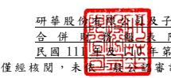
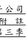

(僅 經核 閱 ,未 依 一 般 公 認 審計 準 則查 核 ) 
單位 : 新台 幣 仟 元 (除 特別 註 明 者 外 ) 

## 一、 公 司 沿 革

(一 )研 華股 份 有 限 公司 (以 下 簡稱「本 公司 」 )於 民 國 70 年 9 月 設立。主 要 從事 嵌入 式 板卡 、 工 業 控制 產 品 、 應 用電 腦 及 工 業用 電 腦之 製造 加 工及 買 賣。 

(二 )本 公司 股 票 自 民 國 88 年 12 月起 在 台 灣 證券 交 易所 上市 買 賣。 

(三 )本 公司 為 提 升 企業 集 團 整 體 營運 效 率, 於民 國 98 年 6 月 30 日 經 本 公司 董 事 會 決 議 通 過 與 本 公 司 百 分 之 百 持 股 之 子 公 司 -研 華 企 管 顧 問 股 份 有 限 公 司進 行 簡易 合 併, 並以 民 國 98 年 7 月 30 日 為 合 併基 準 日,以 本 公 司 為存 續公 司,研華 企 管顧 問公 司 為消 滅 公 司,本公 司 概括 承 受研 華企 管 顧 問 公 司 之債 權 與債 務。本 公司 另 於民 國 103 年 6 月 26 日經 董 事 會決 議 通 過 與 本公 司 1 00%持 股之 子 公 司 -研 華 投 資股 份 有 限公 司 (以 下 簡 稱「 研華 投 資公 司」) 持 股 95.51%之 子 公 司 -智 翔 科 技股 份 有 限公 司 (以 下 稱「 智 翔 公 司 )進 行非 對 稱式 合 併,以 民國 1 03 年 7 月 27 日 為合 併 基準 日 ,本 公司 為存 續 公司,智 翔公 司 為消 滅 公 司 ,本 公 司 概 括 承受 智 翔 公 司之 債 權與 債務 。 

## 二、 通 過 財 務報 告 之日 期及 程 序

本合 併 財務 報 告 已 於民 國 111 年 10 月 28 日經 董 事會 通 過 後發 布 。 

三、 新 發 布 及修 訂 準則 及解 釋 之適 用 
(一 )已 採 用 金融 監 督管 理委 員 會 (以下 簡 稱 「金 管 會」 )認 可 之 新發 布 、修 正 後 國際 財 務報 導 準 則 之影 響 下表 彙 列金 管 會 認 可之 民 國 111 年 適 用之 國 際財 務 報導 準則 之 新 發 布、修 正及 修 訂之 準 則 及 解釋 : 

 民國111年1月1日

國際會計準則第16號之修正「不動產、廠房及設備:達到預

定使用狀態前之價款」

 民國111年1月1日

 民國111年1月1日

2018-2020週期之年度改善

 民國111年1月1日

| 國際會計準則第16號之修正「不動產、廠房及設備:達到預                                                                        |                            |
|-----------------------------------------------------------------------------------------------------------------------------|----------------------------|
| 定使用狀態前之價款」                                                                                                        |                            |
|                                                                                                                             | 新發布/修正/修訂準則及解釋 |
| 國際財務報導準則第3號之修正「對觀念架構之索引」2018-2020週期之年度改善國際會計準則第37號之修正「虧損性合約-履行合約之成本」 |                            |

本 集 團 經 評 估 上 述 準 則 及 解 釋 對 本 集 團 財 務 狀 況 與 財 務 績 效 並 無 重 大 影 響。 

## (二 )尚 未 採 用金 管 會認 可之 新 發布 、 修 正 後國 際 財務 報 導準 則之 影 響

下表 彙 列金 管 會 認 可之 民 國 112 年 適 用之 國 際財 務 報導 準則 之 新 發 布、修 正及 修 訂之 準 則 及 解釋 : 

 民國112年1月1日

國際會計準則第8號之修正「會計估計之定義」

 民國112年1月1日

國際會計準則第12號之修正「與單一交易所產生之資產及負 債有關之遞延所得稅」

民國112年1月1日

| 國際會計準則第8號之修正「會計估計之定義」國際會計準則第12號之修正「與單一交易所產生之資產及負   |                            |
|-------------------------------------------------------------------------------------------------|----------------------------|
| 債有關之遞延所得稅」                                                                            |                            |
|                                                                                                 | 新發布/修正/修訂準則及解釋 |
| 國際會計準則第1號之修正「會計政策之揭露」                                                       |                            |

本 集 團 經 評 估 上 述 準 則 及 解 釋 對 本 集 團 財 務 狀 況 與 財 務 績 效 並 無 重 大 影 響。 

(三 )國 際 會 計準 則 理事 會已 發 布但 尚 未 經 金管 會 認可 之 國際 財務 報 導 準 則 之影 響 下 表 彙 列 國 際 會 計 準 則 理 事 會 已 發 布 但 尚 未 納 入 金 管 會 認 可 之 國 際 財 務 報 導準 則 之新 發 布 、 修正 及 修 訂 之 準則 及 解 釋 : 

 民國113年1月1日

國際財務報導準則第17號「保險合約」

 民國112年1月1日

國際財務報導準則第17號「保險合約」之修正

| 國際財務報導準則第17號「保險合約」 新發布/修正/修訂準則及解釋                                                                                    |
|--------------------------------------------------------------------------------------------------------------------------------------------------|
| 國際財務報導準則第10號及國際會計準則第28號之修正「投                                                                                             |
| 資者與其關聯企業或合資間之資產出售或投入」                                                                                                       |
| 國際財務報導準則第16號之修正「售後租回中之租賃負債」國際財務報導準則第17號「保險合約」之修正國際財務報導準則第17號之修正「初次適用國際財務報導準 |
| 則第17號及國際財務報導準則第9號—比較資訊」                                                                                                       |
| 國際會計準則第1號之修正「負債之流動或非流動分類」                                                                                                |

 民國112年1月1日

國際財務報導準則第17號之修正「初次適用國際財務報導準

則第17號及國際財務報導準則第9號—比較資訊」

民國112年1月1日

 民國112年1月1日

本 集 團 經 評 估 上 述 準 則 及 解 釋 對 本 集 團 財 務 狀 況 與 財 務 績 效 並 無 重 大 影 響。 

## 四、 重 大 會 計政 策 之彙 總說 明

重大 會 計政 策 除 遵 循聲 明、編 製 基礎、合併 基 礎及 新 增 部 分說 明 如下,餘 與 民國 110 年 度合 併 財務 報 表附 註 四相 同。除 另有 說 明外,此 等 政策 在 所有 報 導期 間 一 致地 適 用。 (一 )遵 循 聲 明 1.本 合 併 財 務 報 告 係 依 照 證 券 發 行 人 財 務 報 告 編 製 準 則 及 經 金 管 會 認 可 並 發布 生 效之 國 際 會 計準 則 第 3 4 號 「 期 中財 務 報導」 編 製 。 

2.本 合 併財 務 報 告 應併 同 民 國 110 年 度 合 併 財務 報 告閱 讀。 