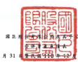

4

| 1 R 4 4 12                                     |                                                    |                    |               |              |               |                |              |     |               |      |
|------------------------------------------------|----------------------------------------------------|--------------------|---------------|--------------|---------------|----------------|--------------|-----|---------------|------|
| 民居:111年3月 31                               | 31 日及 3 月 31 8                                  | 早但:新台部长元    |               |              |               |                |              |     |               |      |
| 111 年3月31 8                                  | I 10-12月31 H                                      | 110年3月31日       |               |              |               |                |              |     |               |      |
| (显故障)                                       | (查编设巡短查招)                                   | (童编须提纽班被网) |               |              |               |                |              |     |               |      |
| મ્દ્                                             | ಷ್                                                  | 星 金              | 程            | જે રે          | 会            | 联             | %            | 全  | 程            | જર   |
| 盟费家                                         |                                                    |                    |               |              |               |                |              |     |               |      |
| 1100                                           | 现会及的需硬金(附註六)                             | $ 42,892,859       | 17            | $ 39,126,405 | 16            | $ 31,304,990   | 14           |     |               |      |
| -流動(附紅七)                                  | 3,853,705                                          |                    |               |              |               |                |              |     |               |      |
| 1110
1136                                                | 就是政府首次重飞情世人
选過接互按公允慎值用量之全融資產一流動(附
按跟網後成本同量之全融資產一流動(所註九)                                                    | ﺩﻩ                 | 4,208,551     | 2            | 2,908,803     | 1              |              |     |               |      |
| 7,504,890                                      | 3                                                  | 10,764,854         | 4             | 12,100,511   |               |                |              |     |               |      |
| 88,707                                         | -                                                  | 『                 | 97,365        |              |               |                |              |     |               |      |
| हुँ दु                                            | 避險之全融資重一須動(則該十)
歷收票讓淨額(開鍵十一)                                                    | '                  |               |              |               |                |              |     |               |      |
| 244,636                                        | 195,177                                            | 260,159            |               |              |               |                |              |     |               |      |
| 1170                                           | ﻭ                                                  |                    |               |              |               |                |              |     |               |      |
| 應收帳款净額(別註十一、三二及三三)             | 23,815,597                                         | ﻭ                  | 22,105,150    | 22,315,971   | 10            |                |              |     |               |      |
| 1200                                           | 其他應收載(附註三二)                               | 983,822            | 1,072,785     | 1            | 990,134       | l              |              |     |               |      |
| 1300                                           | 存食(附拉十二及卫卫)                               | 26,122,761         | 10            | 25,197,902   | 10            | 19,220,647     | 8            |     |               |      |
| 1410                                           | 预计教演                                           | 2,124,500          | 1             | 1,292,243    | 1             | 1              |              |     |               |      |
|                                                | 1,125,278                                          |                    |               |              |               |                |              |     |               |      |
| 1470                                           | 其他消费者                                         | 1,029,741          | 865.559       |              |               |                |              |     |               |      |
| 泡動資產總計                                   | 236.330                                            |                    |               |              |               |                |              |     |               |      |
| 11XX                                           | 108.661.218                                        | 43                 | 104,828,656   | - 43         | 91,060,185    | 40             |              |     |               |      |
| 非通勉资産                                     |                                                    |                    |               |              |               |                |              |     |               |      |
| 1510                                           | 这语得益按公允赏佳街量之会融资産一非演動《所坦七》 | 1,264,119          | 672,258       | 307,378      |               |                |              |     |               |      |
| 1517                                           | 780,487                                            | 691,440            |               |              |               |                |              |     |               |      |
| 或過其他統合接及投公允健保所量之全融資產一亦適動(附註入)
按樂銷後成本质量之全融資產一求減動(附註九)                                                |                                                    |                    |               |              |               |                |              |     |               |      |
| 1535                                           | 13,743,676                                         | 5                  | 9,143,579     | 4            | 7.006.294     | 3              |              |     |               |      |
| 1538                                           | 556,475                                            | 507,195            | 375,894       |              |               |                |              |     |               |      |
| 1550                                           | 現役と全駐貢産一寿遺動(附は十)
採用機益法之投資(附註十四)                                                    | 1,599,955          | 1,517/420     | 1            | 1,760,369     |                |              |     |               |      |
| 1600                                           | 答的是、破得及较调(附註十五及三三)                 | 53,400,974         | 21            | 50,695,356   | 21            | 50,889,441     | 22           |     |               |      |
| 1755                                           | 使用程资金                                         | 1,326,508          | 1,647,319     |              |               |                |              |     |               |      |
|                                                | 1                                                  | 1                  | 1,715,144     | 1            |               |                |              |     |               |      |
| 1760                                           | 投资过不動產(開班十六及三三)                       | 136,097            | 135,632       | 138,670      |               |                |              |     |               |      |
| 1805                                           | 45,302,477                                         | 18                 | 44,131,198    | 18           | 46,718,148    | 20             |              |     |               |      |
| 1821                                           | 改參(附註十七)
其他無利實法律領(府姓十八)                                                    | 22,900,643         | ﻭ             | 22,303,362   | 9             | 10             |              |     |               |      |
| 1840                                           | 遮Ն刚得就實產《阿拉二五》                          | 4,552,059          | 5,493,080     | 23,297,592
  3,470,722              |               |                |              |     |               |      |
|                                                | 2                                                  | 2                  | 2             |              |               |                |              |     |               |      |
| 1920                                           | 存台体报会                                         | 212,426            | .             | 197,878      | 193,116       |                |              |     |               |      |
| 1990                                           | 其他存通的實產                                     | 728,143            | איז גע        | 1,165,176    |               |                |              |     |               |      |
| 15XX                                           | 非演始實產總好                                     | 146,504,039        | 57            | 138,074,027  | 57            | 137,039,914    | প            |     |               |      |
| 1XXX                                           | 资                                                 | 喜                 | 鸣            | 바           | $ 255.165.257 | 100            | 5-242-02-183 | 100 | $ 228,100,102 | -102 |
| મ્દ                                             | ঙ্গা                                                 | _黄                | 展            | es           | 道            |                |              |     |               |      |
| 法与資                                         |                                                    |                    |               |              |               |                |              |     |               |      |
| 2100                                           | 短期借款(图坛十九及三三)                           | $ 18,320,812       | 7             | $ 26,005,204 | 11            | ડ              | 40,582,587   | 18  |               |      |
| 2110
2120                                                | 應付她期眾學(財班十九)                             | 20,075,116         | 8             | 20,078,123   | 8             | 1,192,174      | I            |     |               |      |
| 送過接益按公允價值周豐之会融負債一減動(別註七) | 95,210                                             | 44,192             | 190,200       |              |               |                |              |     |               |      |
| 2126                                           | 8,326                                              | .                  |               |              |               |                |              |     |               |      |
| 或者之全服身慢一流動(附註十)
 過什男妹                                                | .                                                  |                    |               |              |               |                |              |     |               |      |
| 2150                                           | 1,012                                              | 4,722              | 7.297         |              |               |                |              |     |               |      |
| 2170                                           | 鳳付極款(居然三二)                                 | 17,390,961         | 18,626,978    | 8            | 16.379.773    | 7              |              |     |               |      |
| 2220                                           | 其他患付款(附註二一及三二)                         | 21,739,877         | 15,126,324    | 6            | 14,099,932    | 6              |              |     |               |      |
| 2230                                           | 本期所得到角價(附註二星)                           | 5,385,044          | 2             | 4,295,120    | 2             | 3,226,931      | N            |     |               |      |
| 22.80                                          | 368,390                                            |                    |               |              |               |                |              |     |               |      |
| 本期价格比赛
在复良债一道的
一年六到期之長期赚钱(附在十九)                                                | 441,465                                            | .                  | 390,102       |              |               |                |              |     |               |      |
| 2320                                           | 892,628                                            | .                  | 830,508       | 779,471      |               |                |              |     |               |      |
| 2399                                           | 其他演到負債                                       | 868,787            | 700,909       | 566,689      |               |                |              |     |               |      |
| 21XX                                           | 演的黄佳總計                                       | 85,137,837         | 53            | 86,169,871   | 35            | 77,415,156     | -- 34        |     |               |      |
| 市波野角镇                                     |                                                    |                    |               |              |               |                |              |     |               |      |
| 2500                                           | 选過接照按公允價值得受之金融資價一非過的(創班七)   | 18                 |               |              |               |                |              |     |               |      |
| 2511                                           | 657.936                                            | 621,252            | 502,634       |              |               |                |              |     |               |      |
| 2530                                           | 絕險之全脉負債一非遺動(附註十)
應付公司債(府註二十)                                                    | 20,338,807         | 8             | 15,981,017   | 7             | 5.970.639      | 3            |     |               |      |
| 2540                                           | 長期借投(附註十九及三正)                           | 29,383,120         | 12            | 27,888,787   | 12            | 38,324,058     | 17           |     |               |      |
| દ્વ ચે દ                                         | 装饰情纸
感延所搭载黄线(射註二五)
组餐员俄一界波角                                                    | 5,035,781          | 2             | 4,723,754    | 2             | 4.270.468      |              |     |               |      |
| 849,055                                        | 982.249                                            | 나 =               |               |              |               |                |              |     |               |      |
|                                                | -- --                                              | 865,347            |               |              |               |                |              |     |               |      |
| 2640                                           | 淨確定幅利負債(則這回及二二)                       | 2,584,427          | 2,547,605     | ı            | 2,957,034     | 1              |              |     |               |      |
| 2645                                           | 非入保健会                                         | 365.794            | 276.976       | 212,987      |               |                |              |     |               |      |
| 2670                                           | 其他排流動員債                                     | 5,820,956          | 4.285,304     | 2,976,300    |               |                |              |     |               |      |
| 25XX                                           | 非波動員債媽媽                                     | ז                  |               |              |               |                |              |     |               |      |
| 65.035.876                                     | _26                                                | 57,306,962         | 24            | 56,079,467   |               |                |              |     |               |      |
| 2XXX                                           | 具情緒轩                                           | 150.173.713        | _52           | 143.476.833  | .... 59       | .. 138,494,623 | _'           |     |               |      |
|                                                | -                                                  |                    |               |              |               |                |              |     |               |      |
| 邮届的本公司第五之祖超                         |                                                    |                    |               |              |               |                |              |     |               |      |
| 版                                             | 本
普 通 股                                                    |                    |               |              |               |                |              |     |               |      |
| 3110                                           | 5,436,982                                          | 2                  | 4,959,189     | 4,969,841    |               |                |              |     |               |      |
|                                                | N                                                  | 2                  |               |              |               |                |              |     |               |      |
| 债券绩履程利促高                               | 3,578                                              |                    |               |              |               |                |              |     |               |      |
| 3130
3140                                                | 预收股本                                           | 40                 | 18.99         |              |               |                |              |     |               |      |
| 3100                                           | 股本總計                                           | z                  |               |              |               |                |              |     |               |      |
| 5.440.600                                      | 4,559,189                                          | -2                 | 4,863,835     | -2           |               |                |              |     |               |      |
| 资本公積                                       |                                                    |                    |               |              |               |                |              |     |               |      |
| 3211                                           | 發行法律                                           | 42,445,950         | 17            | 20,221,583   | 8             | 21,312,901     | 9            |     |               |      |
| 3260                                           | 採用推益处認列之購聯公黨股權淨優之發動數           | 157,358            | .             | 1,574,490    | 1             | 1,578,663      | 1            |     |               |      |
| 3271                                           | 员工运股模                                         | 6,953              | .             |              |               |                |              |     |               |      |
| 3272                                           | 可棒搞公司使您列覆盖胆或都会                       | 259.411            | 252,844       | 252,844      |               |                |              |     |               |      |
| | 1                                            | I                                                  |                    |               |              |               |                |              |     |               |      |
| 3200                                           | 贸本公种總計                                       | 42.892.719         | 22.048.917    | ﺍ ﻣﺎ         | 23,151,361    | 10             |              |     |               |      |
| 保留盈除                                       |                                                    |                    |               |              |               |                |              |     |               |      |
| 3310                                           | 法定置结合精                                       | 8.621,366          | 3             | 8,621,366    | 4             | 7.331.396      | 3            |     |               |      |
| 3320                                           | 特别盈给公纳                                       | 4.594.931          | 4,594,931     | 2            | 2,945,827     | 1              |              |     |               |      |
| 3350                                           | 本分配登船                                         | 51,387,184         | 20            | 50,545,451   | 41,738,446    |                |              |     |               |      |
| 3300                                           | 係容量快绝计                                       | "                  | ાર ટિ           | 12 12        |               |                |              |     |               |      |
| 64.603,481                                     | 25                                                 | 63,761,745         | 52,015,660    |              |               |                |              |     |               |      |
| 其他最近                                       |                                                    |                    |               |              |               |                |              |     |               |      |
| 3410                                           | 图外管道换得时药粗表换第之见换差铜                 | (                  | 6,424,293 )   | 2 )          | 9,753,973 )   | 4 )            | 5,155,600 )  |     |               |      |
| (                                              | (                                                  | (                  | (             | 2)           |               |                |              |     |               |      |
| 3420                                           | 66,717                                             | 81,021             | 76,021        |              |               |                |              |     |               |      |
| 自才会给大讲话的被获换第一元钟发明
这通其他综合演员接公允候值阅录之全起货运来官现模型
 通险工具指其                                                |                                                    |                    |               |              |               |                |              |     |               |      |
| 3450                                           | 505,322                                            | 198,811            | 294,764       |              |               |                |              |     |               |      |
| 3400                                           | 其他模型總計                                       | 5,852,254          | 9,474,141     | 4,784,815)   |               |                |              |     |               |      |
| 3500                                           | 車旅服業                                           | և Ը՞ էլ . .        |               |              |               |                |              |     |               |      |
| <                                              | 2,416,265 )                                        | 1)                 | <             | 1,879,155)   | [][1]         | 2,421,552 )    | ් උඩු .        |     |               |      |
| 31XX                                           | 本公司案在之强损绝好                               | 104,668,281        | न्दा            | 79,416,558   | -             | 72,949,502     |              |     |               |      |
| 35XX                                           | 奖网技制下彩手理益                                 | 223,991            | 16251         | ..           |               |                |              |     |               |      |
| 36XX                                           | 率在创推后                                         | 323,263            | -             | 19,785,301   | 에            | 21.494.696     | __           |     |               |      |
| 3XXXX                                          | 提后满计                                           | _104.991_544       | --            | - 99.423.850 | --            | 94,605,479     | --           |     |               |      |
| 角 级 突 强 近 店 折                           | $_255.165.257                                      | -100               | $ 242.902.683 | --           | $ 228.100.102 | - 100          |              |     |               |      |
| 使用之所註權本合                               | 外财资程                                           | - 11 4 -           |               |              |               |                |              |     |               |      |
| (语多朋到家具信群合食店印章                    | 年4月26日结财频合)                                 |                    |               |              |               |                |              |     |               |      |
| 夏年长:李会纪                                  | 短理人:王演 bt                                     | 食計生管: 编文网   |               |              |               |                |              |     |               |      |
| 5                                              |                                                    |                    |               |              |               |                |              |     |               |      |
