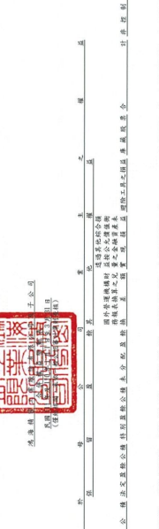

集位:新台梦仟元
_ 註

车 短 制 报 互

者 通 股 股 本 资 本 公 精 法定盘综公精 特别量综公租 来 分 配 盘 给
站

|                                                  | 52,582                                     |                             |                         |                   |            |            |            |                 |
|--------------------------------------------------|--------------------------------------------|-----------------------------|-------------------------|-------------------|------------|------------|------------|-----------------|
| 55,451,962 ]                                     | 4,228,716]                                 | 2.198.748                   | 108.941                 | 72.087.551)       | 1,295,773  | 1,025,839  |            |                 |
| 30,979,257                                       | 6.316.755                                  | 37.296.007                  | 29,609,427              | 53,983,576        | 83,593,003 |            |            |                 |
| 1,454,069,427                                    | 1,573,260,118                              | 1,585,088,086               |                         |                   |            |            |            |                 |
| $ 1,474,146,409                                  | -                                          | -                           |                         |                   |            |            |            |                 |
| 108.941                                          | 52,582                                     |                             |                         |                   |            |            |            |                 |
| 266,602                                          | 159,125                                    |                             |                         |                   |            |            |            |                 |
| 2,817,477                                        | 3.084.079                                  | 5,947,641                   | 6.106.766               |                   |            |            |            |                 |
| $ 176,869,033                                    | S 180,062,053                              | $ 192,802,808               | $ 198,962,156           |                   |            |            |            |                 |
| 6.050.153                                        | 55,451,962                                 | 4,228,716                   | 2.198.748               | 72,087,551        | 1,295,773  | 1,025,839  |            |                 |
| 28,161,775                                       | 34,211,928                                 | 29,450,303                  | 48,035.935              | 77,486,237        |            |            |            |                 |
| $ 1,274,007,374                                  | $ 1,380,457,310                            | $ 1,386,125,930             |                         |                   |            |            |            |                 |
| ($ 15,194) $ 1,297,277,376                       | ($ 15,194)                                 | (S 15,194)                  |                         |                   |            |            |            |                 |
|                                                  | $ 165,645 ($ 15,194)                       | 104.07                      | 104.074                 | $ 61,571          |            |            |            |                 |
| s                                                | 1.326                                      | ( 9,606,321) (_             | ( 9.606,321) (_         | 627,644           |            |            |            |                 |
| 12,469,947                                       | 12,469,947                                 | $ 49,708,126                |                         |                   |            |            |            |                 |
| ($124.551.979) $ 37,236,853                      | ($146,312,958) $ 56,641,420                | ($ 88,566,628) $ 46,407,455 |                         |                   |            |            |            |                 |
| 6.419.794)                                       | 57,746,330                                 | 57,746,330                  |                         |                   |            |            |            |                 |
| ( 6,419,794)                                     | ($ 130,971,773 )                           |                             |                         |                   |            |            |            |                 |
| 1,326                                            |                                            |                             |                         |                   |            |            |            |                 |
| 28,161,775                                       | 131,175                                    | 627.644                     |                         |                   |            |            |            |                 |
| $ 779,836,380                                    | 28,161,775                                 | 55,451,962                  | $ 752,676,042           | $ 871 , 193 , 344 | 29,450.302 | 29.450.302 | 72,087,551 | $ 829, 183, 459 |
|                                                  | (                                          |                             |                         |                   |            |            |            |                 |
| $ 102.451.720                                    | $ 102,451,720                              | $ 87,315,126                | $ 87,315,126            |                   |            |            |            |                 |
| $ 161,043,748                                    | $ 161,043,748                              | $170,755,591                | $ 170,755,591           |                   |            |            |            |                 |
| 4,359,891                                        | 2,198,748                                  | $ 202,084,430               | 1,295,773               | 1,025,559         |            |            |            |                 |
| $ 202,645,942                                    | S 200,484,799                              | $ 202,354.644               |                         |                   |            |            |            |                 |
|                                                  | C                                          |                             |                         |                   |            |            |            |                 |
|                                                  | .                                          |                             |                         |                   |            |            |            |                 |
| 138.629.906                                      | 138,629,906                                |                             |                         |                   |            |            |            |                 |
| 138,629,906                                      | 138,629,906                                |                             |                         |                   |            |            |            |                 |
| 六(二十九)                                       | 六(二十八)                                 | 六(二十七)                  | 六(二十七)              | 六(二十九)        | 六(二十八) | 六(二十七) | 六(二十七) |                 |
| 六(三十)                                         | 十川)六                                    |                             |                         |                   |            |            |            |                 |
| (分选過其他綜合損益按公允價值街量之權益工具 六(J | 分透過其他綜合損益按公允價值倒量之權益工具 |                             |                         |                   |            |            |            |                 |
|                                                  | 用程益法認列之關聯企業及合買之變動物       |                             |                         |                   |            |            |            |                 |
| 採用擬益法認列之顯聯全黨及合貢之變動             |                                            |                             |                         |                   |            |            |            |                 |
| 109年盈餘指报及分配                              | 见列對子公司所有權變動畫                   | 110 年量综指搬及分配        | 3列野子公司所有报梦纷纷 |                   |            |            |            |                 |
| 本期其他綜合演員                                 | 现金股利                                   | 本期其他综合损益            | 现金股利                |                   |            |            |            |                 |
| 本期综合損益總司                                 | 非控制模益增加                             | 本期综合损益绝对            | 年控制模及增加          |                   |            |            |            |                 |
| 1 月 1 日 絵 領                                  | 3月31日休新                                | 1月1日給額                  | 3 月 31 日给第          |                   |            |            |            |                 |
| 民 图 110 年                                     | 本期净利                                   | 本期净利                    |                         |                   |            |            |            |                 |
| 民国 111 年                                      |                                            |                             |                         |                   |            |            |            |                 |

鳥

付合鲜财務搬表附註為本合伴財務報告之一 级理人:劉揚靖
~10~
會計主管:周宗

查事長:劉揚偉

