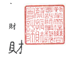

11073 台北市信藏區松仁路100號20樓

Deloitte & Touche 20F, Taipei Nan Shan Plaza No. 100, Soneren Rd.

Xinyi Dist., Taipei 11073, Taiwan Tel : \#886 (2) 2725-9988 Fax:+886 (2) 4051-6888 www.deloitte.com.tw 會計師核閱報告 國巨股份有限公司 公鑒:

## 前 章

國巨股份有限公司及其子公司(國巨集團)民國 111年及 110年 3 月 31 日之合併資產負債表,暨民國 111 年及 110 年 1 月 1 日至 3 月 31 日之合併綜 合損益表、合併權益變動表、合併現金流量表,以及合併財務報表附註(包 括重大會計政策黨總),業經本會計師核閱竣事。依證券發行人財務報告編製 準則及經金融監督管理委員會認可並發布生效之國際會計準則第 34號「期中 財務報導」編製允當表達之合併財務報表係管理階層之賣任,本會計師之貴 任條依據核閱結果對合併財務報表作成結論。

## 範 图

除保留結論之基礎段所並者外,本會計師係依照審計準則公報第六十五 號「財務報表之核閱」執行核閱工作。核閱合併財務報表時所執行之程序包 括查詢(主要向負責財務與會計事務之人員查詢)、分析性程序及其他核閱程 序。核閱工作之範圍明顯小於查核工作之範圍,因此本會計師可能無法察覺 所有可藉由查核工作辨認之重大事項,故無法表示查核意見。 ・
保留結論之基礎 如合併財務報表附註十三所述,列入上開合併財務報表之部分非重要子 公司之同期間財務報表未經會計師核閲,其民國 111年及 110年 3月 31 日之 資產總額分別為新台幣(以下同)20,120,449 仟元及 21,200,104 仟元,分別占 合併資產總額之 7.89%及 9.29%;負債總額共計分別為 2,827,283 仟元及 2,684,061 仟元,分別佔合併負債總額之 1.88%及 2.01%;其民國 111 年及 110 年1月1日至3月 31 日之綜合損益總額分別為 567,183 仟元及 495,147 仟元, 分別占各期合併綜合損益總額之 5.23%及 10.21%。又如合併財務報表附註十 四所述,民國 111 年及 110 年 3 月 31 日採用權益法之投資餘額共計分別為 1,599,955 仟元及 1,389,828 仟元,及其民國 111 年及 110年 1 月 1 日至 3 月 31 日認列之關聯企業損益份額共計分別為 45,254 仟元及 20,899 元,暨合併財 務報表附註三八附註揭露事項所述轉投資事業相關資訊,係依據被投資公司 同期間未經會計師核閱之財務報表認列與揭露。 保留结論 依本會計師核閱結果,除保留結論之基礎段所述部分非重要子公司及關 聯企業之財務報表倫經會計師核閱,對合併財務報表可能有所調整之影響 外,並未發現上開合併財務報表在所有重大方面有未依照證券發行人財務報 告編製準則及經金融監督管理委員會認可並發布生效之國際會計準則第 34 號
「期中財務報導」編製,致無法允當表達國巨集團民國 111年及 110年 3月 31日之合併財務狀況,豎民國 111年及 110年1月1日至 3月 31 日之合併財 務績效及合併現金流量之情事。

強調事項 如合併财務報告附註,國巨股份有限公司於民國 111年1月發行 47,779 仟股普通股作為對價,以股份轉換方式取得奇力新電子股份有限公司 100%之股權,該交易因屬共同控制下之組織重組,於編製民國 111年第1季 合併財務報表時,應視為自始即合併,故國巨股份有限公司編製民國 111 年 第1季合併財務報表時,已追溯重編民國 110年度及 110年第1季合併財務 報表。

* [16] A. A. K.  
勤業眾信聯合會計師事務所

$$\begin{array}{r l r l}{\phi_{\mathrm{f}}}&{{}\star\uparrow}&{{}\phi_{\mathrm{f}}}\end{array}$$
 趙 永 祥

$$\begin{array}{r l r}{\oint_{\mathbb{R}}\ \ \ \ \ \oint_{\mathbb{R}}\ \ \ \ \oint_{\mathbb{R}}\ \ \ \ \oint_{\mathbb{R}}\ \ \ \ \oint_{\mathbb{R}}}\end{array}$$

$$\begin{array}{c c c}{{\frac{\partial\vec{k}}{\partial\vec{k}}}}&{{}}&{{\frac{1}{2}\vec{k}}}&{{}}&{{\vec{k}}}\\ {{}}&{{}}&{{}}&{{}}\\ {{\vec{j}\vec{k}}}&{{}}&{{\frac{1}{2}\vec{j}\vec{k}}}&{{}}&{{\vec{k}}}\end{array}$$

金融監督管理委員會核准文號 金管證審字第 1050024633 號 證券暨期貨管理委員會核准文號 台財證六字第 0920123784 號

中 華 民 國 111 年 র্ব 月 26
$\mathrm{\overline{H}}$