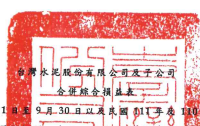
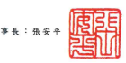
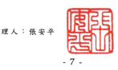
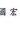

| 民圈 111年及 110年 7月 1       | 201                                  | 9月30日以及           | 1月1日至9月30日       |                       |                       |              |              |             |           |           |             |    |           |             |    |    |
|--------------------------------|--------------------------------------|-----------------------|-----------------------|-----------------------|-----------------------|--------------|--------------|-------------|-----------|-----------|-------------|----|-----------|-------------|----|----|
| ( 保                           | 100                                  | 周阳,未依一般         | 公路                  | 計建刷查              | 單位:除每股盈餘為新台 |              |              |             |           |           |             |    |           |             |    |    |
|                                | 梦元外,给像仟元                      |                       |                       |                       |                       |              |              |             |           |           |             |    |           |             |    |    |
| G                              |                                      |                       |                       |                       |                       |              |              |             |           |           |             |    |           |             |    |    |
| 111年次月1日                   | 至9月30日                            | -110年7月1日至9月30日 | 111年1月1日 至9月30日 | 110年1月1日 至9月30日 |                       |              |              |             |           |           |             |    |           |             |    |    |
| 代                             | ਸ                                    | স্ক                    | 31                    | જેર                    | A                     | 37           | de 2.        | रु           | 新        | ళిళ        | 2           | 旗 | તેર        |             |    |    |
| 4000                           | 誉業收入(附註二四及三四)             | $31,123,036           | 100                   | $26,881,4321          | 100                   | $79,274,330  | 100          | $76,904,796 | 100       |           |             |    |           |             |    |    |
| 5000                           | 營業成本(附註十二、二二、二五及三四) | 28,559,87             | -92                   | 21,705,636            | 74,872,991            | ਰੇਕੋ           | 57,595,324   | 75          |           |           |             |    |           |             |    |    |
| 5900                           | 管集毛利                             | 563767                | -- 8                  | 5,175,796             | 4,401,339             | - 6          | 19,309,472   | _25         |           |           |             |    |           |             |    |    |
| 答案費用(附註二二、二五及三四) |                                      |                       |                       |                       |                       |              |              |             |           |           |             |    |           |             |    |    |
| 6100                           | 推销费用                             | 194,427               | 1 - 3 - 3 - 1         | 597,445               | 513,317               |              |              |             |           |           |             |    |           |             |    |    |
|                                | 1                                    |                       |                       |                       |                       |              |              |             |           |           |             |    |           |             |    |    |
| 6200                           | 管理費用                             | 1,558,213             | 1.110.706             | 19 20                 | 4                     | 4,440,272    | 5            | 3,630,625   | 5         |           |             |    |           |             |    |    |
| 6300                           | 研究發展費用                         | 182,979               | 58,118                | 536,140               | 1                     | 58,118       |              |             |           |           |             |    |           |             |    |    |
| 6000                           | 餐集實用合計                         | 1,935,619             | 6                     | 1,319,769             | _5                    | 5,573,857    | 7            | 4,202,060   | 5         |           |             |    |           |             |    |    |
| 6900                           | 營業淨利(損)                         | 627,538               | _2                    | 3,856,027             | _15                   | (_1,172,518) | (_1)         | 15,107,412  | _20       |           |             |    |           |             |    |    |
| 答案外收入及支出               |                                      |                       |                       |                       |                       |              |              |             |           |           |             |    |           |             |    |    |
| 7060                           | 埃用權益法認列之關聯企業及合資       |                       |                       |                       |                       |              |              |             |           |           |             |    |           |             |    |    |
| 損益份額(附註十四)             | 998,326                              | 3                     | 844,347               | 3                     | 2,463,295             | 3            | 2,494,138    | 3           |           |           |             |    |           |             |    |    |
| 7100                           | 利息收入(附註二五)                   | 551,352               | 2                     | 389,244               | 1                     | 1,350,512    | 2            | 1,156,178   | 1         |           |             |    |           |             |    |    |
| 7130                           | 股利收入                             | 668,129               | 2                     | 128,572               | 1                     | 2,303,585    | 3            | 1,249,895   | 2         |           |             |    |           |             |    |    |
| 7190                           | 其他收入                             | 91,978                | .                     | 177,445               | l                     | 399,691      | 1            | 759,139     | 1         |           |             |    |           |             |    |    |
| 7230                           | 外替兌換淨益(損)                     | 327,515               | 1                     | 8,556 )               | 889,453               | 1            | 43,879 )     |             |           |           |             |    |           |             |    |    |
| 7050                           | 财務成本(附註二五)                   | (                     | 812,628 )             | (                     | 2)                    | (            | 411,224 )    | (           | 2)        | (         | 1,998,010 ) | (  | 3)        | 1,205,082 ) | ﮨ  | 2) |
| 7210                           | 處分不動產、廠房及設備利益(損失)     |                       |                       |                       |                       |              |              |             |           |           |             |    |           |             |    |    |
| (附註十五)                     | 13,051 )                             | -                     | 41,004 )              | 32,930 )              | 388,965               | 1            |              |             |           |           |             |    |           |             |    |    |
| 7590                           | 其他支出                             | 95,852 )              | -                     | (                     | 215,837 )             | (            | 1)           | (           | 792,777 ) | (         | 1)          | (  | 549,502 ) | ( 1)        |    |    |
| 7635                           | 透過損益按公允價值街量金融資產       |                       |                       |                       |                       |              |              |             |           |           |             |    |           |             |    |    |
| 及負債之淨損                   | 239,984)                             | 1)                    | 27,234)               |                       |                       |              |              |             |           |           |             |    |           |             |    |    |
| (-                             | (                                    | (                     | 569,617 )             | (_                    | 1)                    | (            | 11,703 )     |             |           |           |             |    |           |             |    |    |
| 7000                           | 管案外收入及支出合計                 | 1,475,785             | 5                     | 835,753               | 3                     | 4,013,202    | 4,238,149    | __          |           |           |             |    |           |             |    |    |
|                                |                                      |                       |                       |                       |                       |              |              |             |           |           |             |    |           |             |    |    |
| 7900                           | 繼續營黨單位稅前淨利                 | 2,103,323             | 7                     | 4,691,780             | 18                    | 2,840,684    | 4            | 19,345,561  | 25        |           |             |    |           |             |    |    |
| 7950                           | 所得我費用(附註二六)                 | 464,731               | _ 2                   | 990,727               | - 4                   | 1,286,301    | 2            | 4,159,059   | 5         |           |             |    |           |             |    |    |
| 8000                           | 繼續參黨單位本期淨利                 | 1,638,592             | 5                     | 3,701,053             | 14                    | 1,554,383    | 2            | 15,186,502  | 20        |           |             |    |           |             |    |    |
| 8100                           | 停需單位利益(附註十一)               | 1.                    | ---                   | 535,831               | -2                    | 1,053,559    |              |             |           |           |             |    |           |             |    |    |
|                                | =                                    | =                     | T                     |                       |                       |              |              |             |           |           |             |    |           |             |    |    |
| 8200                           | 本期净利                             | 1,638,592             | ___ 5                 | 4,236,884             | _16                   | 1,554,383    | 2            | 16,240,061  | 21        |           |             |    |           |             |    |    |
| 本期其他综合損益净額(附註二三) |                                      |                       |                       |                       |                       |              |              |             |           |           |             |    |           |             |    |    |
| 8310                           | 不重分類至損益之項目:                |                       |                       |                       |                       |              |              |             |           |           |             |    |           |             |    |    |
| 8316                           | 透過其他综合損益按公允償值           |                       |                       |                       |                       |              |              |             |           |           |             |    |           |             |    |    |
| 街量之權益工具投資未實現       |                                      |                       |                       |                       |                       |              |              |             |           |           |             |    |           |             |    |    |
| 評價利益(損失)                 | 3,984,096 )                          | ( 13 )                | 1,858,942             | 7                     | (                     | 7,099,902 )  | (            | 9)          | (         | 950,545 ) | ( 1)        |    |           |             |    |    |
| 8320                           | 採用權益法認列之關聯企業及           |                       |                       |                       |                       |              |              |             |           |           |             |    |           |             |    |    |
| 合實之其他綜合損益之份額       | 77,372                               | 2,357                 | 324,884 ]             | 1)                    | 243,171               |              |              |             |           |           |             |    |           |             |    |    |
| 4,061,468 )                    | (_13)                                | 1,861,299             | 7                     | 7,424,786 )           | 10)                   | 707,374)     | 1)           |             |           |           |             |    |           |             |    |    |
| 8360                           | 後續可能重分類至損益之項目:          |                       |                       |                       |                       |              |              |             |           |           |             |    |           |             |    |    |
| 8361                           | 圖外管運機構財務報表換算之           |                       |                       |                       |                       |              |              |             |           |           |             |    |           |             |    |    |
| 兌換差額                       | 3,126,570                            | 10                    | 865,650               | 3                     | 7,205,996             | 9            | (            | 1,336,698 ) | ( 1)      |           |             |    |           |             |    |    |
| 8370                           | 採用機益法認列之關聯企業及           |                       |                       |                       |                       |              |              |             |           |           |             |    |           |             |    |    |
| 合資之其他綜合損益份額         | 514,838                              | 2                     | 631,846 )             |                       |                       |              |              |             |           |           |             |    |           |             |    |    |
| (                              | (_2)                                 | 574,819               | 3,007,593 )           | 4)                    |                       |              |              |             |           |           |             |    |           |             |    |    |
| 3,641,408                      | 12                                   | 233,804               | 7,780,815             | 10                    | 4,344,291 )           | 5)           |              |             |           |           |             |    |           |             |    |    |
| 8300                           | 其他综合損益净額                     | 420,060 )             | 1)                    | 2,095,103             |                       | 356,029      | ==           | 5,051,665 ) | ( )       |           |             |    |           |             |    |    |
| 8500                           | 本期综合損益總額                     | $ 1,218,532           | 1                     | $ 6,331,987           | 24                    | $ 1,910,412  | _2           | $11,188,396 | _15       |           |             |    |           |             |    |    |
| 淨利(損)歸屬於                 |                                      |                       |                       |                       |                       |              |              |             |           |           |             |    |           |             |    |    |
| 8610                           | 本公司第主                           | $ 1,509,641           | 5                     | $ 3,984,484           | 15                    | $ 2,917,831  | $ 14,836,550 | 19          |           |           |             |    |           |             |    |    |
| 8620                           | 非控制模益                           | 128,951               | 252,400               | 1                     | 1,363,448 )           | 2)           | 1.403.511    | 2           |           |           |             |    |           |             |    |    |
| 8600                           | $ 1,638,592                          | _5                    | $ 4,236,884           | 16                    | $ 1,554,383           | $ 16,240,061 | 21           |             |           |           |             |    |           |             |    |    |
| (接次頁)                       |                                      |                       |                       |                       |                       |              |              |             |           |           |             |    |           |             |    |    |

(承前頁)

| 111年7月1日 至9月30日      | 110年7月1日 至9月30日   | 111年1月1日 至9月30日   | 110年1月1日 至9月30日   |             |             |               |              |             |      |       |
|----------------------------|-------------------------|-------------------------|-------------------------|-------------|-------------|---------------|--------------|-------------|------|-------|
| 代 昌                      | 会                      | 全 频 %                 | 金 额 %                 | 全 额 %     |             |               |              |             |      |       |
| 綜合損益總額飾局於         |                         |                         |                         |             |             |               |              |             |      |       |
| 8710                       | 本公司案主              | $ 954,813               | 3                       | $ 6,091,084 | 23          | $ 3,129,262   | 4            | $ 9,804,607 | 13   |       |
| 8720                       | 非控制模益              | 263,719                 | 1                       | 240,903     | 1           | (_ 1,218,850) | (_2)         | 1,383,789   | _2   |       |
| 8700                       | $ 1,218,532             | 4                       | $ 6,331,987             | 24          | $ 1,910,412 | 2             | $ 11,188,396 | 15          |      |       |
| 每股盈餘(附註二七)         |                         |                         |                         |             |             |               |              |             |      |       |
| 突自繼續營業單位及停業單位 |                         |                         |                         |             |             |               |              |             |      |       |
| 9750                       | 基                      | ક                       | 0.22                    | S           | 0.54        | રે             | 0.38         | S           | 2.12 |       |
| 9850                       | #                       | 降                      | _0.22                   | $           | 0.54        | S             | 0.38         | S           | 2.16 |       |
| 来自继续答案單位           |                         |                         |                         |             |             |               |              |             |      |       |
| 9710                       | 基                      | 本                      | 0.22                    | S           | 0.46        | S             | 0.38         | $           | 2.03 |       |
| 9810                       | 科                      | 样                      | ક                       | 0.22        | S           | 0.46          | $            | 0.38        | $    | _2.00 |

後附之附註條本合併財務報告之一部分。

(靖多閱勤業眾信聯合會計師事務所民國 111年 11月 10日核閱報告)

