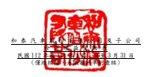
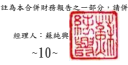

單位:新台幣仟元

| 歸                                   | 屬                                                                                                         | 於          | 母                       | 公    | 司        | 業                         | 主         | 之           | 權                | 益                                        |                  |             |             |             |
|--------------------------------------|------------------------------------------------------------------------------------------------------------|-------------|--------------------------|-------|-----------|----------------------------|------------|--------------|-------------------|-------------------------------------------|------------------|-------------|-------------|-------------|
| 保                                   | 留                                                                                                         | 盈          | 餘 其                    | 他    | 權        | 益                         |            |              |                   |                                           |                  |             |             |             |
|                                      | 國外營運機構財 透過其他綜合損益按 採用覆蓋法重分 務報表換算之兌 公允價值衡量之金融 類之其他綜合 避險工具之 |             |                          |       |           |                            |            |              |                   |                                           |                  |             |             |             |
| 附                                   | 註 普通股股本 資本公積 法定盈餘公積 特別盈餘公積 未分配盈餘 換                                             | 差          | 額 資產未實現評價損益 損 | 益 損 | 益 總     | 計 非 控 制 權 益 權益總額 |            |              |                   |                                           |                  |             |             |             |
| 111 年度第一季  111 年 1 月 1 日餘額 | $ 5,461,792                                                                                                | $ 2,807,477 | $ 13,925,963             | $     | 381,843   | $ 47,944,833 ($            | 556,123) $ | 3,265,105    | $                 | 563,781 ($ 23,820) $73,770,851            | $20,695,114      | $94,465,965 |             |             |
| 111 年第一季淨利                     | -                                                                                                          | -           | -                        | -     | 4,293,291 | -                          | -          | -            | -                 | 4,293,291                                 | 951,934          | 5,245,225   |             |             |
| 111 年第一季其他綜合損益             | -                                                                                                          | -           | -                        | -     | -         | 461,207                    | 389,168 (  | 256,277)     | 9,344             | 603,442                                   | 115,546          | 718,988     |             |             |
| 本期綜合損益總額                     | -                                                                                                          | -           | -                        | -     | 4,293,291 | 461,207                    | 389,168 (  | 256,277)     | 9,344             | 4,896,733                                 | 1,067,480        | 5,964,213   |             |             |
| 盈餘指撥及分派:                     | 六(二十七)                                                                                                 |             |                          |       |           |                            |            |              |                   |                                           |                  |             |             |             |
|                                      | 現金股利                                                                                                   | -           | -                        | -     | - (       | 10,923,584)                | -          | -            | -                 | - ( 10,923,584)                           | - ( 10,923,584 ) |             |             |             |
| 處分子公司股權價格與帳面價值差額     | 六(三十五)                                                                                                 | -           | 119,102                  | -     | -         | -                          | -          | -            | -                 | -                                         | 119,102 (        | 120,102) (  | 1,000 )     |             |
| 非控制權益變動                       | -                                                                                                          | -           | -                        | -     | -         | -                          | -          | -            | -                 | -                                         | 393,934          | 393,934     |             |             |
| 111 年 3 月 31 日餘額                | $ 5,461,792                                                                                                | $ 2,926,579 | $ 13,925,963             | $     | 381,843   | $ 41,314,540 ($            | 94,916) $  | 3,654,273    | $                 | 307,504 ($ 14,476) $67,863,102            | $22,036,426      | $89,899,528 |             |             |
| 112 年度第一季  112 年 1 月 1 日餘額 | $ 5,461,792                                                                                                | $ 2,898,044 | $ 15,553,282             | $     | 381,843   | $ 16,165,239 ($            | 323,552) $ | 1,699,344 ($ | 140,088) $ 69,083 | $41,764,987                               | $27,807,076      | $69,572,063 |             |             |
| 112 年第一季淨利                     | -                                                                                                          | -           | -                        | -     | 5,063,405 | -                          | -          | -            | -                 | 5,063,405                                 | 861,496          | 5,924,901   |             |             |
| 112 年第一季其他綜合損益             | -                                                                                                          | -           | -                        | -     | -         | 74,531                     | 277,315    | 227,750 (    | 45,596)           | 534,000 (                                 | 40,136)          | 493,864     |             |             |
| 本期綜合損益總額                     | -                                                                                                          | -           | -                        | -     | 5,063,405 | 74,531                     | 277,315    | 227,750 (    | 45,596)           | 5,597,405                                 | 821,360          | 6,418,765   |             |             |
| 盈餘指撥及分派:                     | 六(二十七)                                                                                                 |             |                          |       |           |                            |            |              |                   |                                           |                  |             |             |             |
|                                      | 現金股利                                                                                                   | -           | -                        | -     | - (       | 1,092,358)                 | -          | -            | -                 | - ( 1,092,358) ( 1,016,394) ( 2,108,752 ) |                  |             |             |             |
| 112 年 3 月 31 日餘額                | $ 5,461,792                                                                                                | $ 2,898,044 | $ 15,553,282             | $     | 381,843   | $ 20,136,286 ($            | 249,021) $ | 1,976,659    | $                 | 87,662                                    | $ 23,487         | $46,270,034 | $27,612,042 | $73,882,076 |

董事長:黃南光 經理人:蘇純興 會計主管:陳亭汝

後附合併財務報表附註為本合併財務報告之一部分,請併同參閱。