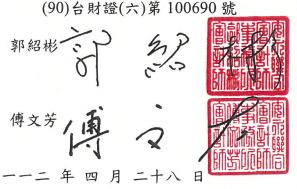

30078 新竹市新竹科學園區力行一路1號E-3 E-3, No.1, Lixing 1st Rd., Hsinchu Science Park Hsinchu City, Taiwan, R.O.C.

Tel: 886 3 688 5678 Fax: 886 3 688 6000 www.ey.com/taiwan 會計師核閱報告 公參:
聯發科技股份有限公司

## 前言

聯發科技股份有限公司及其子公司民國一一二年三月三十一日及民國一一一年三 月三十一日之合併資產負債表,暨民國一一二年一月一日至三月三十一日及民國一一 一年一月一日至三月三十一日之合併綜合損益表、合併權益變動表及合併現金流量表, 以及合併財務報表附註(包括重大會計政策彙總),業經本會計師核閲竣事。依證券發行 人財務報告編製準則暨經金融監督管理委員會認可並發布生效之國際會計準則第三十 四號「期中財務報導」編製允當表達之合併財務報表條管理階層之責任,本會計師之 責任係依據核閱結果對合併財務報表作成結論。

## 範圍

本會計師係依照核閱準則2410號「財務報表之核閱」執行核閱工作。核閱合併財 務報表時所執行之程序包括查詢(主要向負責財務與會計事務之人員查詢)、分析性程 序及其他核閱程序。核閱工作之範圍明顯小於查核工作之範圍,因此本會計師可能無 法察覺所有可藉由查核工作辨認之重大事項,故無法表示查核意見。

## 結論

依本會計師核閱結果,並未發現上開合併財務報表在所有重大方面有未依照證券 發行人財務報告編製準則暨經金融監督管理委員會認可並發布生效之國際會計準則第 三十四號「期中財務報導」編製,致無法允當表達聯發科技股份有限公司及其子公司 民國一一二年三月三十一日及民國一一一年三月三十一日之合併財務狀況,暨民國一 一二年一月一日至三月三十一日及民國一一一年一月一日至三月三十一日之合併財務 績效及合併現金流量之情事。

安永聯合會計師事務所 主管機關核准辨理公開發行公司財務報告 查核簽證文號:(97)金管證(六)第 0970037690 號

$$\mathsf{f_{n}}$$

會計師:

中華民國