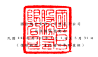
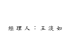
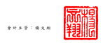

單 位 : 新 台 幣 仟 元

|                          | 單 位 : 新 台 幣 仟 元                           |             |                         |                                                           |                                                                     |                                          |             |                         |                           |                                                |                       |              |                |              |            |               |               |               |                        |           |               |               |
|--------------------------|---------------------------------------------------|-------------|-------------------------|-----------------------------------------------------------|---------------------------------------------------------------------|------------------------------------------|-------------|-------------------------|---------------------------|------------------------------------------------|-----------------------|--------------|----------------|--------------|------------|---------------|---------------|---------------|------------------------|-----------|---------------|---------------|
| 歸                       | 屬                                                | 本          | 公                      | 司                                                        | 業                                                                  | 主                                       | 之          | 權                      | 益                        |                                                |                       |              |                |              |            |               |               |               |                        |           |               |               |
|                          | 其                                                | 他          | 權                      | 益                                                        | 項                                                                  | 目                                       |             |                         |                           |                                                |                       |              |                |              |            |               |               |               |                        |           |               |               |
|                          | 透過其他綜合 損益按公允                           |             |                         |                                                           |                                                                     |                                          |             |                         |                           |                                                |                       |              |                |              |            |               |               |               |                        |           |               |               |
|                          | 國外營運機構 價值衡量 之                          |             |                         |                                                           |                                                                     |                                          |             |                         |                           |                                                |                       |              |                |              |            |               |               |               |                        |           |               |               |
| 股                       | 本                                                | (          | 附                      | 註                                                        | 二                                                                  | 三                                       | ) 資本公積 | 財務報 表 換算 金融資產 | 共同控制下 非控制權益     |                                                |                       |              |                |              |            |               |               |               |                        |           |               |               |
| 債券換股                 | (附註二 三 保                                    | 留          | 盈                      | 餘                                                        | (                                                                  | 附                                       | 註          | 二                      | 三                        | ) 之兌換差額 未實現損益 避險工具損益 庫藏股票 | 前手權益 (附註 二 三 |              |                |              |            |               |               |               |                        |           |               |               |
| 代 碼                    | 普                                                | 通          | 股 權利證書 預收股本 合 | 計 、二七及二九) 法定盈餘公積 特別盈餘公積 未分配盈餘 合 | 計 (附註二 三 ) (附註二 三 ) (附註二 三 ) (附 註 二 三 ) 總 | 計 (附 註 二 三 ) 及 二 九 ) 權益總額 |             |                         |                           |                                                |                       |              |                |              |            |               |               |               |                        |           |               |               |
| A1                       | 111 年 1 月 1 日餘額                              | $ 4,959,189 | $                       | -                                                         | $                                                                   | -                                        | $ 4,959,189 | $ 22,048,917            | $ 8,621,366               | $ 4,594,931                                    | $ 50,545,451          | $ 63,761,748 | ($ 9,753,973)  | $            | 81,021     | $ 198,811     | ($ 1,879,155) | $ 79,416,558  | $                      | -         | $ 354,137     | $ 79,770,695  |
| A4                       | 追溯調整共同控制下組織重組                        | -           | -                       | -                                                         | -                                                                   | -                                        | -           | -                       | -                         | -                                              | -                     | -            | -              | -            | -          | 223,991       | 19,431,164    | 19,655,155    |                        |           |               |               |
| A5                       | 111 年 1 月 1 日重編後餘額                        | 4,959,189   | -                       | -                                                         | 4,959,189                                                           | 22,048,917                               | 8,621,366   | 4,594,931               | 50,545,451                | 63,761,748                                     | ( 9,753,973)          | 81,021       | 198,811        | ( 1,879,155) | 79,416,558 | 223,991       | 19,785,301    | 99,425,850    |                        |           |               |               |
| 110 年度盈餘指撥及分配: |                                                   |             |                         |                                                           |                                                                     |                                          |             |                         |                           |                                                |                       |              |                |              |            |               |               |               |                        |           |               |               |
| B5                       | 本公司股東現金股利                                | -           | -                       | -                                                         | -                                                                   | -                                        | -           | -                       | ( 5,400,560) ( 5,400,560) | -                                              | -                     | -            | -              | ( 5,400,560) | -          | -             | ( 5,400,560)  |               |                        |           |               |               |
| O1                       | 子公司股東現金股利                                | -           | -                       | -                                                         | -                                                                   | -                                        | -           | -                       | -                         | -                                              | -                     | -            | -              | -            | -          | -             | (             | 30,273) (     | 30,273)                |           |               |               |
| C7                       | 採用權益法認列之關聯企業及合資之變動數            | -           | -                       | -                                                         | -                                                                   | 4                                        | -           | -                       | -                         | -                                              | -                     | -            | -              | -            | 4          | -             | -             | 4             |                        |           |               |               |
| D1                       | 111 年 1 月 1 日至 3 月 31 日淨利                 | -           | -                       | -                                                         | -                                                                   | -                                        | -           | -                       | 6,242,293                 | 6,242,293                                      | -                     | -            | -              | -            | 6,242,293  | 1,245         | 26,448        | 6,269,986     |                        |           |               |               |
| D3                       | 111 年 1 月 1 日至 3 月 31 日稅後其他綜合損益     | -           | -                       | -                                                         | -                                                                   | -                                        | -           | -                       | -                         | -                                              | 4,282,355             | (            | 16,297)        | 306,511      | -          | 4,572,569     | -             | 6,902         | 4,579,471              |           |               |               |
| H3                       | 組織重組                                          | 477,793     | -                       | -                                                         | 477,793                                                             | 20,691,277                               | -           | -                       | -                         | -                                              | (                     | 952,675)     | 1,993          | -            | (          | 537,110)      | 19,681,278    | (             | 225,236) ( 19,456,042) | -         |               |               |
| I1                       | 可轉換公司債轉換為普通股                          | -           | 3,578                   | -                                                         | 3,578                                                               | 151,371                                  | -           | -                       | -                         | -                                              | -                     | -            | -              | -            | 154,949    | -             | -             | 154,949       |                        |           |               |               |
| M5                       | 實際取得子公司部分權益                            | -           | -                       | -                                                         | -                                                                   | 342                                      | -           | -                       | -                         | -                                              | -                     | -            | -              | -            | 342        | -             | (             | 9,073) (      | 8,731)                 |           |               |               |
| N1                       | 股份基礎給付-員工認股權                          | -           | -                       | 40                                                        | 40                                                                  | 808                                      | -           | -                       | -                         | -                                              | -                     | -            | -              | -            | 848        | -             | -             | 848           |                        |           |               |               |
| Z1                       | 111 年 3 月 31 日餘額                             | $ 5,436,982 | $                       | 3,578                                                     | $                                                                   | 40                                       | $ 5,440,600 | $ 42,892,719            | $ 8,621,366               | $ 4,594,931                                    | $ 51,387,184          | $ 64,603,481 | ($ 6,424,293)  | $            | 66,717     | $ 505,322     | ($ 2,416,265) | $ 104,668,281 | $                      | -         | $ 323,263     | $ 104,991,544 |
| A1                       | 112 年 1 月 1 日餘額                              | $ 4,212,608 | $                       | 1,934                                                     | $                                                                   | -                                        | $ 4,214,542 | $ 41,679,879            | $ 10,694,034              | $ 9,911,736                                    | $ 56,678,721          | $ 77,284,491 | ($ 421,272) ($ | 14,098)      | $ 631,535  | ($ 2,030,720) | $ 121,344,357 | $             | -                      | $ 204,960 | $ 121,549,317 |               |
| 111 年度盈餘指撥及分配: |                                                   |             |                         |                                                           |                                                                     |                                          |             |                         |                           |                                                |                       |              |                |              |            |               |               |               |                        |           |               |               |
| B5                       | 本公司股東現金股利                                | -           | -                       | -                                                         | -                                                                   | -                                        | -           | -                       | ( 4,186,652) ( 4,186,652) | -                                              | -                     | -            | -              | ( 4,186,652) | -          | -             | ( 4,186,652)  |               |                        |           |               |               |
| C7                       | 採用權益法認列之關聯企業及合資之變動數            | -           | -                       | -                                                         | -                                                                   | 6,646                                    | -           | -                       | (                         | 105) (                                         | 105)                  | -            | -              | -            | -          | 6,541         | -             | -             | 6,541                  |           |               |               |
| D1                       | 112 年 1 月 1 日至 3 月 31 日淨利                 | -           | -                       | -                                                         | -                                                                   | -                                        | -           | -                       | 4,131,526                 | 4,131,526                                      | -                     | -            | -              | -            | 4,131,526  | -             | 3,261         | 4,134,787     |                        |           |               |               |
| D3                       | 112 年 1 月 1 日至 3 月 31 日稅後其他綜合損益     | -           | -                       | -                                                         | -                                                                   | -                                        | -           | -                       | -                         | -                                              | (                     | 538,824)     | 42,603         | 49,111       | -          | (             | 447,110)      | -             | (                      | 1,702) (  | 448,812)      |               |
| I1                       | 可轉換公司債轉換為普通股                          | 1,934       | 4,596                   | -                                                         | 6,530                                                               | 279,302                                  | -           | -                       | -                         | -                                              | -                     | -            | -              | -            | 285,832    | -             | -             | 285,832       |                        |           |               |               |
| Q1                       | 處分透過其他綜合損益按公允價值衡量之權益 工具投資 | -           | -                       | -                                                         | -                                                                   | -                                        | -           | -                       | (                         | 107) (                                         | 107)                  | -            | 107            | -            | -          | -             | -             | -             | -                      |           |               |               |
| Z1                       | 112 年 3 月 31 日餘額                             | $ 4,214,542 | $                       | 6,530                                                     | $                                                                   | -                                        | $ 4,221,072 | $ 41,965,827            | $ 10,694,034              | $ 9,911,736                                    | $ 56,623,383          | $ 77,229,153 | ($ 960,096)    | $            | 28,612     | $ 680,646     | ($ 2,030,720) | $ 121,134,494 | $                      | -         | $ 206,519     | $ 121,341,013 |

後 附 之 附 註 係 本 合 併 財 務報告 之 一 部 分 。

( 請 參 閱 勤 業 眾 信 聯 合 會 計 師 事 務 所 民 國 1 1 2 年 4 月 20 日 核閱報告)

董 事 長 : 陳泰銘 經 理 人 : 王淡如 會 計 主 管 : 楊文翔

