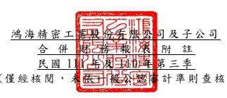

單位:新 台幣仟 元 (除特別註 明者外 )

## 一、 公司沿革

鴻海精密 工業股 份有限 公司 (以 下簡稱「 本公司 」)於 中華民 國設立,本 公司及 子 公司(以下 統稱「本集團 」)主 要營業 項 目為資訊 產業、通訊產 業、自 動化設 備 產 業、精密 機械產 業、汽 車產業 與消費 性 電子產業 有關之 各種連 接器、機殼、散 熱 器、有線/無線 通訊產 品、光學產 品、電 源供應模 組、應用模 組組裝 產品以 及網 路線纜裝 配等產 品之製 造、銷 售及服 務 。

## 二、 通過財務 報告之 日期及 程序

本合併財 務報告 已於民國 111 年 11 月 10 日提報董事 會後發 布 。

三、 新發布及 修訂準 則及解 釋之適 用
(一)已採用金 融監督 管理委 員會 (以 下簡稱「 金管會 」)認 可之新 發布、修 正 後國 際財務報 導準則 之影響 下列彙列 金管會 認可之 民國 111 年適用 之國際財 務報導 準則之 新發布 、修 正及修訂 之準則 及解釋 :

|                             | 國際會計準則理事會            |              |                 |                 |
|-----------------------------|-------------------------------|--------------|-----------------|-----------------|
|                             | 新發布/修正/修訂準則及解釋    | 發布之生效日 |                 |                 |
| 國際財務報導準則第3號之修正 | 「對觀念架構之索引」          |              | 民國111年1月1日 |                 |
| 國際會計準則第16號之修正    | 「不動產                      | 、廠房及設備 | :達到預定      | 民國111年1月1日 |
| 使用狀態前之價款」          |                               |              |                 |                 |
| 國際會計準則第37號之修正    | 「虧損性合約─履行合約之成本」 |              | 民國111年1月1日 |                 |
| 2018-2020週期之年度改善     | 民國111年1月1日               |              |                 |                 |

本集團經 評估上 述準則 及解釋 對本集 團 財務狀況 與 財務 績效並 無重大 影響。

(二)尚未採用 金管會 認可之 新發布 、修正 後 國際財務 報導準 則之影 響

|                          | 國際會計準則理事會             |                 |                 |
|--------------------------|--------------------------------|-----------------|-----------------|
|                          | 新發布/修正/修訂準則及解釋     | 發布之生效日    |                 |
| 國際會計準則第1號之修正  | 「會計政策之揭露」             |                 | 民國112年1月1日 |
| 國際會計準則第8號之修正  | 「會計估計之定義」             |                 | 民國112年1月1日 |
| 國際會計準則第12號之修正 | 「與單一交易所產生之資產及負債 | 民國112年1月1日 |                 |
| 有關之遞延所得稅」       |                                |                 |                 |

下表彙列 金管會 認可之 民國 112 年適用 之國際財 務報導 準則之 新發布 、修 正及修訂 之準則 及解釋 :
本集團經 評估上 述準則 及解釋 對本集 團 財務狀況 與 財務 績效並 無重大 影響。