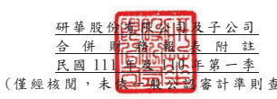

ൂՏ Ǻ ཥѠ ჾ щϡ )**ନ ձ ຏ ܴޣ Ѧ** *!

## Ǵ Ϧљ ݮ ॠ

)*ࣴ ި ҽ Ԗज़ Ϧљ )а Π ᙁᆀȨҁ Ϧљ ȩ*ܭ҇ ୯ 81 ԃ : **Д ҥǶЬ ा வ٣**
൪Ε Ԅ ݈ь ǵ π ڋ ౢ ࠔǵ ᔈ Ҕႝ တϷ π Ҕ ႝ တϐ ᇙ у πϷ ວ ፤Ƕ
)Β*ҁ Ϧљ ި ౻Ծ ҇ ୯ 99 ԃ 23 **Дଆ ӧѠ  چ Ҭ ܰ܌ ѱ ວ ፤ Ƕ** )Ο*ҁ Ϧљ ࣁ ගϲ Ҿ  ი ᡏ ᔼၮ ਏ Ǵ ܭ҇ ୯ :9 ԃ 7 Д 41 **В  ҁ Ϧљ ဠ**
٣  ،  ೯ ၸ ᆶ ҁ Ϧ љ ԭ ϩ ϐ ԭ  ި ϐ η Ϧ љ .**ࣴ  Ҿ ᆅ ៝ ୢ ި ҽ Ԗ ज़ Ϧ** љ Չ ᙁܰ ӝ ٳǴ ٠а ҇ ୯ :9 ԃ 8 Д 41 **Вࣁ ӝ ٳ ୷ྗ ВǴ а ҁϦ љ ࣁӸ**
ុϦ љǴࣴ Ҿ ᆅ៝ ୢϦ љ ࣁ ྐ ϦљǴҁϦ љ ཷ ܍ ࣴڙ Ҿ ᆅ ៝ୢ Ϧ љ ϐ  ᆶ ୍Ƕҁ Ϧљ ќ ܭ҇ ୯ 214 ԃ 7 Д 37 **В ဠ ٣ ،  ೯ၸ ᆶ ҁϦ** љ 211& ިϐ η Ϧ љ .ࣴ  ၗި ҽ Ԗ ज़Ϧ љ )**а Πᙁ ᆀȨ ࣴ  ၗϦ љȩ*** ި :6/62&ϐ η Ϧ љ.ඵ๔ ࣽ מި ҽ Ԗ ज़Ϧ љ )а ΠᆀȨ ඵ ๔Ϧ љ *** Չߚ ჹ** ᆀԄ ӝ ٳǴа ҇୯ 214 ԃ 8 Д 38 **Вࣁ ӝ ٳ ୷ྗ ВǴҁ Ϧљ ࣁӸ ុ ϦљǴඵ** ๔Ϧ љ ࣁ ྐ Ϧљ Ǵҁ Ϧ љཷ  ڙ܍ ඵ๔ Ϧ љϐ  ᆶ ୍ Ƕ

## Βǵ ೯ၸ  ୍ൔ  Βв යϷ ำ ׇ

ҁӝ ٳ ୍  ൔ ς ܭ҇ ୯ 222 ԃ 5 Д 3: **В  ဠ٣  ೯ၸ ࡕ วѲ Ƕ**
Οǵ ཥว Ѳ Ϸঅ ु ྗ߾ Ϸှ ញ ϐ Ҕ
)*ς௦ Ҕ ߎᑼ ᅱ ࿎ᆅ ہ(   аΠ ᙁ ᆀ Ȩߎ ᆅ ȩ ***ᇡ ё ϐ ཥว Ѳ ǵঅ ҅ ࡕ**
୯ሞ  ୍ൔ Ꮴ ྗ߾ ϐቹ ៜ Π߄ ༽ ӈߎ ᆅ ᇡ ёϐ ҇ ୯ 222 **ԃ  Ҕϐ ୯ ሞ ୍ ൔᏤ ྗ߾ ϐ ཥว Ѳ ǵঅ** ҅Ϸ অ ुϐ ྗ ߾Ϸ ှញ Ǻ

|              | !୯ሞ཮ीྗ߾౛٣཮      |            |            |
|--------------|---------------|------------|------------|
|              | !ཥวѲ0অ҅0অुྗ߾Ϸှញ   | วѲϐғਏВ     |            |
| ୯ሞ଄୍ൔᏤྗ߾ಃ4ဦϐঅ҅   | Ȩჹᢀ           | ࢎ          |            |
|              | ۺ             | ᄬϐ઩Їȩ     | !҇୯222ԃ2Д2В |
| ୯ሞ཮ीྗ߾ಃ27ဦϐঅ҅    | Ȩό୏ౢǵቷ܊Ϸ೛ഢ     | ǺၲډႣ        | !҇୯222ԃ2Д2В |
| !!ۓ٬Ҕރᄊ߻ϐሽීȩ |               |            |            |
| ୯ሞ཮ीྗ߾ಃ48ဦϐঅ҅    | Ȩᖝཞ܄ӝऊˇቬՉӝऊϐԋ | !҇୯222ԃ2Д2В |            |
| !!ҁȩ         |               |            |            |
| 3129.3131ຼයϐԃ | ׯ             |            |            |
|              | ࡋ             | ๓          | !҇୯222ԃ2Д2В |

ҁ  ი  ຑ   ॊ ྗ ߾ Ϸ ှ ញ ჹ ҁ  ი  ୍ ރ ݩ ᆶ  ୍ ᕮ ਏ ٠ ค ख़ ε ቹ ៜǶ
無。

(三)國際 會 計準 則 理事 會已 發 布但 尚 未經 金管 會 認可 之 國際 財務 報 導準 則 之影 響 下 表 彙 列 國 際 會 計 準 則 理 事 會 已 發 布 但 尚 未 納 入 金 管 會 認 可 之 國 際 財 務 報 導準 則 之新 發 布、 修正 及 修訂 之 準則 及解 釋 :

|                                                  | 國際會計準則理事會           |                 |                 |
|--------------------------------------------------|------------------------------|-----------------|-----------------|
|                                                  | 新發布/修正/修訂準則及解釋   | 發布之生效日    |                 |
| 國際財務報導準則第10號及國際會計準則第28號之修正 | 「投                         | 待國際會計準則  |                 |
| 資者與其關聯企業或合資間之資產出售或投入」       |                              | 理事會決定      |                 |
| 國際財務報導準則第17號                           | 「保險合約」                 |                 | 民國112年1月1日 |
| 國際財務報導準則第17號                           | 「保險合約」之修正           | 民國112年1月1日 |                 |
| 國際財務報導準則第17號之修正                     | 「初次適用國際財務報導準     | 民國112年1月1日 |                 |
| 則第17號及國際財務報導準則第9號—比較資訊」       |                              |                 |                 |
| 國際會計準則第1號之修正                          | 「負債之流動或非流動分類」   |                 | 民國112年1月1日 |
| 國際會計準則第1號之修正                          | 「會計政策之揭露」           |                 | 民國112年1月1日 |
| 國際會計準則第8號之修正                          | 「會計估計之定義」           |                 | 民國112年1月1日 |
| 國際會計準則第12號之修正                         | 「與單一交易所產生之資產及負 | 民國112年1月1日 |                 |
| 債有關之遞延所得稅」                             |                              |                 |                 |

本 集 團 經 評 估 上 述 準 則 及 解 釋 對 本 集 團 財 務 狀 況 與 財 務 績 效 並 無 重 大 影 響。

## 四、 重大 會 計政 策 之彙 總說 明

重大 會 計政 策 除遵 循聲 明、編 製 基礎、合併 基 礎及 新 增部 分說 明 如下,餘 與 民國 110 年 度合 併 財務 報 表附 註 四相 同。除 另有 說 明外,此 等 政策 在 所有 報 導期 間一 致地 適 用。

## (一)遵循 聲 明

1.本 合 併 財 務 報 告 係 依 照 證 券 發 行 人 財 務 報 告 編 製 準 則 及 經 金 管 會 認 可 並 發布 生 效之 國 際會 計準 則 第 34 號 「 期 中財 務 報導 」 編製 。

2.本 合 併財 務 報告 應併 同 民 國 110 年 度合 併 財務 報 告閱 讀 。

## (二)編製 基 礎

1.除 下 列重 要 項目 外, 本 合併 財 務報 告係 按 歷史 成 本 基 礎編製:
(1)按 公 允 價 值 衡 量 之 透 過 損 益 按 公 允 價 值 衡 量 之 金 融 資 產 及 負 債 (包 括 衍生 工 具)。

(2)按公 允 價值 衡 量 之 透 過 其他 綜 合損 益按 公 允價 值 衡量 之金 融 資產 。 (3)按退 休 基金 資 產 減除 確 定福 利 義務 現值 之 淨額 認 列之 確定 福 利負 債 。