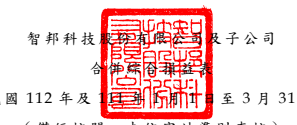

(僅 經核 閱, 未依 審 計準 則查 核 )
單位 : 新 台幣 仟元 , 惟 每 股 盈餘 為 元

| 112年1月1日至3月31日                      | 111年1月1日至3月31日              |            |            |            |        |            |     |
|-------------------------------------------|-----------------------------------|------------|------------|------------|--------|------------|-----|
| 代                                        | 碼                                | 金         | 額         | %         | 金     | 額         | %  |
| 4100                                      | 銷貨收入(附註二四及三二)        | $          | 19,685,588 | 100        | $      | 15,729,561 | 100 |
| 5110                                      | 銷貨成本(附註十一、二二及 二五) | 15,374,346 | 78         | 12,748,815 | 81     |            |     |
| 5900                                      | 營業毛利                          | 4,311,242  | 22         | 2,980,746  | 19     |            |     |
| 營業費用(附註十、二二及二 五)           |                                   |            |            |            |        |            |     |
| 6100                                      | 推銷費用                          | 401,310    | 2          | 381,624    | 2      |            |     |
| 6200                                      | 管理費用                          | 489,065    | 3          | 450,253    | 3      |            |     |
| 6300                                      | 研究發展費用                      | 834,895    | 4          | 639,105    | 4      |            |     |
| 6450                                      | 預期信用減損(迴轉利 益)損失     | (          | 223 )      | -          | 42     | -          |     |
| 6000                                      | 營業費用合計                      | 1,725,047  | 9          | 1,471,024  | 9      |            |     |
| 6900                                      | 營業淨利                          | 2,586,195  | 13         | 1,509,722  | 10     |            |     |
| 營業外收入及支出(附註十 三、二五及三二) |                                   |            |            |            |        |            |     |
| 7100                                      | 利息收入                          | 140,450    | 1          | 9,595      | -      |            |     |
| 7010                                      | 其他收入                          | 12,947     | -          | 7,333      | -      |            |     |
| 7020                                      | 其他利益及損失                    | (          | 178,165 )  | (          | 1 )    | 79,640     | -   |
| 7050                                      | 財務成本                          | (          | 22,137 )   | -          | (      | 14,574 )   | -   |
| 7060                                      | 採用權益法認列之關聯 企業損益份額 | (          | 51 )       | -          | (      | 227 )      | -   |
| 7000                                      | 營業外收入及支出 合計             | (          | 46,956 )   | -          | 81,767 | -          |     |
| 7900                                      | 稅前淨利                          | 2,539,239  | 13         | 1,591,489  | 10     |            |     |
| 7950                                      | 所得稅費用(附註四及二六)        | 502,074    | 3          | 304,276    | 2      |            |     |
| 8200                                      | 本期淨利                          | 2,037,165  | 10         | 1,287,213  | 8      |            |     |
| (接 次頁 )                              |                                   |            |            |            |        |            |     |

(承 前頁 )

| 112年1月1日至3月31日     | 111年1月1日至3月31日                                          |           |           |         |           |           |    |
|--------------------------|---------------------------------------------------------------|-----------|-----------|---------|-----------|-----------|----|
| 代                       | 碼                                                            | 金        | 額        | %      | 金        | 額        | % |
| 其他綜合損益(附註二三) |                                                               |           |           |         |           |           |    |
| 8310                     | 不重分類至損益之項目:                                        |           |           |         |           |           |    |
| 8316                     | 透過其他綜合損益 按公允價值衡量 之權益工具投資 未實現評價損益 | $         | 51,398    | 1       | ( $       | 22,905 )  | -  |
| 8360                     | 後續可能重分類至損益 之項目:                                 |           |           |         |           |           |    |
| 8361                     | 國外營運機構財務 報表換算之兌換 差額                          | 17,904    | -         | 196,185 | 1         |           |    |
| 8300                     | 本期其他綜合損益 (稅後淨額)                                 | 69,302    | 1         | 173,280 | 1         |           |    |
| 8500                     | 本期綜合損益總額                                              | $         | 2,106,467 | 11      | $         | 1,460,493 | 9  |
| 淨利(損)歸屬於:       |                                                               |           |           |         |           |           |    |
| 8610                     | 母公司業主                                                    | $         | 2,037,165 | 10      | $         | 1,287,213 | 8  |
| 8620                     | 非控制權益                                                    | -         | -         | -       | -         |           |    |
| 8600                     | $                                                             | 2,037,165 | 10        | $       | 1,287,213 | 8         |    |
| 綜合損益總額歸屬於:     |                                                               |           |           |         |           |           |    |
| 8710                     | 母公司業主                                                    | $         | 2,106,467 | 11      | $         | 1,460,493 | 9  |
| 8720                     | 非控制權益                                                    | -         | -         | -       | -         |           |    |
| 8700                     | $                                                             | 2,106,467 | 11        | $       | 1,460,493 | 9         |    |
| 每股盈餘(附註二七)     |                                                               |           |           |         |           |           |    |
| 9750                     | 基                                                            | 本        | $         | 3.65    | $         | 2.31      |    |
| 9850                     | 稀                                                            | 釋        | $         | 3.62    | $         | 2.29      |    |

後附 之附 註係 本 合 併 財務 報 告 之一 部分 。

(請 參閱 勤業 眾信 聯 合會 計師 事務 所民 國 112 年 5 月 11 日 核閱 報告 )

- 7 -

