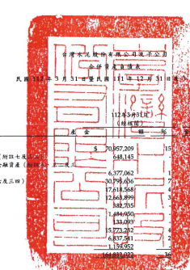
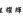
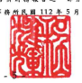

31 1

|                                                     | 單但: 新台警仔元                                         |                 |               |              |               |             |     |
|-----------------------------------------------------|----------------------------------------------------------|-----------------|---------------|--------------|---------------|-------------|-----|
| 0                                                   |                                                          |                 |               |              |               |             |     |
| 112439311                                           | 111年12月31日                                            | 111年3月31日    |               |              |               |             |     |
| 0 9 4 12 12                                         | (经查拉)                                                 | (经植聞)        |               |              |               |             |     |
| 育                                                  | 42                                                       | अञ              | %             | ফ            | 发            | ୨୫          |     |
| હ્ય                                                  | ਸ਼                                                        | 流動買屋        |               |              |               |             |     |
| 1100                                                | 现金及约含现金(附註六)                                   | 70,957,209      | 88,842,494    | 19           | ર             | 98,040,416  | 22  |
| 送酒摄总按公允情德街景之会融背景(附加七及           | 611,802                                                  | 370,222         |               |              |               |             |     |
| 1110                                                | 648,145                                                  |                 |               |              |               |             |     |
| 选通其他综合摄益按公允情值街登之全融资産(           | 8 11 3                                                   |                 |               |              |               |             |     |
| 1120                                                | w )                                                      | 6,377,062       | 5,934,753     | l            | 6,978,002     | 2           |     |
| 1136                                                | 30,795,636                                               | 20,954,299      | 5             | 20,341,977   | 5             |             |     |
| 按潍纺仪成本街量之会融资産(附近六及三四)            | 17,618,568                                               | 19,450,723      | 23,092,974    | ហ            |               |             |     |
| 1150                                                | 應收票據(所註大及二三)                                   | 4               |               |              |               |             |     |
| 1170                                                | 惠收帳款(所註九·十及二三)                                | 12,665,899      | 15,148,760    | 3            | 10,329,793    | 2           |     |
| 586.735                                             | 513,975                                                  | 378,563         |               |              |               |             |     |
| 1180                                                | 惠收票搞及顿故一周徐人(附註三三)                         | 0 0 8           |               |              |               |             |     |
|                                                     | 1,353,943                                                |                 |               |              |               |             |     |
| 1200                                                | 吴优惠设款                                               | 1,484,950r      | 2,309,268     | 1            | ﻳ             |             |     |
| 1210                                                | 其他應收款一國德人(附拉三三)                             | 133,093         | 415,606       | 303,904      |               |             |     |
| 0                                                   | 16.089.980                                               | 4               | 13.552.203    | 3            |               |             |     |
| 130X                                                | 存货(附址十一)                                           | 5.773.232       | 1             |              |               |             |     |
| 1410                                                | 预付款項                                                 | 6,837,541       | 4,268,024     | 1            | 5,472,861     |             |     |
| 黑他演動演奏《附註二三)                             | 1 159 052                                                | 1,084,374       | 817,729       |              |               |             |     |
| 1479                                                |                                                          |                 |               |              |               |             |     |
| 11XX                                                | 流動質產總計                                             | Frid 61,832,924 | 175,624,058   | દ્વ           | 181,032,587   | 40          |     |
| 20                                                  | 21.07                                                    | 11              |               |              |               |             |     |
| 抑流動質產                                          |                                                          |                 |               |              |               |             |     |
| 法過損益按公允價值到量之全融資產(附註七、三二反三四 | 2017                                                     | -               |               |              |               |             |     |
| 1510                                                | 284,876                                                  | .               |               |              |               |             |     |
| 1517                                                | 透過其他紹合捐益按公允價值街量之全融資產(附註八·三二及三 | 23,662,688      | 5             | 22,751,646   | 5             | 28,349,964  | 6   |
| == )                                                |                                                          |                 |               |              |               |             |     |
| 1535                                                | 11,492,164                                               | 9,577,103       | 2             | 5,874,111    | 1             |             |     |
| 按線銷後或本街量之合融資產(所註六及三四)            | 3                                                        |                 |               |              |               |             |     |
| 1550                                                | 55,617,949                                               | 12              | 53,586,673    | 12           | 48,438,239    | 11          |     |
| 积用相益法之投費(附註十三及三四)                    |                                                          |                 |               |              |               |             |     |
| 不動産、販鳥及設備(所註十四、二四、三三及三四)      | 103,227,319                                              |                 |               |              |               |             |     |
| 1600                                                | 120,821,456                                              | 26              | 114,739,983   | 15           | 23            |             |     |
|                                                     | 15,503,775                                               | 15,433,901      | ﺹ             |              |               |             |     |
| 1755                                                | 使用相责度(附班十五及二四)                               | 15,650,039      | 3             | 3            |               |             |     |
| 1760                                                | 5.317.619                                                | 1               | 5,323,016     | 1            | 5,420,880     | 1           |     |
| 投資社不動産(財該十六、二四及三09)                  |                                                          |                 |               |              |               |             |     |
| 1780                                                | 無彩資産(肘粒十七反二四)                                 | 28,319,815      | 6             | 27,880,416   | ર             | 28,443,122  | б   |
|                                                     | 9,658,047                                                | 8,583,847       |               |              |               |             |     |
| 1915                                                | 预付级编辑(刚进十四)                                     | 10,416,682      | 2             | 2            | 2             |             |     |
|                                                     | 21,372,402                                               | 5               | 24,108,219    | 5            |               |             |     |
| 194D                                                | 應收融資租賃款(別珠十)                                   | 20,593,782      | 5             |              |               |             |     |
| 1975                                                | 净硫定描利贤麦(肘胶四)                                   | 1,570,101       | .             | 1,567,531    | -             | 1,852,446   | l   |
| 1995                                                | 2,939,435                                                | 2,073,636       |               |              |               |             |     |
| 其他非演動資産(財經四及三四)                        | 3,063,639                                                |                 |               |              |               |             |     |
| 15XX                                                | 非值到货星助计                                           | 296,816,346     | 64            | 285,184,903  | 62            | 271,805,684 | 60  |
|                                                     | $ 460,808,961                                            | $ 452,838,271   | 100           |              |               |             |     |
| 1XXX                                                | 资                                                       | 美              | 越            | 하           | $ 461.648,368 | _100        | 100 |
| દ્ધ                                                  | ય                                                        | 1               | 设            | 及           | ਕ             | র           |     |
| 流動員價                                            |                                                          |                 |               |              |               |             |     |
| 2100                                                | 5                                                        | 49,691,467      | 11            |              |               |             |     |
| 短期情故(附該十八、三十及三四)                      | $ 17,733,242                                             | 4               | 5 22,416,812  | ક            |               |             |     |
| 2110                                                | 應付紐期眾學(財誌十八)                                   | 3,051,693       | 1             | 3,065,961    | 1             | 6,159,512   | 1   |
|                                                     | 641,522                                                  |                 |               |              |               |             |     |
| 2120                                                | 这通摄益按公允情佳街量之会破典情(附註七及三)             | 364,022         | 461,702       |              |               |             |     |
| 2.779.840                                           | 1                                                        | 1,774,714       | 1,398,293     |              |               |             |     |
| 2130                                                | 合约典债(附班二三)                                       |                 |               |              |               |             |     |
| 2170                                                | 應付票讓及帳款(別誌三三)                                 | 14,355,988      | 3             | 13,691,411   | 3             | 11,279,929  | 3   |
|                                                     | 2                                                        |                 |               |              |               |             |     |
| 2219                                                | 其他患付款(附註十四及二十)                               | 11,231,963      | 2             | 9,771,591    | 2             | 8,768,775   |     |
|                                                     | 750,236                                                  | 27,392          |               |              |               |             |     |
| 2220                                                | 其他愿分散一周休人(财誌三三)                             | 1,242,861       | 00 00         | ı            |               |             |     |
| 2230                                                | 本期所得就角清《财旅馆》                                 | 1,317,413       | .             | 1,063,356    | 2,104,940     |             |     |
| 2280                                                | 租賃負債(附班十五及三三)                                 | 423,841         | 400,136       | 416,321      |               |             |     |
|                                                     | 29,080,294                                               | ବସ୍ତ ମ           |               |              |               |             |     |
| 2320                                                | 一年內到期之長期負債(刑往十八·十九·三十及三四)           | 21,115,742      | 5             | 21,511,839   | 5             |             |     |
| 2399                                                | 其他流動負債                                             | 723,450         | 121,833       | ﻟﻴ           | 269,506       |             |     |
| 21XX                                                | 波動負債時計                                             | 74,340,055      | 16            | 75,209,411   | ार             | 109,658,131 | _24 |
| 非流動員債                                          |                                                          |                 |               |              |               |             |     |
| 2530                                                | 72,136,574                                               | 81,616,287      |               |              |               |             |     |
| 應付公司債(所註十九)                                | 81,423,818                                               | 18              | 16            | 18           |               |             |     |
|                                                     | 7                                                        | 42.864.736      | 9             | 8.455.784    | 2             |             |     |
| 2540                                                | 長期借款(附註十八·三十及三四)                            | 33,234,023      |               |              |               |             |     |
| 2580                                                | 组货商值(附拉十五及三三)                                 | 3,641,884       | 1             | 3,550,048    | 1             | 3,222,571   | 1   |
|                                                     | 12,359,419                                               | 12,075,590      |               |              |               |             |     |
| 2570                                                | 遮延所得就角值(附註四)                                   | 12,460,280      | 3             | 3            | 3             |             |     |
|                                                     | 697 646                                                  |                 |               |              |               |             |     |
| 2610                                                | 長期應付票據(財註十八)                                   | 15,055,513      | 3             | 14,990,589   | 3             | . .         |     |
| 2640                                                | 净確定結利角績(附註四)                                   | 64,273          | .             | 119,623      | -             | 84,705      |     |
|                                                     | 1,269,802                                                |                 |               |              |               |             |     |
| 2670                                                | 其他非波動員演《射班十三)                                | 1,347,488       | 1,302,781     |              |               |             |     |
| 25XX                                                | 乖近動員債總計                                           | 147,227,279     | _32           | _147,323,770 | _32           | 107,422,385 | 24  |
|                                                     | 222,533,181                                              | 217,080,516     |               |              |               |             |     |
| 2XXX                                                | 負債總計                                                 | 221,567,334     | - 48          | નર્           | ন্ত            |             |     |
| 本公司案主提监總計(附近二二)                        |                                                          |                 |               |              |               |             |     |
| 3110                                                | 普通股股本                                               | 71,561,817      | 71,561,817    | 61,252,340   | 13            |             |     |
|                                                     | 16                                                       | 16              |               |              |               |             |     |
| 3120                                                | 特別酸酸本                                               | 2,000,000       | 2,000,000     | 2,000,000    |               |             |     |
| 3200                                                | 65,985,865                                               | 14              | 56,758,936    | 13           |               |             |     |
| 資本公積                                            | 66,000,181                                               | 14              |               |              |               |             |     |
| 3300                                                | 伴留屋绘                                                 | 15              | 66,527,594    | 75,140,220   |               |             |     |
| 67,934,698                                          | 14                                                       | 17              |               |              |               |             |     |
| 3400                                                | 其他模层                                                 | 11,991,090      | 3             | 20,037,610   | 4             |             |     |
| 13,484,421                                          | 3                                                        |                 |               |              |               |             |     |
| 3500                                                | 392.343 )                                                |                 |               |              |               |             |     |
| 本道原景                                            | (                                                        | 904,059 )       | 171,600 )     |              |               |             |     |
| 31XX                                                | 本公司案立慰后绝对                                       | 48              | 47            | 47           |               |             |     |
| 220,077,058                                         | 217,894,766                                              | 214,796,763     |               |              |               |             |     |
| 36XX                                                | 非控制權益(所註二二)                                     | 20,003,976      | 20,381,014    | 5            | 20,960,992    | 5           |     |
|                                                     | 1                                                        |                 |               |              |               |             |     |
| 3XXX                                                | 时益地计                                                 | 235,757,755     | _52           |              |               |             |     |
| 240,081,034                                         | _____                                                    | 238,275,780     | 52            |              |               |             |     |
| 真 情 共 型 总 给 计                                | $ 461,648,368                                            | 100             | $ 460.808.961 | 100          | $ 152,838,271 | 100         |     |

微刑之附近像本合併时得报告之一郎分
(猜參閱到黨眾信聯合會計師事 5月11 \# 班服装)
會計主管: 萊因 定

资事長:领安平

经理人:组织峰

