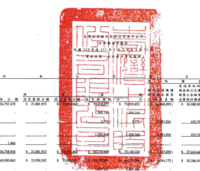
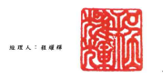
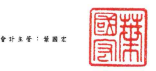

單位:新台盤仔光

|  埃            | 基                       | 59             | *                  | 2             | 推            |              |              |              |                |              |    |           |               |               |               |              |               |
|----------------|--------------------------|----------------|--------------------|---------------|---------------|--------------|--------------|--------------|----------------|--------------|----|-----------|---------------|---------------|---------------|--------------|---------------|
|                | ਲ                        | 피             | 项                 |               |               |              |              |              |                |              |    |           |               |               |               |              |               |
|                | 透過其他综合             |                |                    |               |               |              |              |              |                |              |    |           |               |               |               |              |               |
|                | 峰 线                    | 摄品按公允價值 |                    |               |               |              |              |              |                |              |    |           |               |               |               |              |               |
|                | 大 出 第                 | 知量之全社管是 | 公                 | 4             |               |              |              |              |                |              |    |           |               |               |               |              |               |
| 手通股股本     | 将别 殷 叔 本            | 價 本 公 线    | 止义监理公确       | 45 3          | 200           | 分 配 波 世  | 더           | 表 辆        | 永育现评值福丘 |              |    |           |               |               |               |              |               |
| વ મ            | 避险工具福迈             | 麻 法 股 黑    | 第左被互浮镇       | 用 控制 组 互 | 理 品 购 叶   |              |              |              |                |              |    |           |               |               |               |              |               |
| A1             | 111 年 1 月 1 日 绘 版   | $ 61,252,340   | $ 2,000,000        | $ 86,757,470  | $ 21,881,915  | 39.01.302    | $ 73 939,852 | 48           | ( 568 8900 4   | S 26,988,909 | S  | (s        | 392,343 )     | $ 204,477,333 | $ 21,177,340  |              |               |
|                | .                        | $ 226,654,673  |                    |               |               |              |              |              |                |              |    |           |               |               |               |              |               |
| D1             | 本期评利《编》           | 1,204,143      | 1,204,344 ..       | 1,204,144     | 347,638 )     | 856,506      |              |              |                |              |    |           |               |               |               |              |               |
| D3             | 其他坦会振位             | 3,776)         | $1.836             | 635,760       | 9,113,820     | 130,505      | 9,244,325    |              |                |              |    |           |               |               |               |              |               |
| D5             | 111年1月1日至3月31日     |                |                    |               |               |              |              |              |                |              |    |           |               |               |               |              |               |
| 综合捐旦跑頭   | 1,200,368                | 2.200.368      | 51,836             | 635,760       | -- 10,317,964 | ( 217 LAN )  | _10,100,831  |              |                |              |    |           |               |               |               |              |               |
| M7             | 到子公司所有假摆出登录   | 1.462          | PRODUCE MITERS THE | -1.466        | 785           | 2,251        |              |              |                |              |    |           |               |               |               |              |               |
|                | ***                      |                |                    |               |               |              |              |              |                |              |    |           |               |               |               |              |               |
| Z1             | 111年3月31日给颖         | $ 61,252,340   | $ 2.000.000        | $ 56,758,936  | S 21,881,915  | 2027843      | 75,140,220   | ( 87.059 )   | $ 27,624,669   | 392.343 )    |    |           |               |               |               |              |               |
|                | 1                        | (S             | $ 214.796.763      | $ 20,960,992  | $ 235,757,755 |              |              |              |                |              |    |           |               |               |               |              |               |
| A1             | 112年1月1日休鎖          | $ 71,561,817   | $ 2,000,000        | $ 65,985,865  | $ 23,950,392  | ર            | 294,175 )    | $ 20,286,916 | (s             | 1,651 )      | (S | 171,600 ) | $ 217,894,766 | $ 20,381,014  | $ 238,275,780 |              |               |
| D1             | 本期净利【级)            | .              | 1,407,161          | 401,517 )     | 1,005,644     |              |              |              |                |              |    |           |               |               |               |              |               |
|                | -                        |                |                    |               |               |              |              |              |                |              |    |           |               |               |               |              |               |
| D3             | 其他综合损益             | 31,063)        | 1,524,251          | 143           | 1,493,331     | 7,438        | 1,500,769    |              |                |              |    |           |               |               |               |              |               |
| D5             | 112年1月1日更3月31日     |                |                    |               |               |              |              |              |                |              |    |           |               |               |               |              |               |
| 球合捐互總額   | 1,407,161                | 1,407,161      | 31,063 )           | 1,524,251     | 143           | 2,900,492    | 394029)      | 2,506,413    |                |              |    |           |               |               |               |              |               |
| M5             | 服拜返属分子公司股涨價格 |                |                    |               |               |              |              |              |                |              |    |           |               |               |               |              |               |
| 风候的情绩是随 | ,                        | (              | 57 ] (             | 57 )          | .             | "            | と           | 57 )         | 16,743         | 16,686       |    |           |               |               |               |              |               |
| M7             | 到子会同所有限推出受到   | 14,316         | 14,316             | 298           | 14,614        |              |              |              |                |              |    |           |               |               |               |              |               |
| La             | 座藏胶買回               | 732.459 )      | 732,452 )          | =             | 732,452 )     |              |              |              |                |              |    |           |               |               |               |              |               |
| Z1             | 112年3月31日检频         | $ 71,561,817   | $ 2,000,000        | $ 66,000,181  | $ 23,950,392  | $ 13,004,401 | $ 30,979,905 | $ 67,934,693 | ($ 8.325.238)  | $ 21,831,167 | (5 | 1.528)    | (S            | 904,059 )     | $ 220,077,058 | $ 20,003,976 | $ 240.081.034 |

《 设别之所工作本合併时持程合之一部分 ·
(清字周致富不住群合會計師事務所民國 112年 5月 11日被問題台)

- 9 -