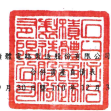
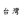

台灣 後

及子公司 民國 111 年 9 1 日及 9 月 30 日

|                                    | 單位:新台舉仟元                                     |                |                 |                |                |                |         |    |    |    |    |
|------------------------------------|-----------------------------------------------------|----------------|-----------------|----------------|----------------|----------------|---------|----|----|----|----|
| 111 年 9 月 30 日                  | 110 年 12 月 31 日                                  | 110年9月30日   |                 |                |                |                |         |    |    |    |    |
|                                    | (经抽圖)                                            |                |                 |                |                |                |         |    |    |    |    |
| (短结圈)                           | (经查拉)                                            |                |                 |                |                |                |         |    |    |    |    |
| કર                                 | ন্ধ                                                  | 该             | 產 全           | 级             | %              | रु              | រវ      | 96 | रु  | 城 | ళ  |
| 消動資產                           |                                                     |                |                 |                |                |                |         |    |    |    |    |
| 1100                               | 现金及约雷现金(附註六)                              | $1,296,012,784 | 28              | $1,064,990,192 | 29             | $ 853,811,966  | 26      |    |    |    |    |
| 1110                               | 透過損益按公允價值街量之全融資產(附註七)            | 4,705,434      | 159,048         | 33,956         |                |                |         |    |    |    |    |
| 1120                               | 透過其他綜合損益按公允價值制量之金融資產(附近八)    | 126,209,422    | 3               | 119,519,251    | 3              | 121,935,878    | ﻪ       |    |    |    |    |
| 按機銷後成本衛量之会融資產(附註九) | 3,773,571                                           | .              |                 |                |                |                |         |    |    |    |    |
| 1136                               | 71,857,468                                          | 1              |                 |                |                |                |         |    |    |    |    |
| 1139                               | 避險之金融資産(開班十)                              | 88,431         | 13,468          | 37,769         |                |                |         |    |    |    |    |
|                                    | 197,586,109                                         | 5              | 186,309,080     | б              |                |                |         |    |    |    |    |
| 1170                               | 應收票據及帳狀淨額(附註十一)                        | 260,447,134    | б               |                |                |                |         |    |    |    |    |
| 1180                               | 應收關係人款項〔附註三一〕                          | 1,091,174      | .               | 715.324        | .              | 859,144        | -       |    |    |    |    |
|                                    | 73,090                                              |                |                 |                |                |                |         |    |    |    |    |
| 1210                               | 其他恩收關係人获項(財該三一)                        | 76,143         | 61,531          |                |                |                |         |    |    |    |    |
| 1310                               | 存货(附註十二)                                      | 218,335,874    | 5               | 193,102,321    | 5              | 182,233,752    | 5       |    |    |    |    |
| 1476                               | 其他金融资產(附該三二)                              | 24,855,999     | י               | 16,630,611     | -              | 14,007,812     | .       |    |    |    |    |
| 1479                               | 其他液動質產                                        | 10,552,495     | 10,521,481      | 11,336,722     |                |                |         |    |    |    |    |
| 11XX                               | 流動資產合計                                        | 2,014,232,358  | 43              | _1,607,072,907 | 43             | 1,370,639,169  | ... श   |    |    |    |    |
| 非液動資產                         | 6,784,978                                           | 5,887,892      | .               | 5,729,779      |                |                |         |    |    |    |    |
| 1517                               | 选過其他综合损益按公允價值街量之全融資產〔附班八〕  | .              | 1,545,597       | -              |                |                |         |    |    |    |    |
| 1535                               | 按绯到夜成本街量文金融资産(附址九)                  | 42,347,584     | 1               | 1,533,391      | 1              |                |         |    |    |    |    |
| 1550                               | 採用權益法之投資(附註十三)                          | 26.663.336     | 1               | 21,963,418     | 20,455,175     | 1              |         |    |    |    |    |
| 1600                               | 不動產、廠房及設備(附註十四)                        | 2,411,490,251  | 52              | 1,975,118,704  | 53             | 1,828,894,565  | 55      |    |    |    |    |
| 1755                               | 使用模资產(附註十五)                                | 42,349,743     | l               | 32,734,537     | 1              | 32,961,097     | l       |    |    |    |    |
| 1780                               | 無形質產《附註十六〕                                | 26,706,552     | 1               | 26,821,697     | 1              | 25,643,914     | 1       |    |    |    |    |
| 1840                               | 遮延所得就资產《附註四》                            | 63,058,097     | l               | 49,153,886     | ﻀﻌ             | 41.925.391     | l       |    |    |    |    |
| 1920                               | 存出保證金                                          | 4,451,490      | .               | 2.624.854      | .              | 2,422,262      | -       |    |    |    |    |
| 1990                               | 其他非通野资産                                      | 5,217,377      | 2,592,169       | 2,094,935      |                |                |         |    |    |    |    |
| 15XX                               | 非流好肯產合計                                      | | 레           | 2,118,430,548   | _57            | 1,961,672,715  | 59             |         |    |    |    |    |
| _2,629,069,408                     |                                                     |                |                 |                |                |                |         |    |    |    |    |
| 1XXX                               | 4                                                   | $4.643,301,766 | 100             | $3,725,503,455 | 100            | $3,332,311,884 | ... 100 |    |    |    |    |
| 资                                 | 星                                                  | 차             | 雅              | ৱ              |                |                |         |    |    |    |    |
| P                                  | 생                                                  | 風             |                 |                |                |                |         |    |    |    |    |
| 流動負債                           | 4                                                   |                |                 |                |                |                |         |    |    |    |    |
| 2100                               | 短期借款(附註十七及二元)                            | S              | $ 114,921,333   | 3              | $ 118,844,065  |                |         |    |    |    |    |
| 2120                               | 透過攝益按公允價值的量之会融負債(所該七)            | 611,010        | .               | 681,914        | -              | 1,405,470      | -       |    |    |    |    |
| 2126                               | 避险之金融負債(附註十)                              | 9,642          |                 |                |                |                |         |    |    |    |    |
| 2170                               | 见付帳状                                            | 60,147,405     | 1               | 47,285,603     | 1              | 41,733,233     | 1       |    |    |    |    |
| 2180                               | 應付關係人款項(開往三一)                            | 1,870,819      | 1,437,186       | 2,155,628      |                |                |         |    |    |    |    |
| 2201                               | 應付薪買及灵全                                      | 31,380,029     | 1               | 23.802.100     | 1              | 20,422,409     | 1       |    |    |    |    |
| 2206                               | 45.041.965                                          | 1              | 36,524,741      | נ              | 27,219,784     | -              |         |    |    |    |    |
| 應付員工副發及童事酬務〔附註二八〕 | 145,742,148                                         | ﺔ              | 128,367,724     | 4              |                |                |         |    |    |    |    |
| 2213                               | 應付工程及设備部                                    | 159,780,369    | دب              | 4              | 142,617,092    |                |         |    |    |    |    |
| 2216                               | 應付現金股利(財证二十)                              | 142,617,093    | 3               | 142,617,093    | ﺘﻬ             |                |         |    |    |    |    |
| 2230                               | 本期所得税负债(肘柱四)                              | 76,005,324     | 2               | 59,647,152     | 2              | 33,614,402     | 1       |    |    |    |    |
| 2320                               | 一年内到期長期負債(附註十八、十九及二九)            | 23,426,667     | 1               | 4,566,667      | .              |                |         |    |    |    |    |
| 2399                               | 應付費用及其他通動負債《附註十五、二一、二九及三一) | 266,550,606    | 6               | 162,267,779    | 4              | 139,241,643    | 4       |    |    |    |    |
| 21XX                               | 流纷负债合計                                        | 807,431,287    | 18              | 739,503,358    | 20             | 655,621,450    | _20     |    |    |    |    |
| 中流動員債                         |                                                     |                |                 |                |                |                |         |    |    |    |    |
| 2530                               | 虑付公司债(附註十八及二九)                          | 842.386.471    | 18              | 610,070,652    | 16             | 459,733,448    | 14      |    |    |    |    |
| 2541                               | 長期終行借款(附註十九及二元)                        | 3,055,178      | .               | 3,309,131      | -              | 3,472,190      | .       |    |    |    |    |
| 2573                               | 遮延所得我負債(附註四)                              | 1,466,389      | 1,873,877       | 2,306,909      |                |                |         |    |    |    |    |
| 2580                               | 租赁負債(附往十五及二九)                            | 30,182,353     | 1               | 20,764,214     | 1              | 21,052,983     | 1       |    |    |    |    |
| 2640                               | 净暖定福利角债(附註四)                              | 8,503,262      | 11,036,879      | 11,276,177     |                |                |         |    |    |    |    |
| .                                  |                                                     | :              |                 |                |                |                |         |    |    |    |    |
| 2645                               | 在入保证会                                          | 907,991        | .               | 686,762        | .              | 641,546        |         |    |    |    |    |
|                                    | 167,525,377                                         | 5              | 99,856,871      | 3              |                |                |         |    |    |    |    |
| 2670                               | 其他非流動負債(附註二一)                            | 197,052,676    |                 |                |                |                |         |    |    |    |    |
| 25XX                               | 非演動負債合計                                      | 1,083,554,320  | |  |            | 815,266,892    | 22             | 598,370,124    | 18      |    |    |    |    |
| 2XXX                               | 奥债合計                                            | 1,890,985,607  | -11             | 1,554,770,250  | - 45           | 1,253,991,574  | 38      |    |    |    |    |
| 厨屬於母公司東玉之權益             |                                                     |                |                 |                |                |                |         |    |    |    |    |
| 3110                               | 股本(附証回及二十)                                  |                |                 |                |                |                |         |    |    |    |    |
| 普通股股本                         | 259,303,805                                         | 259,303,805    | 259,303,805     | 100            |                |                |         |    |    |    |    |
| ﻟﻤ                                 | 13 2                                                |                |                 |                |                |                |         |    |    |    |    |
|                                    | 64,761,602                                          | 64,746,864     | 11 1            |                |                |                |         |    |    |    |    |
| 3200                               | 資本公積(附註四·二十及二七)                         | 69,316,391     | 1               |                |                |                |         |    |    |    |    |
| 係留意餘(附註四及二十)             |                                                     |                |                 |                |                |                |         |    |    |    |    |
| 3310                               | 7                                                   | 311,146,899    | 8               | 311,146,899    | 9              |                |         |    |    |    |    |
| 法定盈综公接                       | 311,146,899                                         |                |                 |                |                |                |         |    |    |    |    |
| 3320                               | 特別量徐公積                                        | 35,064,663     | 1               | 59,304,212     | 2              | 58,594,043     | ನ       |    |    |    |    |
| 3350                               | 来分配盈餘                                          | 2,066,562,035  | -44             | 1,536,378,550  | ব ।            | 1,441,532,663  | বহু      |    |    |    |    |
| 3300                               | 保留意综合計                                        | 2,412,773,597  | ్ల ల             | 1,906,829,661  | _51            | 1,811,273,605  | হন      |    |    |    |    |
| 3400                               | 其他壁益(附註四、二十及二七)                        | 3,419,487 |    | 62,608,515 )    | 21             | 59,304,212 )   | _2)            |         |    |    |    |    |
| 31XX                               | 号公司第主报益合計                                  | 2,737,974,306  | રેતે              | 2,168,286,553  | 58             | 2,076,020,062  | 62      |    |    |    |    |
| 36XX                               | 非在制框货                                          | 14.341.853     | 2,446,652       | 2,300,248      |                |                |         |    |    |    |    |
| -                                  |                                                     |                |                 |                |                |                |         |    |    |    |    |
| 3XXX                               | 59                                                  | 2,170,733,205  | ___ 58          | _2,078,320,310 | _ 62           |                |         |    |    |    |    |
| 權益合計                           | _2,752,316,159                                      |                |                 |                |                |                |         |    |    |    |    |
| 負 優 及 權 益 為 計               | $4.643.301.766                                      | _100           | $ 3,725,503,455 | 100            | $3,332,311,854 | 100            |         |    |    |    |    |

後附之防盜與本合併財務報會之一部分。

经理人