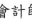
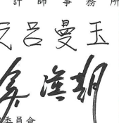
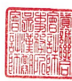

會計師核閱報告
(111)財審報字第 22001961 號 台灣化學纖維股份有限公司 公鑒:

## 前言

台灣化學纖維股份有限公司及其子公司(以下簡稱「台化集團」)民國 111年及 110 年9月30日之合併資產負債表,暨民國 111年及 110年7月1日至 9月 30 日、民國 111年及 110年1月1日至 9月 30日之合併綜合損益表,暨民國 111年及 110年1月1 日至9月30日之合併權益變動表、合併現金流量表,以及合併財務報表附註(包括重大 會計政策彙總),業經本會計師核閱竣事。依證券發行人財務報告編製準則及金融監督 管理委員會認可之國際會計準則第三十四號「期中財務報導」編製允當表達之合併財務 報表係管理階層之責任,本會計師之責任係依據核閱結果對合併財務報表作成結論。

## 範圍

除保留結論之基礎段所述者外,本會計師係依照審計準則公報第六十五號「財務報 表之核閱」執行核閔工作。核閔合併財務報表時所執行之程序包括查詢(主要向負責財 務與會計事務之人員查詢)、分析性程序及其他核閲程序。核閲工作之範圍明顯小於查 核工作之範圍,因此本會計師可能無法察覺所有可藉由查核工作辨認之重大事項,故無 法表示查核意見。

## 保留結論之基礎

如合併財務報表附註四(三)及六(七)所並,列入上開合併財務報表之部分非重要子 公司及採用權益法之投資之同期間財務報表未經會計師核閱,該等公司民國 111 年及 110年9月 30 日之資產總額(含採用權益法之投資)分別為新台幣 102,865,761 仟元及 新台幣 96,956,417 仟元,分別占合併資產總額之 18%及 16%;負債總額分別為新台幣 24,977,213 仟元及新台幣18,545,661 仟元,分別占合併負債總額之13%及 12%;其民國 111年及 110年7月1日至 9月 30日、民國 111年及 110年1月1日至9月 30日之綜 合損益總額(含採用權益法之關聯企業及合資損益之份額及採用權益法認列之關聯企業 及合資之綜合損益份額)分別為損失新台幣 472,584 仟元、利益新台幣 353,760 仟元丶 利益新台幣 656,595 仟元及利益新台幣 6,455,143 仟元,分別占合併綜合損益總額之 2%、2%、(3%)及 10%。

## ~4~

T: +886 (2) 2729 6666, F:+ 886 (2) 2729 6686, www.pwc.tw

## 保留結論

依本會計師核閱結果及其他會計師之核閱報告(請參閱其他事項段),除保留結論之 基礎段所述部分非重要子公司及採用權益法之投資之財務報表倘經會計師核閱,對合併 財務報表可能有所調整之影響外,並未發現上開合併財務報表在所有重大方面有未依照 證券發行人財務報告編製準則及金融監督管理委員會認可之國際會計準則第三十四號
「期中財務報導」編製,致無法允當表達台化集團民國 111年及 110年 9 月 30 日之合 併財務狀況,民國111年及110年7月1日至9月30日、民國111年及110年1月1 日至 9月30日之合併財務績效,暨民國 111年及 110年1月1日至9月30日之合併現 金流量之情事。

## 其他事項-提及其他會計師之核閱

列入台化集團合併財務報表之部分採用權益法之被投資公司,其財務報表未經本會 計師核閱,而係由其他會計師核閱。因此,本會計師對上開合併財務報表所出具之核閱 報告中,有關該等公司財務報表所列之金額,條依據其他會計師之核閱報告。民國 111 年及 110年 9月 30日對前並公司採用權益法之投資金額分別為新台幣 78,865,103 仟元 及 83,685,737 仟元,皆占合併資產總額之 14%,民國 111年及 110年7月1日至 9月 30 日、民國 111年及 110年1月1日至 9月 30日對前述公司認列之綜合損益分別為損 失新台幣 2,930,033 仟元、利益新台幣 3,248,877 仟元、利益新台幣 1,524,849 仟元及 利益新台幣 10,907,114 仟元,各占合併綜合損益之 11%、15%、(7%)及 17%。

資 誠

$\mathcal{L}_{\mathrm{NL}}$

聯 合 會 計

會計師

* [16] M. C.  
師

務 所

前行政院金融監督管理委員會 核准簽證文號:金管證審字第 0990058257號 前財政部證券暨期貨管理委員會 核准簽證文號:(90)台財證(六)字第157088 號

* [10] M. C. Gonzalez-Garcia, M. C. Gonzalez-Garcia, M.  
~5~