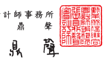
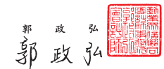

Tel :+886 (2) 2725-9981

 Fax:+886 (2) 4051-6888 會計師核閱報告 中華電信股份有限公司 公鑒:
前

## 言

中華電信股份有限公司及其子公司民國 111 年及 110 年 3 月 31 日之合併資 產負債表,暨民國 111 年及 110 年 1 月 1 日至 3 月 31 日之合併綜合損益表、合 併權益變動表與合併現金流量表,以及合併財務報表附註(包括重大會計政策 彙總),業經本會計師核閱竣事。依證券發行人財務報告編製準則及經金融監督 管理委員會認可並發布生效之國際會計準則第 34 號「期中財務報導」編製允當 表達之財務報表係管理陪層之責任,本會計師之責任係依據核閱結果對合併財 務報表作成結論。

範 图 本會計師係依照審計準則公報第六十五號「財務報表之核閱」 執行核閱工 作。核閱合併財務報表時所執行之程序包括查詢(主要向負責財務與會計事務 之人員查詢)、分析性程序及其他核閱程序。核閱工作之範圍明顯小於查核工作 之範圍,因此本會計師可能無法察覺所有可藉由查核工作辨認之重大事項,故 無法表示查核意見。

結 論 依本會計師核閱結果,並未發現上開合併財務報表在所有重大方面有未依 照證券發行人財務報告編製準則及經金融監督管理委員會認可並發布生效之國 際會計準則第 34 號「期中財務報導」編製,致無法允當表達中華電信股份有限 公司及其子公司民國 111年及 110年 3 月 31 日之合併財務狀況,豎民國 111 年 及 110 年 1 月 1 日至 3 月 31 日之合併財務績效及合併現金流量之情事。

勤業眾信聯合會計師事務所 會 計 師 張

金融監督管理委員會核准文號 金管證審字第 1060023872 號 中 華 民 國

$$1\ 1\ 1$$
$\frac{4}{5}$  4. 
年 5 月 6 日 計 會

師

證券暨期貨管理委員會核准文號 台 財 證 六 字 第 0920123784 號