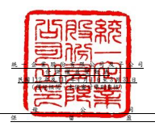
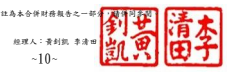
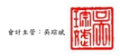

單位:新台幣仟元 歸 屬 於 母 公 司 業 主 之 權 益 保留盈餘 其他權益
附 註 普通股股本 資本公積 法定盈餘公積 特別盈餘公積 未分配盈餘 國外營運機構 財務報表換算 之兌換差額 透過其他綜合 損益按公允價 值衡量之金融 資產未實現 損 益 總 計 非控制權益 權益總計

| 111 年 1 月 1 日 至 3 月 31 日  111 年 1 月 1 日餘額                           | $ 56,820,154       | $   | 2,834,168   | $ 26,375,315   | $            | 8,201,965    | $ 32,449,568   | ($ 11,347,334 )   | $           | 1,252,363   | $ 116,586,199   | $ 64,407,546   | $ 180,993,745   |               |
|--------------------------------------------------------------------------------|--------------------|-----|-------------|----------------|--------------|--------------|----------------|-------------------|-------------|-------------|-----------------|----------------|-----------------|---------------|
| 111 年 1 至 3 月淨利                                                           | -                  | -   | -           | -              | 4,233,600    | -            | -              | 4,233,600         | 2,209,127   | 6,442,727   |                 |                |                 |               |
| 111 年 1 至 3 月其他綜合損益                                                   | 六(二十四)         | -   | -           | -              | -            | -            | 3,860,815      | (                 | 386,946 )   | 3,473,869   | 935,152         | 4,409,021      |                 |               |
| 111 年 1 至 3 月綜合損益總額                                                   | -                  | -   | -           | -              | 4,233,600    | 3,860,815    | (              | 386,946 )         | 7,707,469   | 3,144,279   | 10,851,748      |                |                 |               |
| 取得或處分子公司股權價格與帳面金額差額                                         | 六(二十二)(三十四) | -   | (           | 7,323 )        | -            | -            | -              | -                 | -           | (           | 7,323 ) (       | 13,088 ) (     | 20,411 )        |               |
| 採用權益法之投資未按持股比例認購調整數                                         | 六(二十二)         | -   | 313         | -              | -            | -            | -              | -                 | 313         | -           | 313             |                |                 |               |
| 以前年度轉列資本公積之未付現金股利本期支付數                                   | 六(二十二)         | -   | (           | 150 )          | -            | -            | -              | -                 | -           | (           | 150 )           | -              | (               | 150 )         |
| 處分透過其他綜合損益按公允價值衡量之金融資產-權 六(七) 益工具轉列數           | -                  | -   | -           | -              | 62,349       | -            | (              | 62,349 )          | -           | -           | -               |                |                 |               |
| 非控制權益變動數                                                               | -                  | -   | -           | -              | -            | -            | -              | -                 | 635,660     | 635,660     |                 |                |                 |               |
| 111 年 3 月 31 日餘額                                                          | $ 56,820,154       | $   | 2,827,008   | $ 26,375,315   | $            | 8,201,965    | $ 36,745,517   | ($                | 7,486,519 ) | $           | 803,068         | $ 124,286,508  | $ 68,174,397    | $ 192,460,905 |
| 112 年 1 月 1 日 至 3 月 31 日  112 年 1 月 1 日餘額                           | $ 56,820,154       | $   | 2,730,532   | $ 28,406,550   | $ 10,199,821 | $ 31,744,946 | ($             | 4,691,759 )       | $           | 492,835     | $ 125,703,079   | $ 66,491,875   | $ 192,194,954   |               |
| 112 年 1 至 3 月淨利                                                           | -                  | -   | -           | -              | 5,001,455    | -            | -              | 5,001,455         | 2,706,084   | 7,707,539   |                 |                |                 |               |
| 112 年 1 至 3 月其他綜合損益                                                   | 六(二十四)         | -   | -           | -              | -            | -            | (              | 913,685 )         | 365,856     | (           | 547,829 ) (     | 221,604 ) (    | 769,433 )       |               |
| 112 年 1 至 3 月綜合損益總額                                                   | -                  | -   | -           | -              | 5,001,455    | (            | 913,685 )      | 365,856           | 4,453,626   | 2,484,480   | 6,938,106       |                |                 |               |
| 被投資公司資本公積變動本公司依持股比例調整數                                   | 六(二十二)         | -   | 24          | -              | -            | -            | -              | -                 | 24          | -           | 24              |                |                 |               |
| 取得或處分子公司股權價格與帳面金額差額                                         | 六(二十二)(三十四) | -   | 144,535     | -              | -            | -            | -              | -                 | 144,535     | (           | 337,867 ) (     | 193,332 )      |                 |               |
| 以前年度轉列資本公積之未付現金股利本期支付數                                   | 六(二十二)         | -   | (           | 125 )          | -            | -            | -              | -                 | -           | (           | 125 )           | -              | (               | 125 )         |
| 迴轉特別盈餘公積                                                               | 六(二十三)         | -   | -           | -              | (            | 145 )        | 145            | -                 | -           | -           | -               | -              |                 |               |
| 被投資公司處分透過其他綜合損益按公允價值衡量之金 六(七) 融資產-權益工具轉列數 | -                  | -   | -           | -              | 9,013        | -            | (              | 9,013 )           | -           | -           | -               |                |                 |               |
| 非控制權益變動數                                                               | -                  | -   | -           | -              | -            | -            | -              | -                 | 11,635      | 11,635      |                 |                |                 |               |
| 112 年 3 月 31 日餘額                                                          | $ 56,820,154       | $   | 2,874,966   | $ 28,406,550   | $ 10,199,676 | $ 36,755,559 | ($             | 5,605,444 )       | $           | 849,678     | $ 130,301,139   | $ 68,650,123   | $ 198,951,262   |               |

後附合併財務報表附註為本合併財務報告之一部分,請併同參閱。

董事長:羅智先 經理人:黃釗凱 李清田 會計主管:吳琮斌

