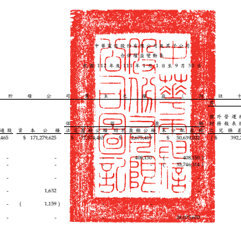
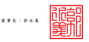
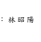
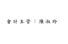

單位:新台餐仔元

|  频                      |  易                                                         | 於             |  我           | 公            | ્દ            | ﺖ            | +           | 及                             | 二 入 )       |                        |               |               |               |               |
|--------------------------|-------------------------------------------------------------|----------------|---------------|---------------|--------------|--------------|-------------|--------------------------------|---------------|------------------------|---------------|---------------|---------------|---------------|
|                          | 优                                                          | 程             | ৱহ            |               |              |              |             |                                |               |                        |               |               |               |               |
|                          | 透 過其他 烷 烷 含                                          |                |               |               |              |              |             |                                |               |                        |               |               |               |               |
|                          | 外 登 迷 操   摄  摄  摄 互投 允假值                        | 非 控 制 应 益 |               |               |              |              |             |                                |               |                        |               |               |               |               |
|                          | 药 领表换 第 例量之全融资産                                 | ( 胜 立 十 三  |               |               |              |              |             |                                |               |                        |               |               |               |               |
| 代 க                     | 股本一管通股 货                                             | 本             | 公            | સ્વ            | 盟 修公 绿   | 135          | 见 换 送 级 | 未實現評價报益 避險工具領道 總 | 하            | 及 二 入 ) 屋 益 總 額 |               |               |               |               |
| A1                       | 111 年 1 月 1 日 參 級                                      | $ 77,574,465   | $ 171,279,625 | 50,639        | 392,276 )    | ( $          | 7,588 ) ($  | 8,286 )                        | $ 379,334,846 | $ 11,927,604           | $ 391,262,450 |               |               |               |
| 110年度盈徐指授及分配:   |                                                             |                |               |               |              |              |             |                                |               |                        |               |               |               |               |
| B3                       | 持别登徐公杨                                                |                |               |               |              |              |             |                                |               |                        |               |               |               |               |
| B5                       | 本公司股票现金股利                                          | ー             | 35,746,314 )  | (             | 35,746,314 ) |              |             |                                |               |                        |               |               |               |               |
| (01                      | 子公司股鬼观金股利                                          | -              | (             | 1,053,240 ) ( | 1,053,240 )  |              |             |                                |               |                        |               |               |               |               |
|                          | -                                                           | .              |               |               |              |              |             |                                |               |                        |               |               |               |               |
| ଓ                        | 途翔来领股利                                                | -              | 1,632         | -             | 1,632        | .            | 1,632       |                                |               |                        |               |               |               |               |
| C7                       | 採用權益法鋁列關聯企業及合賣之貨本公務變動製                | . (            | 1,159 )       | -             | · (          | 1,159 ) (    | 51 ) (      | 1,210 )                        |               |                        |               |               |               |               |
| D1                       | 111 年1月1日至9月30 日淨利                                  | -              | -             | 28,075,670    | 1,126,929    | 29,202,599   |             |                                |               |                        |               |               |               |               |
| D3                       | 111 年1 月 1 日至 9 月 30 日其他综合摄益净额                | 1.524          | 314.773       | 109.315 )     | 21.038       | 228.020      | 13.295      | 241.315                        |               |                        |               |               |               |               |
| D5                       | 111 年1月1日至9月30 日綜合損益賠額                          | 28,077,194     | 109,315 )     | 21,038        | 28,303,690   | 1,140,224    | 29,443,914  |                                |               |                        |               |               |               |               |
|                          | 314,773                                                     |                |               |               |              |              |             |                                |               |                        |               |               |               |               |
| (01                      | 子公司股份基礎给付交易                                      | 15,705         | .             | 15,705        | 59,370       | 75,075       |             |                                |               |                        |               |               |               |               |
| (01                      | 非控制程益净增加                                            | 91,500         | 91,500        |               |              |              |             |                                |               |                        |               |               |               |               |
| .                        |                                                             |                |               |               |              |              |             |                                |               |                        |               |               |               |               |
| Z1                       | 111 年 9 月 30 日 徐 級                                     | $ 77.574.465   | $ 171.295.803 | 77 574.465    | 3.083.569    | 42.561.752   | 77.503 )    | ( $                            | 116.903 )     | 12.752                 | $ 371,908,400 | $ 12.165.407  | $ 384.073.807 |               |
| A1                       | 112 年 1 月 1 日 參 級                                      | $ 77,574,465   | $ 171,300,898 | $ 77,574,465  | $ 3,083,569  | $ 51,868,574 | ( દે         | 111,213 ) ( $                  | 124,762 ) $   | 12,891                 | $ 381,178,887 | $             | $ 393,778,428 |               |
| 111 年度盈徐指授及分配 : |                                                             |                |               |               |              |              |             |                                |               |                        |               |               |               |               |
| B3                       | 持别量徐公極                                                | .              | 185,066 )     | 185,066       | .            |              |             |                                |               |                        |               |               |               |               |
| B5                       | 本公同股票现金股利                                          | ·              | 36,475,514 )  | -             | .            | 36,475,514 ) | .           | (                              | 36,475,514 )  |                        |               |               |               |               |
| (01                      | 子公司股鬼观金股利                                          | -              | .             | .             | -            | -            | .           | ·                              | (             | 1,091,670 ) (          | 1,091,670 )   |               |               |               |
| ଓ                        | 途翔未领股利                                                | -              | 2,217         | -             | -            | -            | -           | 2,217                          | -             | 2,217                  |               |               |               |               |
| C7                       | 採用權益法認列開聯企業及合實之貨本公積雙動製                | -              | 4,624         | -             | 4,624        | 1,588        | 6,212       |                                |               |                        |               |               |               |               |
|                          | -                                                           | -              |               |               |              |              |             |                                |               |                        |               |               |               |               |
| M5                       | 實際取得子公司都分程益                                      | - (            | 4 )           | -             | -            | -            | -           | · (                            | 4) (          | 37 ) (                 | 41 )          |               |               |               |
| D1                       | 112 年 1 月 1 日 至 9 月 30 日 9 月 30 日 9 月 30 日 9 月 4 | .              | 28,659,133    | -             | -            | -            | 28,659,133  | 800,076                        | 29,459,209    |                        |               |               |               |               |
| D3                       | 112 年 1 月 1 日 至 9 月 30 日 其 統 綜合 攝 益 淨 級       | 10.113         | 108,634       | 550.143       | 16.426 )     | 652.464      | 5.131 )     | 647,333                        |               |                        |               |               |               |               |
| D5                       | 112 年1月1日至9月30 日綜合損益總額                          | 28,669,246     | 108.634       | 550,143       | 16.426 )     | 29.311.597   | 794 945     | 30.106.542                     |               |                        |               |               |               |               |
| (01                      | 子公司股份基礎给付交易                                      | 21,793         | 23,383        |               |              |              |             |                                |               |                        |               |               |               |               |
| 1,590                    | 1,590                                                       |                |               |               |              |              |             |                                |               |                        |               |               |               |               |
| Z1                       | 112 年 9 月 30 日 徐 級                                     | $ 77.574.465   | $ 171,309,325 | $ 77.574.465  | 2 898 503    | $ 44.247.372 | 2.579 )     | ഗ                              | 425,381       | (                      | 3.535 )       | $ 374.023.397 | $ 12,326,160  | $ 386.349.557 |

领所之附註係本合併財務報告之一部分。

规理人:休昭陽

- 6 -