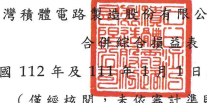
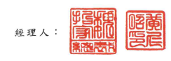
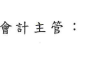

表公司及子公司 日至3月31日 準則查核)
單位:新台幣仟元,惟 每股盈餘為元

| 112年1月1日至3月31日     | 111年1月1日至3月31日      |             |               |             |            |    |
|--------------------------|---------------------------|-------------|---------------|-------------|------------|----|
| 代碼                     | 金                        | 領          | %             | 金          | 額         | %  |
| 4000                     | 誉業收入淨額(附註二一、三 |             |               |             |            |    |
| 二及三七)                | $ 508,632,973             | 100         | $ 491,075,873 | 100         |            |    |
| 5000                     | 誉業成本(附註十二、二八及 |             |               |             |            |    |
| 三二)                    | 222,132,581               | বর্          | 217,872,707   | 44          |            |    |
| 5950                     | 營業毛利                  | 286,500,392 | 56            | 273,203,166 | 56         |    |
| 營業費用(附註二八及三二) | 7                         |             |               |             |            |    |
| 6300                     | 研究發展費用              | 39,157,036  | 8             | 36,048,540  |            |    |
| 6200                     | 管理費用                  | 13,475,948  | 10,500,027    |             |            |    |
|                          | 3                         | 2           |               |             |            |    |
| 6100                     | 行銷費用                  | 2,676,360   | 2,062,623     | 1           |            |    |
|                          | =                         |             |               |             |            |    |
| 6000                     | 合                        | 計          | 55,309,344    | 11          | 48,611,190 | 10 |
| 6500                     | 其他營業收益及費損淨額(附 |             |               |             |            |    |
| 註十四及二八)            | 47,109                    | ----        | (_ 801,858)   | ---         |            |    |
| 6900                     | 營業淨利(附註三七)        | 231,238,157 | 45            | 223,790,118 | 46         |    |
| 梦業外收入及支出         |                           |             |               |             |            |    |
| 7060                     | 採用權益法認列之關聯企    |             |               |             |            |    |
| 業損益份額               | 1,038,817                 | -           | 1,725,490     |             |            |    |
| 7100                     | 利息收入(附註二二)        | 13,617,818  | 3             | 1,673,879   | -          |    |
| 7190                     | 其他收入                  | 87,910      | -             | 308,383     | -          |    |
| 7230                     | 外幣兌換淨益(損)(附       |             |               |             |            |    |
| 註三五)                  | 44,363 )                  | =           | 1,742,888     | -           |            |    |
| 7050                     | 財務成本(附註二三)        | 2,963,686)  | 2,140,766 )   |             |            |    |
|                          | -                         | (           | -             |             |            |    |
| 7020                     | 其他利益及損失淨額(附     |             |               |             |            |    |
| 註二四)                  | 1,300,278                 | (           | 268,296)      |             |            |    |
|                          | =                         | =           |               |             |            |    |
| 7000                     | 合                        | 計          | 13,036,774    | 3           | 3,041,578  | -  |
| 7900                     | 244,274,931               | 226,831,696 |               |             |            |    |
| 税前淨利                 | 48                        | 46          |               |             |            |    |
| 7950                     | 所得稅費用(附註四及二五)  | 37,325,895  | 7             | 23,958,322  | 5          |    |
| 8200 本期淨利            | 206,949,036               | 41          | 202,873,374   | _ 41        |            |    |
| (接次頁)                 |                           |             |               |             |            |    |

| 112年1月1日至3月31日      | 111年1月1日至3月31日   |               |          |               |         |    |
|---------------------------|------------------------|---------------|----------|---------------|---------|----|
| 代碼                      | 金                     | 額            | %        | 金            | 額      | %  |
| 其他綜合損益(附註二十及二 |                        |               |          |               |         |    |
| 五)                       |                        |               |          |               |         |    |
| 8310                      | 不重分類至損益之項目:  |               |          |               |         |    |
| 8316                      | 透過其他綜合損益按     |               |          |               |         |    |
| 公允價值衡量之權          |                        |               |          |               |         |    |
| 益工具投資未實現          |                        |               |          |               |         |    |
| 評價損益                  | ട്                      | 560,573       | .        | ਟੇ             | 315,959 |    |
| 8317                      | 避險工具之損益         | 38,810        | -        | -             | -       |    |
| 8320                      | 採用權益法認列之關     |               |          |               |         |    |
| 聯企業之其他綜合          |                        |               |          |               |         |    |
| 損益份額                  | 4,435)                 |               |          |               |         |    |
| (                         | =                      | 43,839        | =        |               |         |    |
| 8349                      | 與不重分類之項目相     |               |          |               |         |    |
| 關之所得稅費用            | 24 )                   | 15)           |          |               |         |    |
| (_                        | =                      | =             |          |               |         |    |
|                           | 594,924                | 359,783       | =        |               |         |    |
|                           | =                      |               |          |               |         |    |
| 8360                      | 後續可能重分類至損益之 |               |          |               |         |    |
| 項目:                     |                        |               |          |               |         |    |
| 8361                      | 國外營運機構財務報     |               |          |               |         |    |
| 表換算之兌換差額          | (                      | 5,201,209 )   | ( 1)     | 19,345,591    | 4       |    |
| 8367                      | 透過其他綜合損益按     |               |          |               |         |    |
| 公允價值衡量之債          |                        |               |          |               |         |    |
| 務工具投資未實現          |                        |               |          |               |         |    |
| 評價損益                  | 1,351,881              | -             | (        | 5,105,144 )   | (       | 1) |
| 8368                      | 避險工具之損益         | (             | 17,963 ) | -             | 693,828 | D  |
| 8370                      | 採用權益法認列之關     |               |          |               |         |    |
| 聯企業之其他綜合          |                        |               |          |               |         |    |
| 損益份額                  | 23,406 )               | 164,459       |          |               |         |    |
| (                         | -                      | -             |          |               |         |    |
| 8399                      | 與可能重分類之項目     |               |          |               |         |    |
| 相關之所得稅費用          | 47,300)                | =             |          |               |         |    |
| 3,890,697 )               | 1)                     | 15,051,434    | 3        |               |         |    |
| 8300                      | 本期其他綜合損益       |               |          |               |         |    |
| (稅後淨額)                | 3,295,773)             | 15,411,217    |          |               |         |    |
|                           | (____ 1)               | _3            |          |               |         |    |
| 8500                      | 本期綜合損益總額       | $ 203,653,263 | _ 40     | $ 218,284,591 | 44      |    |
| 本期淨利歸屬予            |                        |               |          |               |         |    |
| 8610                      | 母公司業主             | $ 206,986,561 | 41       | $ 202,732,975 | 41      |    |
| 8620                      | 非控制權益             | (             | 37,525 ) | -             | 140,399 | =  |
| $ 206,949,036             | 41                     | $ 202,873,374 | ਜ        |               |         |    |
| (接次頁)                  |                        |               |          |               |         |    |

|                        | 112年1月1日至3月31日   |               | 111年1月1日至3月31日   |               |      |    |    |
|------------------------|------------------------|---------------|------------------------|---------------|------|----|----|
| 代碼                   | 金                     |               | 額                     | %             | 令   | 領 | %  |
| 本期綜合損益總額歸屬予 |                        |               |                        |               |      |    |    |
| 8710                   | 母公司業主             | $ 203,834,717 | 40                     | $ 218,283,654 | 44   |    |    |
| 8720                   | 非控制權益             | (             | 181,454 )              | "             | 937  | =  |    |
|                        | $ 203,653,263          |               | 40                     | $ 218,284,591 | 44   |    |    |
| 毎股盈餘(附註二六)     |                        |               |                        |               |      |    |    |
| 9750                   | 基本每股盈餘           |               | 7.98                   |               |      |    |    |
|                        | ക                      |               | ക                      | 7.82          |      |    |    |
| 9850                   | 稀釋每股盈餘           | ക             | 7.98                   | ક             | 7.82 |    |    |

後附之附註條本合併財務報告之一部分。

- 7 -