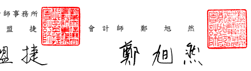

會計師核 閱 報告

光寶 科 技股 份 有限 公司 公鑒 :

## 前 言

 光 寶科 技 股份 有限 公 司 及 其 子公 司( 光 寶集 團 )民 國 112 年及 111 年 3 月 31 日 之 合併 資 產 負債 表 ,暨 民國 112 年及 111 年 1 月 1 日至 3 月 31 日 之 合併綜合損益表、合併權益變動表與合併現金流量表,以及合併財務報告附 註( 包括 重 大會 計 政策 彙 總),業 經本 會計 師 核閱 竣 事。依證 券 發行 人 財務 報 告編 製 準則 及 經金 融監 督 管理 委 員會 認可 並 發布 生 效之 國際 會 計準 則 第 34 號
「期中財務報導」編製允當表達之合併財務報告係管理階層之責任,本會計 師之 責 任係 依 據核 閱結 果 對合 併 財務 報告 作 成 結論。

## 範 圍

 除 保留 結 論之 基礎 段 所述 者 外,本會 計 師係 依 照 核 閱準 則 2410 號「 財 務 報表 之 核閱 」執行 核閱 工 作。核 閱合 併財 務 報告 時 所執 行之 程 序包 括 查詢( 主 要向 負 責財 務 與會 計事 務 之人 員 查詢 )、分 析性 程 序 及其 他核 閱 程序。核 閱 工 作之範圍 明 顯 小 於 查 核 工 作 之 範 圍 , 因 此 本 會 計 師 可 能 無 法 察 覺 所 有 可 藉 由 查核 工 作辨 認 之重 大事 項 ,故 無 法表 示查 核 意見 。

## 保 留 結 論 之 基礎

 如 合 併 財 務 報 告 附 註 十 三 所 述 , 列 入 上 開 合 併 財 務 報 告 之 部 分 非 重 要 子 公司 之 同期 間 財務 報告 未 經會 計 師核 閱,其民 國 112 年 及 111 年 3 月 31 日 之 資產 總 額分 別 為新 台幣 64,402,484 仟 元及 新 台幣 68,858,695 仟元 , 分別 占 合 併資 產 總額 之 34.96%及 37.02%;負債 總額 分 別為 新 台 幣 12,263,168 仟 元及 新 台 幣 14,765,103 仟 元,分 別 占合 併 負 債總 額 之 11.48%及 12.98%;其民 國 112 年 及 111 年 1 月 1 日 至 3 月 31 日之綜合利 益 總額 分 別為 新台 幣 398,733 仟 元 及 1,996,825 仟元 , 分別 占 合併 綜 合利 益總 額之 18.12%及 40.12%。另 如 合併 財務 報 告附 註 十四 所述,民 國 112 年 及 111 年 3 月 31 日 採用 權 益法 之 投資 分 別為 新 台幣 1,894,030 仟 元及 1,904,643 仟元 及 民國 112 年及 111 年 1 月 1 日 至 3 月 31 日 採 用權 益法 認 列之 關 聯企 業 損 失 份額 分 別為 新台 幣 (2,745)仟元 及
(1,581)仟 元 , 暨 合 併 財 務 報 告 附 註 三 五 之 相 關 資 訊 , 係 以 該 等 被 投 資 公 司 同 期間 未 經會 計 師核 閱之 財 務報 告 為依 據。

## 保留結論

 依 本 會 計 師 核 閱 結 果 , 除 保 留 結 論 之 基 礎 段 所 述 部 分 非 重 要 子 公 司 及 被 投資公司之財務報告倘經會計師核閱,對合併財務報告可能有所調整之影響 外,並未發現上開合併財務報告在所有重大方面有未依照證券發行人財務報 告編 製 準則 及 經金 融監 督 管理 委 員會 認可 並 發布 生 效之 國際 會 計準則第 34 號
「期 中 財務 報 導」 編製 , 致無 法 允當 表達 光 寶集 團 民 國 112 年 及 111 年 3 月 31 日之 合 併財 務 狀 況,暨 民 國 112 年 及 111 年 1 月 1 日 至 3 月 31 日之合併財 務績 效 及合 併 現金 流量 之 情 事 。

* [15] M. C. Gonzalez-Garcia, M. C. Gonzalez-Garcia, M.  

$$\gamma\gamma\gamma$$

金融監督管理委員會核准文號 金 管 證審 字 第 1020025513 號 金融監督管理委員會核准文號 金 管 證審 字 第 1010028123 號

$$\begin{array}{c c}{{\pm\overleftarrow{\pi}}}&{{\qquad}}&{{\cal R}}\\ {{\qquad}}&{{}}&{{}}\end{array}$$
中 華 民 國 1 1 2 年 4 月 2 7 日
$$\mathbb{E}^{\otimes}\qquad\quad1\;1\;2$$
$$\begin{array}{c c c c}{{\nleftarrow{}}}&{{}}&{{}}&{{4}}&{{}}&{{}}&{{\nleftarrow{}}}\end{array}$$
$$2\;7$$
