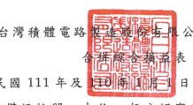

公司及子公司

日至3月31日
(僅經核閱,未依一般公認審計準則查核)
單位:新台幣仟元,惟 每股盈餘為元

| 111年1月1日至3月31日     | 110年1月1日至3月31日      |             |               |             |            |    |
|--------------------------|---------------------------|-------------|---------------|-------------|------------|----|
|                          | %                         | %           |               |             |            |    |
| 代碼                     | 金                        | 額          | 委            | 額          |            |    |
| 4000                     | 營業收入净額(附註二一、三 |             |               |             |            |    |
| 一及三六)                | $ 491,075,873             | 100         | $ 362,410,230 | 100         |            |    |
| 5000                     | 營業成本(附註十二、二八及 |             |               |             |            |    |
| 三一)                    | 217,872,707               | 44          | 172,570,800   | 48          |            |    |
| 5950 菱紫毛利            | 273,203,166               | 56          | 189,839,430   | 52          |            |    |
| 營業費用(附註二八及三一) |                           |             |               |             |            |    |
| 研究發展費用             | 36,048,540                | 30,756,358  |               |             |            |    |
| 6300                     | 7                         | 8           |               |             |            |    |
| 6200                     | 管理費用                  | 10,500,027  | 2             | 6,524,245   | 2          |    |
| 6100                     | 行销费用                  | 2,062,623   | 1             | 1,831,230   | =          |    |
| 6000                     | 合                        |             | 48,611,190    | 10          | 39,111,833 | 10 |
| 6500                     | 其他營業收益及費損淨額(附 |             |               |             |            |    |
| 註十四、十五及二八)      | 801,858)                  | 189,407)    |               |             |            |    |
|                          | --------                  | ----        |               |             |            |    |
| 6900                     | 營業淨利(附註三六)        | 223,790,118 | 46            | 150,538,190 | 42         |    |
| 签案外收入及支出         |                           |             |               |             |            |    |
| 7060                     | 採用權益法認列之關聯企    |             |               |             |            |    |
| 業損益份額               | 1,725,490                 | -           | 1,267,112     | ー          |            |    |
| 7100                     | 利息收入(附註二二)        | 1,673,879   | .             | 1,460,904   | -          |    |
| 其他收入                 | 308,383                   |             |               |             |            |    |
| 7190                     | -                         | 308,084     | -             |             |            |    |
| 7230                     | 外幣兌換淨益(附註三       |             |               |             |            |    |
| 四)                      | 1,742,888                 | 5,473,989   | 2             |             |            |    |
|                          | -                         |             |               |             |            |    |
| 7050                     | 財務成本(附註二三)        | 2,140,766 ) | =             | (           | 772,095)   | -  |
| 7020                     | 其他利益及损失净额(附     |             |               |             |            |    |
| 註二四)                  | 268,296)                  | =           | (_            | 3,211,795)  | (_ 1)      |    |
| 7000                     | 合                        | 計          | 3,041,578     | =           | 4,526,199  | _1 |
| 7900                     | 税前淨利                  | 226,831,696 | 155,064,389   | 43          |            |    |
|                          | 46                        |             |               |             |            |    |
| 7950                     | 所得稅費用(附註四及二五)  | 23,958,322  | 5             | 15,325,640  | র্ব         |    |
| 8200                     | 本期净利                  | 202,873,374 | 41            | 139,738,749 | 39         |    |
| (接次頁)                 |                           |             |               |             |            |    |
