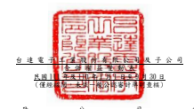
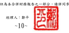

單位:新台幣仟元

| 歸                                           | 屬                                                                        | 於           | 母           | 公               | 司           | 業                 | 主            | 之            | 權          | 益          |               |               |              |           |              |
|----------------------------------------------|---------------------------------------------------------------------------|--------------|--------------|------------------|--------------|--------------------|---------------|---------------|-------------|-------------|---------------|---------------|--------------|-----------|--------------|
| 保                                           | 留                                                                        | 盈           | 餘 其        | 他               | 權           | 益                 |               |               |             |             |               |               |              |           |              |
|                                              | 透過其他綜合 損益按公允價                                                 |              |              |                  |              |                    |               |               |             |             |               |               |              |           |              |
|                                              | 國外營運機構 值衡量之金融 財務報表換算 資產未實現 避 險 工 具 之          |              |              |                  |              |                    |               |               |             |             |               |               |              |           |              |
| 附                                           | 註 普通股股本 資本公積 法定盈餘公積 特別盈餘公積 未分配盈餘 之兌換差額 損 | 益 損        | 益 總        | 計 非控制權益 權 | 益           | 總                 | 額            |               |             |             |               |               |              |           |              |
| 110 年  110 年 1 月 1 日餘額                 | $ 25,975,433                                                              | $ 49,202,505 | $ 27,342,534 | $ 7,622,034      | $ 48,300,040 | ($ 12,319,980 ) ($ | 353,844 )     | $ 130,616     | $           | 145,899,338 | $ 32,690,303  | $             | 178,589,641  |           |              |
|                                              | 本期合併總損益                                                            | -            | -            | -                | -            | 20,538,751         | -             | -             | -           | 20,538,751  | 1,165,841     | 21,704,592    |              |           |              |
|                                              | 本期其他綜合損益                                                          | -            | -            | -                | -            | 65,854             | (             | 2,669,211 ) ( | 524,954 ) ( | 704 ) (     | 3,129,015 ) ( | 1,123,231 ) ( | 4,252,246 )  |           |              |
| 本期綜合損益總額                             | -                                                                         | -            | -            | -                | 20,604,605   | (                  | 2,669,211 ) ( | 524,954 ) (   | 704 )       | 17,409,736  | 42,610        | 17,452,346    |              |           |              |
| 109 年度盈餘分配                             | 六(十九)                                                                  |              |              |                  |              |                    |               |               |             |             |               |               |              |           |              |
|                                              | 提列法定盈餘公積                                                          | -            | -            | 2,355,218        | -            | (                  | 2,355,218 )   | -             | -           | -           | -             | -             | -            |           |              |
|                                              | 提列特別盈餘公積                                                          | -            | -            | -                | 4,921,174    | (                  | 4,921,174 )   | -             | -           | -           | -             | -             | -            |           |              |
|                                              | 分配股東現金股利                                                          | -            | -            | -                | -            | (                  | 14,286,480 )  | -             | -           | -           | (             | 14,286,480 )  | -            | (         | 14,286,480 ) |
| 對子公司所有權權益變動                       | -                                                                         | (            | 116,449 )    | -                | -            | -                  | -             | -             | -           | (           | 116,449 )     | -             | (            | 116,449 ) |              |
| 實際取得或處分子公司股權價格與帳面價值差異   | 六(三十二)                                                                | -            | 3,482        | -                | -            | -                  | -             | -             | -           | 3,482       | (             | 99,741 ) (    | 96,259 )     |           |              |
| 非控制權益增減                               | -                                                                         | -            | -            | -                | -            | -                  | -             | -             | -           | (           | 1,464,506 ) ( | 1,464,506 )   |              |           |              |
| 110 年 9 月 30 日餘額                        | $ 25,975,433                                                              | $ 49,089,538 | $ 29,697,752 | $ 12,543,208     | $ 47,341,773 | ($ 14,989,191 ) ($ | 878,798 )     | $ 129,912     | $           | 148,909,627 | $ 31,168,666  | $             | 180,078,293  |           |              |
| 111 年  111 年 1 月 1 日餘額                 | $ 25,975,433                                                              | $ 49,114,151 | $ 29,697,752 | $ 12,543,208     | $ 53,622,701 | ($ 15,520,287 ) ($ | 776,353 )     | $ 129,917     | $           | 154,786,522 | $ 31,338,136  | $             | 186,124,658  |           |              |
|                                              | 本期合併總損益                                                            | -            | -            | -                | -            | 24,755,470         | -             | -             | -           | 24,755,470  | 3,138,612     | 27,894,082    |              |           |              |
|                                              | 本期其他綜合損益                                                          | -            | -            | -                | -            | 251,536            | 16,458,210    | 18,719        | -           | 16,728,465  | 3,611,090     | 20,339,555    |              |           |              |
| 本期綜合損益總額                             | -                                                                         | -            | -            | -                | 25,007,006   | 16,458,210         | 18,719        | -             | 41,483,935  | 6,749,702   | 48,233,637    |               |              |           |              |
| 110 年度盈餘分配                             | 六(十九)                                                                  |              |              |                  |              |                    |               |               |             |             |               |               |              |           |              |
|                                              | 提列法定盈餘公積                                                          | -            | -            | 2,688,553        | -            | (                  | 2,688,553 )   | -             | -           | -           | -             | -             | -            |           |              |
|                                              | 提列特別盈餘公積                                                          | -            | -            | -                | 3,623,514    | (                  | 3,623,514 )   | -             | -           | -           | -             | -             | -            |           |              |
|                                              | 分配股東現金股利                                                          | -            | -            | -                | -            | (                  | 14,286,479 )  | -             | -           | -           | (             | 14,286,479 )  | -            | (         | 14,286,479 ) |
| 對子公司所有權權益變動                       | -                                                                         | (            | 17,634 )     | -                | -            | (                  | 643 )         | -             | -           | -           | (             | 18,277 )      | -            | (         | 18,277 )     |
| 實際取得子公司股權價格與帳面價值差異         | 六(三十二)                                                                | -            | 15,322       | -                | -            | -                  | -             | -             | -           | 15,322      | (             | 125,504 ) (   | 110,182 )    |           |              |
| 處分透過其他綜合損益按公允價值衡量之權益工具 | -                                                                         | -            | -            | -                | 8,492        | -                  | (             | 8,492 )       | -           | -           | -             | -             |              |           |              |
| 非控制權益增減                               | -                                                                         | -            | -            | -                | -            | -                  | -             | -             | -           | (           | 708,491 ) (   | 708,491 )     |              |           |              |
| 111 年 9 月 30 日餘額                        | $ 25,975,433                                                              | $ 49,111,839 | $ 32,386,305 | $ 16,166,722     | $ 58,039,010 | $                  | 937,923       | ($            | 766,126 )   | $ 129,917   | $             | 181,981,023   | $ 37,253,843 | $         | 219,234,866  |

後附合併財務報表附註為本合併財務報告之一部分,請併同參閱。

董事長:海英俊 經理人:鄭平 會計主管:余博文

