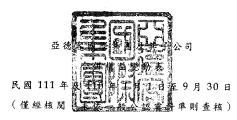
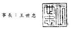
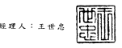
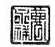
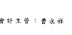

單位:除另予註明者外
,係新台幣仟元

| 1________竺__________ 本   | 公                               | 司                                                | 業           | 主           | 之           | 權            | 益          |             |              |             |           |              |
|----------------------------|----------------------------------|---------------------------------------------------|--------------|--------------|--------------|---------------|-------------|-------------|--------------|-------------|-----------|--------------|
|                            | 其                               | 他                                                | 權           | 益           | 項           | 目            |             |             |              |             |           |              |
| 資本公積                   | 保留盈餘                         |                                                   |              |              |              |               |             |             |              |             |           |              |
| (附註十九)               | 未分配盈餘                       | 國外營運機構 財務報表換算 確定福利計畫 之兌換差額 |              |              |              |               |             |             |              |             |           |              |
| 代碼                       | 股 股數(仟股)                  | 金                                                | 本 額        | 再衡量數     | 總           | 計            | 非控 制權益 | 權益總額    |              |             |           |              |
| A1                         | 110年1月1日餘額                  | 189,025                                           | $            | $ 6,870,172  | $ 14,799,924 | $             | ",          |             |              |             |           |              |
| i/<5yu,匕。0              | ($ 1,083,849)                    | 6,262                                             | $ 22,482,759 | $            | 8,369        | $ 22,491,128  |             |             |              |             |           |              |
| N1                         | 員工認股權酬勞成本               | -                                                 | -            | 212,377      | -            | -             | -           | 212,377     | -            | 212,377     |           |              |
| 109年度盈餘指撥及分配      |                                  |                                                   |              |              |              |               |             |             |              |             |           |              |
| B5                         | 本公司股東現金股利               | -                                                 | -            | -            | (1,712,016)  | -             | -           | (1,712,016) | -            | (1,71X016)  |           |              |
| D1                         | 110年1月1曰至9月30日淨利         | -                                                 | -            | -            | 4,836,237    | -             | -           | 4,836,237   | (            | 529)        | 4,835708  |              |
| D3                         | 110年7月1日至9月30日其他綜合損益 | -                                                 | -            | (            | 387,860)     | (             | 387,860)    | 18          | (            | 387,842)    |           |              |
| D5                         | 年1月1日至9月30日綜合損益總額    | -                                                 | 4,836,237    | (            | 387,860)     | 4,448,377     | (           | 511)        |              |             |           |              |
|                            | \------                          | 4,447,866                                         |              |              |              |               |             |             |              |             |           |              |
| Z1                         | 110年9月30日餘額                 | 189,025                                           | 4= L890.250  | $ 7882,549   | £.17.9205    | $             | 6,262       | 7,858       |              |             |           |              |
|                            | (l_X47L709)                      | $ 25.43L497                                       | $            | S. 25439,355 |              |               |             |             |              |             |           |              |
| A1                         | m年1月1日餘額                    | 200,000                                           | $ 2,000,000  | $ 14,846445  | $ 19,529,933 | ($ 1,238,417) | $           | 6,262       | $ 35,143,923 | $           | 7,748     | $ 35,151,671 |
| 年度盈餘指撥及分配         |                                  |                                                   |              |              |              |               |             |             |              |             |           |              |
| B5                         | 本公司股東現金股利               | -                                                 | -            | -            | (2,675,892)  | -             | -           | (2,675,892) | -            | (2,675,892) |           |              |
| D1                         | 111年1月1日至9月30日淨利         | -                                                 | -            | -            | 4,671,193    | -             | -           | 4,671,193   | (            | 362)        | 4,670,831 |              |
| D3                         | 111年1月1日至9月30 a其他綜合損蓋 | -                                                 | -            | 879,469      | -            | 879,469       | 〕I丿       | 879,438     |              |             |           |              |
| D5                         | m年1月1日至9月30 EJ綜合損蓋總額  | -                                                 | -            | 4,671,193    | 879,469      | -             | 5,550,662   | (-----jyo ) | 5,550,269    |             |           |              |
| Z1                         | 111年9月30日餘額                 | 200,000                                           | $—2,000,000  | 114,846,145  | 121,525,234  | ($— 358,94&)  | A           | 6,262       | SJM1O93      | I—Z355      | 0^026,048 |              |

後附之附註係本合併財務報告之一部分。

經理人:王世忠 會計主管:曹永祥

