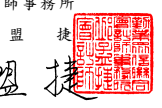
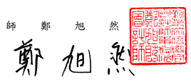

會計師核 閱 報告

光寶 科 技股 份 有限 公司 公鑒 :

## 前 言

 光 寶科 技 股份 有限 公 司及 其 子公 司( 光 寶集 團 )民 國 112 年及 111 年 9 月 30 日 之 合併 資 產 負債 表 、民 國 112 年及 111 年 7 月 1 日至 9 月 30 日 以及 民 國 112 年 及 111 年 1 月 1 日 至 9 月 30 日 之 合併 綜 合損 益 表,暨民 國 112 年 及 111 年 1 月 1 日 至 9 月 30 日合 併 權 益變 動 表與 合 併現 金流 量 表,以及 合 併 財務 報 告附 註( 包 括重 大 會計 政 策彙 總), 業 經本 會 計師 核閱 竣 事。依證 券 發 行人財務報告編製準則及經金融監督管理委員會認可並發布生效之國際會計 準則 第 34 號「 期 中 財務 報 導」編 製允 當表 達 之合 併 財務 報告 係 管理 階 層之 責 任, 本 會計 師 之責 任係 依 據核 閱 結果 對合 併 財 務 報 告作 成結 論 。

## 範 圍

 除 保留 結 論之 基礎 段 所述 者 外,本會 計 師係 依 照核 閱準 則 2410 號「 財 務 報表 之 核閱 」執行 核閱 工 作。核 閱合 併財 務 報告 時 所執 行之 程 序包 括 查詢( 主 要向 負 責財 務 與會 計事 務 之人 員 查詢 )、分 析性 程 序 及其 他核 閱 程序。核 閱 工 作之範圍明顯小於查核工作之範圍,因此本會計師可能無法察覺所有可藉由 查核 工 作辨 認 之重 大事 項 ,故 無 法表 示查 核 意見 。

## 保 留 結 論 之 基礎

 如 合 併 財 務 報 告 附 註 十 四 所 述 , 列 入 上 開 合 併 財 務 報 告 之 部 分 非 重 要 子 公司 之 同期 間 財務 報告 未 經會 計 師核 閱,其民 國 112 年 及 111 年 9 月 30 日 之 資產 總 額分 別 為新 台幣 69,481,659 仟 元及 新 台幣 70,715,172 仟元 , 分別占合 併資 產 總額 之 34.66%及 34.85%;負債 總額 分 別為 新 台 幣 13,323,890 仟 元及 新 台 幣 14,876,447 仟 元,分 別 占合 併 負 債總 額 之 11.49%及 12.06%;其民 國 112 年 及 111 年 7 月 1 日 至 9 月 30 日,以 及民 國 112 年 及 111 年 1 月 1 日 至 9 月 30 日之 綜 合利 益 總 額分 別 為新 台 幣 2,627,571 仟 元、1,567,227 仟元、4,015,686 仟元 及 4,497,318 仟 元,分 別占 合 併綜 合利 益 總額 之 36.33%、24.30%、29.58%
及 29.21%。另 如 合 併財 務 報告 附 註十 五所述,民 國 112 年 及 111 年 9 月 30 日採 用 權益 法 之投 資分 別 為新 台 幣 1,792,300 仟元 及 1,838,178 仟 元, 及 其民 國 112 年 及 111 年 7 月 1 日至 9 月 30 日,以及 民 國 112 年 及 111 年 1 月 1 日 至 9 月 30 日採 用 權 益法 認 列之 關 聯企 業 利 益 份額 分 別為 新台 幣 16,409 仟 元、 2,948 仟元、14,199 仟元 及 11,190 仟 元,暨 合 併財 務 報告 附註 三 六揭 露 之相 關 資訊 , 係以 該 等被 投資 公 司同 期 間未 經 會 計 師核 閱 之財 務報 告 為依 據 。

## 保留結論

 依 本 會 計 師 核 閱 結 果 , 除 保 留 結 論 之 基 礎 段 所 述 部 分 非 重 要 子 公 司 及 被 投資公司之財務報告倘經會計師核閱,對 合 併 財 務 報 告 可 能 有 所 調 整 之 影 響 外,並未發現 上 開 合 併 財 務 報 告 在 所 有 重 大 方 面 有 未 依 照 證 券 發 行 人 財 務 報 告編 製 準則 及 經金 融監 督 管理 委 員會 認可 並 發布 生 效之 國際 會 計準 則 第 34 號 「期 中 財務 報 導」 編製 , 致無 法 允當 表達 光 寶集 團 民 國 112 年 及 111 年 9 月 30 日之 合 併財 務 狀 況,暨 民 國 112 年 及 111 年 7 月 1 日 至 9 月 30 日,以 及 民 國 112 年 及 111 年 1 月 1 日 至 9 月 30 日之 合 併財 務 績效 及合 併 現 金 流 量之 情 事。 勤業 眾 信聯 合 會計 師事 務 所

$$\begin{array}{r l r l}{\oplus}&{{}\nrightarrow{}}&{}&{{}\nrightarrow{}}\\ {\nrightarrow}&{{}}&{{}\nrightarrow{}}&{}&{{}\nrightarrow{}}\end{array}$$
$${\mathfrak{f}}{\mathfrak{h}}$$

$$\left\langle\psi\right\rangle\ \left.\frac{\partial\hat{\phi}}{\partial x}\right|$$

會 計 師 邱 盟 捷 會 計 師 鄭 旭 然

$${\hat{\mathbb{L}}}$$

金融監督管理委員會核准文號 金 管 證審 字 第 1020025513 號 金融監督管理委員會核准文號 金 管 證審 字 第 1010028123 號

$${\mathbb{R}}$$
$\frac{4\star}{4\star}$. 

中 華 民 國 112 年 1 0 月 3 0 日
$${\hat{\mathbf{s}}}{\hat{\mathbf{r}}}$$

$$\mathbb{A}\qquad1\;1\;2\qquad\quad\nleftarrow\qquad1\;0\qquad\quad\mathbb{A}$$
$$3\;0$$
