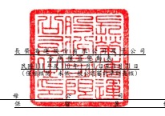
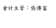
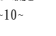

單位:新台幣仟元 歸 屬 於 母 公 司 業 主 之 權 益 保留盈餘 其他權益
附 註 普通股股本 債券換股權利 證 書 資本公積 法定盈餘公積 特別盈餘公積 未分配盈餘 國外營運機構財務 報表換 算之 兌換 差 額 透過其他綜合損 益按公允價值衡 量之金融資產未 實現損益 避險工具之損益 總 計 非控制權益 權益總額

| 110 年度  110 年 1 月 1 日餘額                          | 六(二十二)         | $ 48,980,353   | $       | -            | $ 12,433,364   | $ 5,714,940   | $           | -               | $ 27,734,460 ($        | 4,328,344) $ 1,884,774   | $ 1,862,164   | $ 94,281,711   | $             | 7,212,582     | $ 101,494,293   |
|---------------------------------------------------------|--------------------|----------------|---------|--------------|----------------|---------------|-------------|-----------------|------------------------|--------------------------|---------------|----------------|---------------|---------------|-----------------|
| 本期淨利                                                | 六(二十一)         | -              | -       | -            | -              | -             | 36,083,120  | -               | -                      | -                        | 36,083,120    | 4,782,568      | 40,865,688    |               |                 |
| 本期其他綜合損益                                        | 六(二十一)(二十二) | -              | -       | -            | -              | -             | -           | 1,077,715       | 267,901 (              | 350,651)                 | 994,965       | 146,242        | 1,141,207     |               |                 |
| 本期綜合損益總額                                        | -                  | -              | -       | -            | -              | 36,083,120    | 1,077,715   | 267,901 (       | 350,651)               | 37,078,085               | 4,928,810     | 42,006,895     |               |               |                 |
| 採用權益法認列之關聯企業及合資之變動數 六(二十)(二十一) | -                  | - (            | 38,640) | -            | -              | -             | -           | -               | - (                    | 38,640)                  | - (           | 38,640)        |               |               |                 |
| 其他資本公積變動數                                      | 六(二十)           | -              | - (     | 3)           | -              | -             | -           | -               | -                      | - (                      | 3)            | - (            | 3)            |               |                 |
| 可轉換公司債轉換                                        | 六(十九)(二十)     | 3,235,204      | 493,803 | 2,738,155    | -              | -             | -           | -               | -                      | -                        | 6,467,162     | -              | 6,467,162     |               |                 |
| 非控制權益變動數                                        | 六(三十五)         | -              | -       | -            | -              | -             | -           | -               | -                      | -                        | - (           | 92,305) (      | 92,305)       |               |                 |
| 110 年 3 月 31 日餘額                                   | $ 52,215,557       | $              | 493,803 | $ 15,132,876 | $ 5,714,940    | $             | -           | $ 63,817,580 ($ | 3,250,629) $ 2,152,675 | $ 1,511,513              | $ 137,788,315 | $ 12,049,087   | $ 149,837,402 |               |                 |
| 111 年度  111 年 1 月 1 日餘額                          | 六(二十二)         | $ 52,908,484   | $       | -            | $ 15,762,185   | $ 8,122,482   | $           | 581,406         | $ 250,555,749 ($       | 6,733,006) $ 3,986,029   | $ 1,601,207   | $ 326,784,536  | $ 30,537,054  | $ 357,321,590 |                 |
| 本期淨利                                                | 六(二十一)         | -              | -       | -            | -              | -             | 101,359,559 | -               | -                      | -                        | 101,359,559   | 4,791,718      | 106,151,277   |               |                 |
| 本期其他綜合損益                                        | 六(二十一)(二十二) | -              | -       | -            | -              | - (           | 190)        | 8,422,778       | 251,212 (              | 231,523)                 | 8,442,277     | 944,037        | 9,386,314     |               |                 |
| 本期綜合損益總額                                        | -                  | -              | -       | -            | -              | 101,359,369   | 8,422,778   | 251,212 (       | 231,523)               | 109,801,836              | 5,735,755     | 115,537,591    |               |               |                 |
| 採用權益法認列之關聯企業及合資之變動數 六(二十)(二十一) | -                  | -              | 121,045 | -            | -              | 127           | - (         | 127)            | -                      | 121,045                  | -             | 121,045        |               |               |                 |
| 其他資本公積變動數                                      | 六(二十)           | -              | - (     | 6)           | -              | -             | -           | -               | -                      | - (                      | 6)            | - (            | 6)            |               |                 |
| 可轉換公司債轉換                                        | 六(十九)(二十)     | 2,007          | 11      | 16,112       | -              | -             | -           | -               | -                      | -                        | 18,130        | -              | 18,130        |               |                 |
| 非控制權益變動數                                        | 六(三十五)         | -              | -       | -            | -              | -             | -           | -               | -                      | -                        | - (           | 5,566,864) (   | 5,566,864)    |               |                 |
| 111 年 3 月 31 日餘額                                   | $ 52,910,491       | $              | 11      | $ 15,899,336 | $ 8,122,482    | $             | 581,406     | $ 351,915,245   | $                      | 1,689,772                | $ 4,237,114   | $ 1,369,684    | $ 436,725,541 | $ 30,705,945  | $ 467,431,486   |

董事長:張衍義 經理人:謝惠全 會計主管:張傳富

後附合併財務報表附註為本合併財務報告之一部分,請併同參閱。

