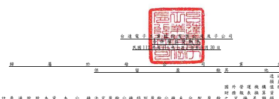
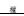
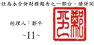

單位:新台幣仟元 歸 屬 於 母 公 司 業 主 之 權 益 附 註 普通股股本 資本公積 法定盈餘公積 特別盈餘公積 未分配盈餘 之兌換差額 透過其他綜合 損益按公允價 值衡量之金融 資產未實現 損 益 避 險 工 具 之 損 益 總 計 非控制權益 權益總額 董事長:海英俊 經理人:鄭平 會計主管:余博文

| 111 年  111 年 1 月 1 日餘額                 | $ 25,975,433     | $ 49,114,151   | $ 29,697,752   | $ 12,543,208   | $ 53,622,701   | ($ 15,520,287 ) ($   | 776,353 )      | $ 129,917   | $           | 154,786,522   | $ 31,338,136   | $            | 186,124,658   |             |              |
|----------------------------------------------|------------------|----------------|----------------|----------------|----------------|----------------------|----------------|-------------|-------------|---------------|----------------|--------------|---------------|-------------|--------------|
|                                              | 本期合併總損益   | -              | -              | -              | -              | 24,755,470           | -              | -           | -           | 24,755,470    | 3,138,612      | 27,894,082   |               |             |              |
|                                              | 本期其他綜合損益 | -              | -              | -              | -              | 251,536              | 16,458,210     | 18,719      | -           | 16,728,465    | 3,611,090      | 20,339,555   |               |             |              |
| 本期綜合損益總額                             | -                | -              | -              | -              | 25,007,006     | 16,458,210           | 18,719         | -           | 41,483,935  | 6,749,702     | 48,233,637     |              |               |             |              |
| 110 年度盈餘分配                             | 六(十八)         |                |                |                |                |                      |                |             |             |               |                |              |               |             |              |
|                                              | 提列法定盈餘公積 | -              | -              | 2,688,553      | -              | (                    | 2,688,553 )    | -           | -           | -             | -              | -            | -             |             |              |
|                                              | 提列特別盈餘公積 | -              | -              | -              | 3,623,514      | (                    | 3,623,514 )    | -           | -           | -             | -              | -            | -             |             |              |
|                                              | 分配股東現金股利 | -              | -              | -              | -              | (                    | 14,286,479 )   | -           | -           | -             | (              | 14,286,479 ) | -             | (           | 14,286,479 ) |
| 對子公司所有權權益變動                       | -                | (              | 17,634 )       | -              | -              | (                    | 643 )          | -           | -           | -             | (              | 18,277 )     | -             | (           | 18,277 )     |
| 實際取得子公司股權價格與帳面價值差異         | 六(三十一)       | -              | 15,322         | -              | -              | -                    | -              | -           | -           | 15,322        | (              | 125,504 ) (  | 110,182 )     |             |              |
| 處分透過其他綜合損益按公允價值衡量之權益工具 | -                | -              | -              | -              | 8,492          | -                    | (              | 8,492 )     | -           | -             | -              | -            |               |             |              |
| 非控制權益增減                               | -                | -              | -              | -              | -              | -                    | -              | -           | -           | (             | 708,491 ) (    | 708,491 )    |               |             |              |
| 111 年 9 月 30 日餘額                        | $ 25,975,433     | $ 49,111,839   | $ 32,386,305   | $ 16,166,722   | $ 58,039,010   | $                    | 937,923        | ($          | 766,126 )   | $ 129,917     | $              | 181,981,023  | $ 37,253,843  | $           | 219,234,866  |
| 112 年  112 年 1 月 1 日餘額                 | $ 25,975,433     | $ 49,321,767   | $ 32,386,305   | $ 16,166,722   | $ 65,907,358   | ($                   | 2,530,216 ) ($ | 568,379 )   | $ 129,917   | $             | 186,788,907    | $ 38,578,278 | $             | 225,367,185 |              |
|                                              | 本期合併總損益   | -              | -              | -              | -              | 24,419,495           | -              | -           | -           | 24,419,495    | 4,104,523      | 28,524,018   |               |             |              |
|                                              | 本期其他綜合損益 | -              | -              | -              | -              | 18,364               | 6,232,146      | 194,809     | ( 170,271 ) | 6,275,048     | 1,246,841      | 7,521,889    |               |             |              |
| 本期綜合損益總額                             | -                | -              | -              | -              | 24,437,859     | 6,232,146            | 194,809        | ( 170,271 ) | 30,694,543  | 5,351,364     | 36,045,907     |              |               |             |              |
| 111 年度盈餘分配                             | 六(十八)         |                |                |                |                |                      |                |             |             |               |                |              |               |             |              |
|                                              | 提列法定盈餘公積 | -              | -              | 3,288,320      | -              | (                    | 3,288,320 )    | -           | -           | -             | -              | -            | -             |             |              |
|                                              | 迴轉特別盈餘公積 | -              | -              | -              | ( 13,198,044 ) | 13,198,044           | -              | -           | -           | -             | -              | -            |               |             |              |
|                                              | 分配股東現金股利 | -              | -              | -              | -              | (                    | 25,559,802 )   | -           | -           | -             | (              | 25,559,802 ) | -             | (           | 25,559,802 ) |
| 對子公司所有權權益變動                       | -                | 83,061         | -              | -              | -              | -                    | -              | -           | 83,061      | -             | 83,061         |              |               |             |              |
| 實際取得或處分子公司股權價格與帳面價值差異   | 六(三十一)       | -              | 5,283,640      | -              | -              | (                    | 507 )          | 38,742      | -           | -             | 5,321,875      | 451,901      | 5,773,776     |             |              |
| 避險工具損益基礎調整                         | 六(四)           | -              | -              | -              | -              | -                    | -              | -           | 154,640     | 154,640       | -              | 154,640      |               |             |              |
| 非控制權益增減                               | -                | -              | -              | -              | -              | -                    | -              | -           | -           | (             | 1,269,640 ) (  | 1,269,640 )  |               |             |              |
| 112 年 9 月 30 日餘額                        | $ 25,975,433     | $ 54,688,468   | $ 35,674,625   | $ 2,968,678    | $ 74,694,632   | $                    | 3,740,672      | ($          | 373,570 )   | $ 114,286     | $              | 197,483,224  | $ 43,111,903  | $           | 240,595,127  |

後附合併財務報表附註為本合併財務報告之一部分,請併同參閱。