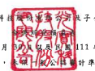
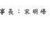
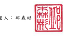
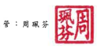

老寶科 \#

后农中医院
(1) 计学则查核)
民圆 111 年及 110年 7 月 1 日 至 9 月
( 僅 經

# 111 年及 110 年 1 月 1 日至 9 月 30 日

單位:新台幣仟元,淮

|                          | 每股盈综為元           |                      |                      |                |                  |                   |            |                  |              |             |         |             |    |             |     |
|--------------------------|------------------------|----------------------|----------------------|----------------|------------------|-------------------|------------|------------------|--------------|-------------|---------|-------------|----|-------------|-----|
| 111年7月1日 至9月30日    | 110年7月1日 至9月30日  | 111年1月1日至9月30日 | 110年1月1日至9月30日 |                |                  |                   |            |                  |              |             |         |             |    |             |     |
| 代 码                    | 镇                     | 会                   | 金                   | 会             |                  |                   |            |                  |              |             |         |             |    |             |     |
| रू                        | - %                    | 頻 _ %               | 9 %                  | 镇 %           |                  |                   |            |                  |              |             |         |             |    |             |     |
| 營業收入(附註二四及三一) |                        |                      |                      |                |                  |                   |            |                  |              |             |         |             |    |             |     |
| 4110                     | 编貨收入               | $ 47,127,280         | 102                  | $ 42,838,475   | 102              | $ 133,162,997     | 102        | $ 122,888,015    | 102          |             |         |             |    |             |     |
| 4190                     | 波:纳貨折讓            | 885,748              | 2                    | 695,691        | 1                | 2,551,497         | 2          | 2,146,851        | 2            |             |         |             |    |             |     |
| 4170                     | 纳货退回               | 67 213               | 279,187              | 1              | 249,928          | 482,200           |            |                  |              |             |         |             |    |             |     |
| 4000                     | 參黨收入合計           | 46,174,319           | 100                  | 41,863,597     | 100              | 130,361,572       | 100        | 120,258,964      | 100          |             |         |             |    |             |     |
| 管黨成本                 |                        |                      |                      |                |                  |                   |            |                  |              |             |         |             |    |             |     |
| 5110                     | 銷貨成本(附註十二、二  |                      |                      |                |                  |                   |            |                  |              |             |         |             |    |             |     |
| 五反三一)                | ( _ 37,171,651 )       | ( __ 33,779,902 )    | ( 105,514,836 )      |                |                  |                   |            |                  |              |             |         |             |    |             |     |
| ( ~ 81 )                 | ( 81 )                 | (_8] )               | (_97 A63,849)        | ( 81 )         |                  |                   |            |                  |              |             |         |             |    |             |     |
| 5900                     | 管賓毛利               | 9,002,668            | _19                  | 8,083,695      | _19              | 24,846,736        | _12        | 22,795,115       | _18          |             |         |             |    |             |     |
| 營業費用(附註二五及三一) |                        |                      |                      |                |                  |                   |            |                  |              |             |         |             |    |             |     |
| 6100                     | 推销资用               | 1,489,533 )          | (                    | 1,484,330 )    |                  |                   |            |                  |              |             |         |             |    |             |     |
| 3)                       | (                      | 4 )                  | 4,463,865 )          | 3)             | 4,430,991 )      | 4 )               |            |                  |              |             |         |             |    |             |     |
| 6200                     | 管理费用               | 1,194,848 )          | (                    | 3 )            | 1,086,717 )      | (                 | 3)         | 3,341,126 )      | (            | 3 )         | (       | 3,396,554 ) | (  | 3 )         |     |
| 6300                     | 研究登具费用           | 1,898,963 )          | (                    | 4 )            | (                | 1,557,557 )       | (          | 4)               | (            | 5,268,752 ) | (       | 4 )         | (  | 4,468,907 ) | 4 ) |
| (                        | (                      |                      |                      |                |                  |                   |            |                  |              |             |         |             |    |             |     |
| 6450                     | 預期信用滅損損失(附註  |                      |                      |                |                  |                   |            |                  |              |             |         |             |    |             |     |
| 十一及二四)              | 25,132 )               | 433,53Z )            | 27,518 )             | 1,069,506 )    | 1)               |                   |            |                  |              |             |         |             |    |             |     |
|                          | (一)                   |                      |                      |                |                  |                   |            |                  |              |             |         |             |    |             |     |
| 6000                     | 參寫實用合計           | 4,608 A76 )          | ( - 10 )             | 4,562,141 )    | ( _ 13,101,261 ) | (_10)             | (-         | 13,365,958 )     | (_11)        |             |         |             |    |             |     |
| 6900                     | 管案利益               | 4,394,192            | _ 10                 | 3,521,554      | ___8             | _11,745,475       | ____       | 9,429,157        | __           |             |         |             |    |             |     |
| 管案外收入及支出         |                        |                      |                      |                |                  |                   |            |                  |              |             |         |             |    |             |     |
| 7060                     | 採用權益法認列之關聯企 |                      |                      |                |                  |                   |            |                  |              |             |         |             |    |             |     |
| 赛利益份额(附註十四)     | 2,948                  | 10,283               | -                    | 11,190         | 7,174            | -                 |            |                  |              |             |         |             |    |             |     |
| 7100                     | 利息收入               | 350,669              | 1                    | 187,668        | .                | 735,282           | 1          | 557,880          | .            |             |         |             |    |             |     |
| 7130                     | 股利收入               | 3,271                | -                    | 3.272          | -                | 6,985             | -          | 3,272            | -            |             |         |             |    |             |     |
| 7190                     | 其他收入(附註三一)     | 174,730              | -                    | 165,161        | -                | 480,083           | -          | 522,296          | -            |             |         |             |    |             |     |
| 7210                     | 處分不動產、廠房及設備 |                      |                      |                |                  |                   |            |                  |              |             |         |             |    |             |     |
| 利益                     | 2,325                  | "                    | 1,865                | .              | 14,106           | -                 | 13,230     | a                |              |             |         |             |    |             |     |
| 7225                     | 處分投資净(損)益       | -                    | 3,449 )              | .              | .                |                   |            |                  |              |             |         |             |    |             |     |
| (                        | 58,191                 |                      |                      |                |                  |                   |            |                  |              |             |         |             |    |             |     |
| 7230                     | 外繁兒操净(損)益       | (                    | 1,596,034 )          | (              | 3)               | 131,875           | ·          | (                | 2,688,381 )  | ( 2)        | 340,834 | .           |    |             |     |
| 7235                     | 透過損益按公允價值街量 |                      |                      |                |                  |                   |            |                  |              |             |         |             |    |             |     |
| 之会融商品净(損)互       | 2,208,078              | 5                    | (                    | 124,365 )      | .                | 3,039,667         | 2          | 3,912,733        | 3            |             |         |             |    |             |     |
| 7235                     | 造過損益按公允價值街量 |                      |                      |                |                  |                   |            |                  |              |             |         |             |    |             |     |
| 之金融商品净益—结耦      |                        |                      |                      |                |                  |                   |            |                  |              |             |         |             |    |             |     |
| 性商品                   | 95,883                 | 84,151               | 271,864              | 230,841        |                  |                   |            |                  |              |             |         |             |    |             |     |
| 7510                     | 利息费用(附註二五)     | 62,860 )             |                      |                |                  |                   |            |                  |              |             |         |             |    |             |     |
| 220,760 )                | ( 1)                   | -                    | (                    | 410,425 )      | י                | 152,511 )         | -          |                  |              |             |         |             |    |             |     |
| 7590                     | 什项支出               | (                    | 66,305 )             | -              | (                | 37,083 }          | -          | (                | 206,280 )    | י           | (       | 220,240 )   | .  |             |     |
| 7670                     | 戏撮损失(附註十五及十  |                      |                      |                |                  |                   |            |                  |              |             |         |             |    |             |     |
| 八)                      | 819 )                  | 1                    | (-                   | 5,863 )        | ----             | (_                | 1.301 )    | ----             | (-           | 228.173 )   | -       |             |    |             |     |
| 7000                     | 警案外收入及支出合     |                      |                      |                |                  |                   |            |                  |              |             |         |             |    |             |     |
| 叶                       | 953,986                | _2                   | 350,655              | _1             | 1,252,790        | _1                | 5.045.527  | __               |              |             |         |             |    |             |     |
| 7900                     | 税前净利               | 5,348,178            | 12                   | 3,872,209      | 9                | 12,998,265        | 10         | 14,474,684       | 12           |             |         |             |    |             |     |
| 7950                     | 所得稅費用(附註二六)   | ( __ 1.096.37Z )     | (____)               | ( __ 782.186 ) | (____)           | ( ___ 2,664,640 ) | (_2)       | ( __ 3.061.01Z ) | (_3)         |             |         |             |    |             |     |
| 8200                     | 净                     | 科                   | 4.251.801            | ျ               | 3.090.023        | 7                 | 10.333.625 | ___8             | - II 413 FET | __ 9        |         |             |    |             |     |
| 其他綜合(損)益(附註二三  |                        |                      |                      |                |                  |                   |            |                  |              |             |         |             |    |             |     |
| 及二六)                  |                        |                      |                      |                |                  |                   |            |                  |              |             |         |             |    |             |     |
| 8310                     | 不重分類至損益之項目   |                      |                      |                |                  |                   |            |                  |              |             |         |             |    |             |     |
| 8316                     | 透過其他综合損益按     |                      |                      |                |                  |                   |            |                  |              |             |         |             |    |             |     |
| 公允價值街量之權         |                        |                      |                      |                |                  |                   |            |                  |              |             |         |             |    |             |     |
| 益工具投资未實現         |                        |                      |                      |                |                  |                   |            |                  |              |             |         |             |    |             |     |
| 評價頻失                 | 123,303 )              | -                    | (                    | 13,520 )       | י                | (                 | 124,031 )  | י                | (            | 2,414 )     | -       |             |    |             |     |
| (                        |                        |                      |                      |                |                  |                   |            |                  |              |             |         |             |    |             |     |
| 8320                     | 採用權益法認列之關     |                      |                      |                |                  |                   |            |                  |              |             |         |             |    |             |     |
| 哪企费及合资之其         |                        |                      |                      |                |                  |                   |            |                  |              |             |         |             |    |             |     |
| 他综合損失之份額         | ZZ)                    | =                    |                      |                |                  |                   |            |                  |              |             |         |             |    |             |     |
| 13.520 )                 | l. I.                  |                      |                      |                |                  |                   |            |                  |              |             |         |             |    |             |     |
| (=                       | 123,303 )              | -                    | 124 108 )            | 2414 )         |                  |                   |            |                  |              |             |         |             |    |             |     |
| ( 換 次 頁 )             |                        |                      |                      |                |                  |                   |            |                  |              |             |         |             |    |             |     |

| (承府页)              | 111年7月1日至9月30日   | 110年7月1日 至9月30日   | 111年1月1日至9月30日   | 110年1月1日 至9月30日   |              |              |              |              |           |          |    |
|-----------------------|------------------------|-------------------------|------------------------|-------------------------|--------------|--------------|--------------|--------------|-----------|----------|----|
| 代 码                 | হ্ন                     | 频 %                    | �                      | 频 %                    | 会           | 第 %         | �            | 96           |           |          |    |
| 8360                  | 投續可能重分類至損益之 |                         |                        |                         |              |              |              |              |           |          |    |
| 项目:                 |                        |                         |                        |                         |              |              |              |              |           |          |    |
| ·                     | 8361                   | 國外營運機構財務報      |                        |                         |              |              |              |              |           |          |    |
| 表换算之兌換差额      | $ 2,935,455            | б                       | ( $                    | 338,897 )               | $ 6,466,015  | 5            | 580,077 )    |              |           |          |    |
|                       | ( 1)                   | ($                      | .                      |                         |              |              |              |              |           |          |    |
| 8370                  | 採用機益法認列關聯     |                         |                        |                         |              |              |              |              |           |          |    |
| 企贫之其他综合        |                        |                         |                        |                         |              |              |              |              |           |          |    |
| (損)益之份額          | (                      | 33,012 )                | -                      | (                       | 7,248 )      | -            | 5,118        | -            | (         | 17,481 ) | -  |
| 8399                  | 奥可能重分频至损益     |                         |                        |                         |              |              |              |              |           |          |    |
| 之項目相關之所得      |                        |                         |                        |                         |              |              |              |              |           |          |    |
| 我                    | (_                     | 580,845 )               | 59,704                 | ( __                    | 1,282,036 )  | (_1)         | 85,292       |              |           |          |    |
| (一寸)                | =                      |                         |                        |                         |              |              |              |              |           |          |    |
| 2,321,598             | __5                    | 286/441 )               | 1)                     | 5,189,097               | --           | 512,266 )    | roven        |              |           |          |    |
| 8300                  | 其他综合(損)益合       |                         |                        |                         |              |              |              |              |           |          |    |
| 群                    | 2.198.295              | ____                    | (-                     | 299.961 )               | (_1)         | 5,064,989    | ____         | (            | 514,680 ) | ---      |    |
| 8500                  | 綜合攝互總領           | $ 6,450,096             | - বি                    | $ 2.790.062             | _Z           | $ 15.398.614 | _12          | $ 10.898.987 | __        |          |    |
| 净利歸屬於 :          |                        |                         |                        |                         |              |              |              |              |           |          |    |
| 8610                  | 學公司業主             | $ 4,239,775             | $ 3,079,535            | 7                       | $ 10,303,564 | $ 11,377,338 | 9            |              |           |          |    |
| 9                     | 8                      |                         |                        |                         |              |              |              |              |           |          |    |
| 8620                  | 非在制模型             | 12.026                  | 10,488                 | 30.061                  | =            | 36,329       | =            |              |           |          |    |
| 8600                  | $ 4,251,801            | | 게                    | $ 3,090,023            | LI.                     | $ 10,333,625 | | 메         | $ 11,413,667 | ___          |           |          |    |
| 綜合(損)益總銅飾展於: |                        |                         |                        |                         |              |              |              |              |           |          |    |
| 8710                  | 安公司賞主             | $ 2,793,005             | 7                      |                         |              |              |              |              |           |          |    |
| $ 6,414,912           | 14                     | $ 15,321,137            | 12                     | $ 10,898,255            | 9            |              |              |              |           |          |    |
| 8720                  | 非控制權益             | 35.184                  | 2.943 )                | TIATI                   | 732          | .            |              |              |           |          |    |
| 8700                  | $ 6.450.096            | _14                     | s                      | 2,790,062               | i            | $ 15,398,614 | _12          | $ 10,898,987 | | 게      |          |    |
| 每股盈餘(附註二七)    |                        |                         |                        |                         |              |              |              |              |           |          |    |
| 9750                  | 老                     | 本                      | ક                      | 186                     | 1.33         | 4.51         | 4.90         |              |           |          |    |
| 9850                  | 彩                     | 解                      | S                      | 1.84                    | 1.32         | S            | 4.46         | 4.84         |           |          |    |

後附之附註係本合併財務報告之一部分。

(靖多関勤業家信開合會計師事務所民國 111年 10月 28日 校 閱報告 >

會計主管:周珮

