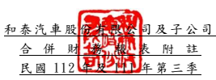

單位:新 台幣仟 元 (除特別註 明者外 )

## 一、 公司沿革

和泰汽車 股份有 限公司 (以下簡 稱「 本公 司」)於中華 民國設 立。本公司 及子公 司 (以下統稱「 本集團 」)主 要經營 業務包 括各種車 輛及其 零件之 進口、買賣 及銷 售 維修服務 、 各種車輛 之 分 期 買 賣 及 租 賃 、 中 古 車 買 賣 交 易 與 各 項 產 物 保 險 業 務 等。

## 二、 通過財務 報告之 日期及 程序

本合併財 務報告 已於民國 112 年 11 月 1 0 日經董事會 通過後 發布。

三、 新發布及 修訂準 則及解 釋之適 用
(一)已採用金融監督管理委員會 (以 下 簡 稱 「 金 管 會 」 )認 可 並 發 布 生 效 之 新 發 布、修正 後國際 財務報 導準則 之影響 下表彙列 金管會 認可並 發布生 效之 民 國 112 年 適用之 國際財 務報導準 則之 新發布、 修正及 修訂之 準則及 解釋:

|                            | 國際會計準則理事會               |                  |                 |
|----------------------------|----------------------------------|------------------|-----------------|
| 新發布/修正/修訂準則及解釋 | 發布之生效日                     |                  |                 |
| 國際會計準則第1號之修正    | 「會計政策之揭露」               |                  | 民國112年1月1日 |
| 國際會計準則第8號之修正    | 「會計估計值之定義」             |                  | 民國112年1月1日 |
| 國際會計準則第12號之修正   | 「與單一交易所產生之資產及負債   | 民國112年1月1日  |                 |
| 有關之遞延所得稅」         |                                  |                  |                 |
| 國際會計準則第12號之修正   | 「國際租稅變革-支柱二規則範本」 | 民國112年5月23日 |                 |

本 集 團 經 評 估 上 述 準 則 及 解 釋 對 本 集 團 財 務 狀 況 與 財 務 績 效 並 無 重 大 影 響。

(二)尚未採用 金管會 認可之 新發布 、修正 後 國際財務 報導準 則之影 響 下表彙列 金管會 認可之 民國 113 年適用 之國際財 務報導 準則之 新發布 、修 正及修訂 之準則 及解釋 :

|                                                | 國際會計準則理事會         |                 |                 |
|------------------------------------------------|----------------------------|-----------------|-----------------|
| 新發布/修正/修訂準則及解釋                     | 發布之生效日               |                 |                 |
| 國際財務報導準則第16號之修正                   | 「售後租回中之租賃負債」   |                 | 民國113年1月1日 |
| 國際會計準則第1號之修正                        | 「負債之流動或非流動分類」 |                 | 民國113年1月1日 |
| 國際會計準則第1號之修正                        | 「具合約條款之非流動負債」 |                 | 民國113年1月1日 |
| 國際會計準則第7號及國際財務報導準則第7號之修正 | 「供應商                   | 民國113年1月1日 |                 |
| 融資安排」                                     |                            |                 |                 |

本 集 團 經 評 估 上 述 準 則 及 解 釋 對 本 集 團 財 務 狀 況 與 財 務 績 效 並 無 重 大 影 響。

## (三)國際會計準則理事會已發布但尚未經金管會認可之國際財務報導準則之影響

下 表 彙 列 國 際 會 計 準 則 理 事 會 已 發 布 但 尚 未 納 入 金 管 會 認 可 之 國 際 財 務 報

|                                                  | 國際會計準則理事會       |                 |                 |
|--------------------------------------------------|--------------------------|-----------------|-----------------|
| 新發布/修正/修訂準則及解釋                       | 發布之生效日             |                 |                 |
| 國際財務報導準則第10號及國際會計準則第28號之修正 | 「投資                   | 待國際會計準則  |                 |
| 者與其關聯企業或合資間之資產出售或投入」         |                          | 理事會決定      |                 |
| 國際財務報導準則第17號                           | 「保險合約」             |                 | 民國112年1月1日 |
| 國際財務報導準則第17號                           | 「保險合約」之修正       | 民國112年1月1日 |                 |
| 國際財務報導準則第17號之修正                     | 「初次適用國際財務報導準 | 民國112年1月1日 |                 |
| 則第17號及國際財務報導準則第9號—比較資訊」       |                          |                 |                 |
| 國際會計準則第21號之修正                         | 「缺乏可兌換性」         |                 | 民國114年1月1日 |

導準則之 新發布 、修正 及修訂 之準則 及 解釋: 除 下 列 所 述 者 外 , 本 集 團 經 評 估 上 述 準 則 及 解 釋 對 本 集 團 財 務 狀 況 與 財 務 績效並無 重大影 響,相 關影響 金額待 評 估完成時 予以揭 露: 1.國際財 務報導 準則第 17 號「 保險合 約 」
國際財務 報導準 則第 17 號「保 險合約 」 取代國際 財務報 導準則第 4 號 並 建立企業 所發行 保險合 約之認 列、衡量、表達 及揭露 原則。此準 則適用 於 企業所發 行之保 險合約 (包含 再保險 合 約)、所持 有之再 保險合 約及所 發 行之具裁 量參與 特性之 投資合 約,前提 是該企業 亦發行 保險合 約。嵌入式 衍 生 工 具 、 可 區 分 之 投 資 組 成 部 分 及 可 區 分 之 履 約 義 務 應 與 保 險 合 約 分 離。於原 始認列時,企業 應將所 發行保 險合約組 合分為 三群組:虧損性、 無顯著風 險成為 虧損性 及剩餘 合約群 組 。國際財 務報導 準則第 17 號 要求 現時衡量 模式,於每 一報導 期間再 衡量 該等估計。衡 量係基 於合約 之折現 及機率加 權後之 現金流 量、風險調 整及 代表合約 未賺得 利潤(合約 服務邊 際)之要 素。企 業得對 部分保 險合約 適 用簡化衡 量方法 (保費 分攤法)。 於 企 業 提 供 保 險 保 障 期 間 及 企 業 自 風 險 解 除 時 認 列 保 險 合 約 群 組 所 產 生 之收益。若保 險合約 群組成 為虧損,企 業立即認 列損失。企 業應分 別列報 保險收入、保 險服務 費用及 保險財 務收 益及費用,並 須揭露 有關來 自於保 險合約之 金額、 判斷及 風險資 訊。

2.國際財 務報導 準則第 17 號「 保險合 約 」之修正 此修正包 括遞延 生效日、保 險取得 現金 流量之預 期回收、可 歸屬於 投資服 務之合約 服務邊 際、所持有 之再保 險合 約 —損失 之回收 及其他 等修正,該 等修正並 未改變 準則之 基本原 則。

3.國際財 務報導 準則第 17 號之 修正「 初次適用 國際財 務報導 準則第 17 號 及國際財 務報導 準則第 9 號— 比較資 訊 」 此 修 正 允 許 企 業 於 初 次 適 用 國 際 財 務 報 導 準 則 第 1 7 號 (以 下 簡 稱 IFRS 17)所列報 之各比 較期間 選擇適 用分類 覆 蓋法。此 選擇允 許企業 對於所有 金融資產,包 括該等 並未 與 IFRS 17 範 圍內之合 約連結 之活動 所持有 者, 按 逐 項 工 具 基 礎 , 於 比 較 期 間 基 於 其 預 期 對 該 等 資 產 於 初 次 適 用 國 際 財 務報導準 則第 9 號(以下 簡稱 IFRS 9)時 將如何分 類,分類 該等金 融資產。 已適用 IFRS 9 或將同 時初次 適用 IFRS 9 及 IFRS 17 之企業 得選擇 適用 分類覆蓋 法。

## 四、 重大會計 政策之 彙總說 明

編製本合 併財務 報告所 採用之 主要會 計 政策說明 如下。除另有 說明外,此 等政策 在所有報 導期間 一致地 適用。

## (一)遵循聲明

本 合 併 財 務 報 告 係 依 據 證 券 發 行 人 財 務 報 告 編 製 準 則 、 保 險 業 財 務 報 告 編 製準則與 金管會 認可 並 發布生 效之國 際 會計準則 第 3 4 號「 期中財 務報導 」 編製。

## (二)編製基礎

1.除下列 重要項 目外, 本合併 財務報 告 係按歷史 成本編 製:
(1)按 公 允 價 值 衡 量 之 透 過 損 益 按 公 允 價 值 衡 量 之 金 融 資 產 及 負 債 (包 括 衍生工具)。

(2)按公允 價值衡 量之透 過其他 綜合損 益 按公允價 值衡量 之金融 資產。 (3)按退休 基金資 產減除 確定福 利義務 現 值之淨額 認列之 確定福 利負債 。 (4)按保險 業相關 特定法 令及函 令等估 列 之各項保 險負債 及再保 險準備 資 產。

2.編製符 合金管 會認可 並發布 生效之 國 際財 務報 導準則、國際會 計準則、解 釋 及 解 釋 公 告 (以 下 簡 稱 IFRSs)之 財 務 報 告 需 要 使 用 一 些 重 要 會 計 估 計 值,在應 用本集團 的會計 政策過 程中亦 需要管理 階層運 用其判 斷,涉及 高 度判斷或 複雜性 之項目,或涉及 合併財 務報 告之 重大假 設及估 計之項 目, 請詳附註 五說明 。