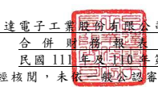

$\lambda\geq\bar{\varepsilon}$. 

台達電子 工業股 份有限 公司及 子公司

(僅經核閱 ,未依 一般公 認審計 準則查 核 )
單位:新 台幣仟 元 (除特別註 明者外 )

## 一、 公司沿革

台達電子 工業股 份有限 公司 (以 下簡稱「 本公司」)於 中華民 國設立,本公司 及子 公司(以下 統稱「 本集團 」 ), 為全球 電 源管理與 散 熱 解 決 方 案 的 領 導 廠 商 , 主 要營業項 目包括 :電源供 應系統、無刷 直 流風扇、散熱系 統、微型 化關鍵 零組件、 工業自動 化、視訊 顯示、資 訊、網 路通 訊、消費性 電子、節能照明、可再 生能 源 應用、電動車充電設備 、能源技術服務 及智慧樓宇管理與控制解決方案 等 之 研 發、設計、製 造與行 銷業務。面對 日益 嚴重的氣 候變遷,本集 團長期 關注環 境 議 題,秉持「環保 節 能 愛地 球 」 的 經 營使 命 , 持 續 開 發 創 新 節 能 產品 及 解 決 方 案、不斷提 升產品的 能源轉 換效率,以減 輕全球暖 化對人 類生存 的衝擊。近 年來, 本集團已 逐步從 關鍵零 組件製 造商邁 入 整體節能 解決方 案提供 者,深耕「電源 及 零組件」、「自動 化」與 「基礎 設施」 三 大業務範 疇。

## 二、 通過財務 報表 之 日期及 程序

本合併財 務報表 已於民國 111 年 4 月 28 日經董事 會通過 後發布 。

三、 新發布及 修訂準 則及解 釋之適 用
(一)已採用金 融監督 管理委 員會 (以 下簡稱「 金管會」)認 可之新 發布、修 正後國 際財務報 導準則 之影響 下表彙列 金管會 認可之 民國 111 年適 用 之國際財 務報導 準則之 新發布 、修 正及修訂 之準則 及解釋 :

|                                                                                           | 國際會計準則理事會            |              |                 |
|-------------------------------------------------------------------------------------------|-------------------------------|--------------|-----------------|
|                                                                                           | 新發布/修正/修訂準則及解釋    | 發布之生效日 |                 |
| 國際財務報導準則第3號之修正                                                               | 「對觀念架構之索引」          |              | 民國111年1月1日 |
| 國際會計準則第16號之修正                                                                  | 「不動產、廠房及設備          | :達到預定   | 民國111年1月1日 |
| 使用狀態前之價款」                                                                        |                               |              |                 |
| 國際會計準則第37號之修正                                                                  | 「虧損性合約—履行合約之成本」 |              | 民國111年1月1日 |
| 2018-2020週期之年度改善                                                                   | 民國111年1月1日               |              |                 |
| 本 集 團 經 評 估 上 述 準 則 及 解 釋 對 本 集 團 財 務 狀 況 與 財 務 績 效 並 無 重 大 |                               |              |                 |
|                                                                                           | 影                            |              |                 |

(二)尚未採用 金管會 認可之 新發布 、修正 後 國際財務 報導準 則之影 響 無。