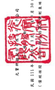

是

| 1,393                                                                                                                                                                         | 7,419                              | 30,549                                  | 12,093                           | 37,793                                                                       | 29,824       | 6,622      |  41         |            |                                   |
|-------------------------------------------------------------------------------------------------------------------------------------------------------------------------------|------------------------------------|-----------------------------------------|----------------------------------|------------------------------------------------------------------------------|--------------|------------|-------------|------------|-----------------------------------|
| 17,894                                                                                                                                                                        | 69,958                             | 3,542                                   | 131,647                          | 514,640                                                                      | 9,241,621    | 320,411    | 97,517      |            |                                   |
| 12,692,187                                                                                                                                                                    | 2,429,194                          | 11,413,667                              | 160.898.987                      | S 2009/01                                                                    | $ 72,873,527 | 10,335,625 | হল জ        | 15.398.617 |                                   |
| S 74141,5                                                                                                                                                                     | ج 28 جنڌيءَ آباد                    |                                         |                                  |                                                                              |              |            |             |            |                                   |
|                                                                                                                                                                               | 1                                  |                                         |                                  |                                                                              |              |            |             |            |                                   |
| 17,396 }                                                                                                                                                                      | _732                               | 7,419                                   |                                  |                                                                              |              |            |             |            |                                   |
| 36,329                                                                                                                                                                        | 15.507                             | 532,459                                 | :80,061                          | ﺍﻟﻤﺴﺎﻋﺪﺓ ﺍﻟﻤﺴ                                                                | 11.80        | $ 617-55   |             |            |                                   |
| 中 在 制 型 4
( 外 电 三二 )
5                                                                                                                                                                               | $ 535,175                          | ડ                                       | 232,396                          |                                                                              |              |            |             |            |                                   |
| 서비스 레이터 - 이유 -                                                                                                                                                        | 2,429,494                          | $ 3.201.808                             | ( $ 3,700,808 )                  | ( 2) 2003 - 1977 - 1997 - 1997 - 1997 - 1997 - 1997 - 1997 - 1997 - 1997 - 1 |              |            |             |            |                                   |
| 00                                                                                                                                                                            |                                    |                                         |                                  |                                                                              |              |            |             |            |                                   |
| 69,958                                                                                                                                                                        | 479/183                            | 782,514                                 |                                  |                                                                              |              |            |             |            |                                   |
| 179,183                                                                                                                                                                       | 5.017.572                          | 5.017.5Z3                               |                                  |                                                                              |              |            |             |            |                                   |
| $ 6.217634 )                                                                                                                                                                  | ( $ 6,156,988 )                    | 5 1.771.928 )                           |                                  |                                                                              |              |            |             |            |                                   |
| ( 5 5,808,500 )                                                                                                                                                               | 782,514 )                          |                                         |                                  |                                                                              |              |            |             |            |                                   |
| 用二十四年回發                                                                                                                                                                | ( 5_232514                         |                                         |                                  |                                                                              |              |            |             |            |                                   |
| 4                                                                                                                                                                             | -                                  |                                         |                                  |                                                                              |              |            |             |            |                                   |
| 9 =                                                                                                                                                                           | 1                                  | ഗ്ഗം                                      | -                                | -2411                                                                        | 245          | 236,908 )  |             |            |                                   |
| કો                                                                                                                                                                             | 124.108 )                          |                                         |                                  |                                                                              |              |            |             |            |                                   |
| 員 並 安 心 免 價 價
和 家 之 金 鼠 實 產 
 免 車 區 上 國 )                                                                                                                                                                               | (                                  | S -- 161.014 )                          |                                  |                                                                              |              |            |             |            |                                   |
| ( 5_247.872                                                                                                                                                                   | ( $                                | .                                       | .                                |                                                                              |              |            |             |            |                                   |
| 69,958                                                                                                                                                                        |                                    |                                         |                                  |                                                                              |              |            |             |            |                                   |
| 者  誕  獎
 獎  天  獎
 獎  獎                                                                                                                                                                               | 476,662 )                          | 476,669 )                               |                                  |                                                                              |              |            |             |            |                                   |
| 5,563,051                                                                                                                                                                     | $__5.969.762 )                     | (5 5,820,080 )                          | - 21 - 2017 - 11:47 - 11         | 5,141,681                                                                    | $ 178.332    |            |             |            |                                   |
| ($ )                                                                                                                                                                          | -                                  | n                                       | .                                |                                                                              |              |            |             |            |                                   |
| 1,393 )                                                                                                                                                                       | 3,542 )                            | 400 )                                   | 9,241,621 ]                      |                                                                              |              |            |             |            |                                   |
| 12,692,187                                                                                                                                                                    | 11,377,338                         | 11,877,334                              | 34.227.420                       | 16,753,852                                                                   | 10,203,564   | 10, 03,564 | $ 37.815.79 |            |                                   |
| $ 35.547.651                                                                                                                                                                  | (                                  | 使用之附近外本合资财防报告之一部分"
: 结 用 合 金 材 标 事 研 限 图 1 ] 下 10 月 28 日 摄 图 股 合 ?                                         |                                  |                                                                              |              |            |             |            |                                   |
|                                                                                                                                                                               | .                                  |                                         |                                  |                                                                              |              |            |             |            |                                   |
| 1,395 ]                                                                                                                                                                       | 3,542 }                            | 007                                     | 1,166,970 )
2,725,667
9,241,621  )                                  |                                                                              |              |            |             |            |                                   |
| 1,824,126 )
1,268,143 ]
12,692,187 ]                                                                                                                                                                               | t 1,377,338                        | 11372                                   | 10,303,564                       | _10_343_564                                                                  |              |            |             |            |                                   |
| ▲ & 星 星 ..
$ 17,026,026                                                                                                                                                                               | 12.678.57                          | $ 15,199,955                            | $ 17,820,595                     |                                                                              |              |            |             |            |                                   |
| -                                                                                                                                                                             |                                    |                                         |                                  |                                                                              |              |            |             |            |                                   |
| 1,208,143                                                                                                                                                                     | 2,725,1467 )                       |                                         |                                  |                                                                              |              |            |             |            |                                   |
| $ 5,910,218                                                                                                                                                                   | $ 5,900,218                        | 5 3.214.551                             |                                  |                                                                              |              |            |             |            |                                   |
| ﮯ                                                                                                                                                                             |                                    |                                         |                                  |                                                                              |              |            |             |            |                                   |
| 保 - -                                                                                                                                                                        | 0 = 1                              | .                                       | ా                                 | :                                                                            | 斯参阅到发   |            |             |            |                                   |
| 1,824,126                                                                                                                                                                     | 1, 166, 970                        |                                         |                                  |                                                                              |              |            |             |            |                                   |
| $ 15.613.679                                                                                                                                                                  | $ 15,613,679                       | 5 16,780,649                            |                                  |                                                                              |              |            |             |            |                                   |
| 131,647                                                                                                                                                                       | 30,549                             | 44,617                                  | 88,015                           | 37,793                                                                       | 29,824       | 6,622      | 97,517      | 11         |                                   |
| S_21_745.221                                                                                                                                                                  | $ 21,836,342                       | $ 22.811.662                            |                                  |                                                                              |              |            |             |            |                                   |
| 1 - 1 - 1 - 1 - 1 - 1 - 1 - 1 - 1 - 1 - 1 - 1 - 1 - 1 - 1 - 1 - 1 - 1 - 1 - 1 - 1 - 1 - 1 - 1 - 1 - 1 - 1 - 1 - 1 - 1 - 1 - 1 - 1 - 1 - 1 - 1 - 1 - 1 - - - - - - - - - - - - | 5 23 508.670                       | $ 23.508.670                            |                                  |                                                                              |              |            |             |            |                                   |
| 《 N                                                                                                                                                                          |                                    |                                         |                                  |                                                                              |              |            |             |            |                                   |
| $ 23,503,670                                                                                                                                                                  | $ 23,508,670                       | .                                       |                                  |                                                                              |              |            |             |            |                                   |
| 2.350.867                                                                                                                                                                     | 2,350,867                          | 2.550.867                               |                                  |                                                                              |              |            |             |            |                                   |
| 分过1图买统综合调盗按公允值值到量之间员。                                                                                                                                     | 年1月1日至9月30日奥比综合《摄      |                                         |                                  |                                                                              |              |            |             |            |                                   |
| 有催品流品列之韻聯全套及合管之變動                                                                                                                                            | 年1月1日至9月30日民地政合镇        | 10年1月1日至9月30日球令《攝)益應        | 建设进行列之际群众拿及合资之受到 |                                                                              |              |            |             |            |                                   |
|                                                                                                                                                                               | 《除运分子公司股权價格與級面價值差 | 11 年 1 月 1 ロ 至 9 月 30 日 球会( 演) |                                  |                                                                              |              |            |             |            |                                   |
| 教育子会司股利钢签资本公园                                                                                                                                                    | 110年1月1日显罗月 30 日产利        | 会被手平会司股利回坚要本公里            | 111年1月1日至9月 30 日活时       |                                                                              |              |            |             |            |                                   |
| 對于公司所有權權益受到                                                                                                                                                        |                                    |                                         |                                  |                                                                              |              |            |             |            |                                   |
| 益载分配:                                                                                                                                                                     | 疯分旗同程品进之投资               | 星於分配:                               | 好于会习所有福程总经营           | 112 年9月 30 日 台 網                                                        |              |            |             |            |                                   |
| 110 年 1 月 1 日 條 飯                                                                                                                                                        | 110 年 9 月 30 日 公寓             | 171 年1月1日给期                        | | 赶制福 | 望台                  | 股给展暖给付交易                                                             |              |            |             |            |                                   |
| 昨在时候正贸易                                                                                                                                                                | 高台库滋股交易                     | 其他模品壁的                            |                                  |                                                                              |              |            |             |            |                                   |
| 新城发育 10                                                                                                                                                                   |                                    |                                         |                                  |                                                                              |              |            |             |            |                                   |
| 气_马                                                                                                                                                                         | 日常日报 日                        | SH                                      | Ե                                | ទ                                                                            | ธ            | ដែនដែ        | ns

เด             | 三 与 泉   | 冠 0 足 只 2 百 百 百 百 百 百 百 |

位: 除 万 于 注 明 者:
 外 吸人:呼▲
- 8 -
� 时 上 查事長:家明

