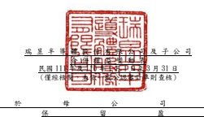
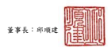
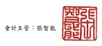
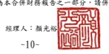

單位:新台幣仟元

| 歸                                                 | 屬                                                                                     | 於          | 母                        | 公          | 司           | 業             | 主             | 之           | 權           | 益        |              |              |
|----------------------------------------------------|----------------------------------------------------------------------------------------|-------------|---------------------------|-------------|--------------|----------------|----------------|--------------|--------------|-----------|--------------|--------------|
| 保                                                 | 留                                                                                     | 盈          | 餘 其                     | 他          | 權           | 益             |                |              |              |           |              |              |
|                                                    | 透 過 其 他 綜 合 損 益 按 公 允 價                                                    |             |                           |             |              |                |                |              |              |           |              |              |
|                                                    | 國 外 營 運 機 構 值 衡 量 之 金 融 財 務 報 表 換 算 資產未實現                       |             |                           |             |              |                |                |              |              |           |              |              |
| 附                                                 | 註 普通股股本 資 本 公 積 法 定 盈 餘 公 積 特 別 盈 餘 公 積 未分配盈餘 之兌換差額 損 | 益 總       | 計 非控制權益 權 益 總 額 |             |              |                |                |              |              |           |              |              |
| 110 年 1 月 1 日至 3 月 31 日 110 年 1 月 1 日餘額 | $ 5,106,849                                                                            | $ 2,122,008 | $ 5,577,083               | $           | 217,036      | $ 17,992,154   | ($ 2,940,958 ) | $ 1,384,909  | $ 29,459,081 | $         | 9,665        | $ 29,468,746 |
| 本期淨利                                           | -                                                                                      | -           | -                         | -           | 3,054,765    | -              | -              | 3,054,765    | 6            | 3,054,771 |              |              |
| 本期其他綜合損益                                   | 六(二十)                                                                               | -           | -                         | -           | -            | -              | 29,189         | 572,921      | 602,110      | -         | 602,110      |              |
| 本期綜合損益總額                                   | -                                                                                      | -           | -                         | -           | 3,054,765    | 29,189         | 572,921        | 3,656,875    | 6            | 3,656,881 |              |              |
| 非控制權益變動                                     | -                                                                                      | -           | -                         | -           | -            | -              | -              | -            | (            | 44 ) (    | 44 )         |              |
| 110 年 3 月 31 日餘額                              | $ 5,106,849                                                                            | $ 2,122,008 | $ 5,577,083               | $           | 217,036      | $ 21,046,919   | ($ 2,911,769 ) | $ 1,957,830  | $ 33,115,956 | $         | 9,627        | $ 33,125,583 |
| 111 年 1 月 1 日至 3 月 31 日 111 年 1 月 1 日餘額 | $ 5,106,849                                                                            | $ 1,101,079 | $ 5,577,083               | $ 1,556,049 | $ 27,377,681 | ($ 4,156,871 ) | $ 2,380,781    | $ 38,942,651 | $            | 9,673     | $ 38,952,324 |              |
| 本期淨利                                           | -                                                                                      | -           | -                         | -           | 5,186,268    | -              | -              | 5,186,268    | 14           | 5,186,282 |              |              |
| 本期其他綜合損益                                   | 六(二十)                                                                               | -           | -                         | -           | -            | -              | 1,681,693      | (            | 342,438 )    | 1,339,255 | -            | 1,339,255    |
| 本期綜合損益總額                                   | -                                                                                      | -           | -                         | -           | 5,186,268    | 1,681,693      | (              | 342,438 )    | 6,525,523    | 14        | 6,525,537    |              |
| 員工酬勞轉增資                                     | 六(十七)(十八)                                                                         | 21,787      | 969,551                   | -           | -            | -              | -              | -            | 991,338      | -         | 991,338      |              |
| 非控制權益變動                                     | -                                                                                      | -           | -                         | -           | -            | -              | -              | -            | (            | 46 ) (    | 46 )         |              |
| 111 年 3 月 31 日餘額                              | $ 5,128,636                                                                            | $ 2,070,630 | $ 5,577,083               | $ 1,556,049 | $ 32,563,949 | ($ 2,475,178 ) | $ 2,038,343    | $ 46,459,512 | $            | 9,641     | $ 46,469,153 |              |
|                                                    |                                                                                        |             |                           |             |              |                |                |              |              |           |              |              |

董事長:邱順建 經理人:顏光裕 **會計主管:張智能**

 ~10~ 
後附合併財務報表附註為本合併財務報告之一部分,請併同參閱。

