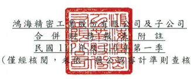

單位:新台幣仟元
(除特別註明者外)

## 一、公司沿革

鴻海精密工業股份有限公司(以下簡稱「本公司」)於中華民國設立,本公司及 子公司(以下統稱「本集團」)主要營業項目為資訊產業、通訊產業、自動化設 備產業、精密機械產業、汽車產業與消費性電子產業有關之各種連接器、機殼、
散熱器、有線/無線通訊產品、光學產品、電源供應模組、應用模組組裝產品以 及網路線纜裝配等產品之製造、銷售及服務。

## 二、通過財務報告之日期及程序

本合併財務報告已於民國 111年5月12日提報董事會後發布。

三、新發布及修訂準則及解釋之適用
(一)已採用金融監督管理委員會(以下簡稱「金管會」)認可之新發布、修正後 國際財務報導準則之影響 下列彙列金管會認可之民國 111 年適用之國際財務報導準則之新發布、修 正及修訂之準則及解釋:

|                                                       | 國際會計準則理事會         |              |
|-------------------------------------------------------|----------------------------|--------------|
|                                                       | 新發布/修正/修訂準則及解釋 | 發布之生效日 |
| 國際財務報導準則第3號之修正「對觀念架構之索引」       | 民國111年1月1日            |              |
| 國際會計準則第16號之修正「不動產、廠房及設備:達到預定 | 民國111年1月1日            |              |
| 使用狀態前之價款」                                    |                            |              |
| 國際會計準則第37號之修正「虧損性合約─履行合約之成本」 | 民國111年1月1日            |              |
| 2018-2020週期之年度改善                               | 民國111年1月1日            |              |

本集團經評估上並準則及解釋對本集團財務狀況與財務績效並無重大影 级。

(二)尚未採用金管會認可之新發布、修正後國際財務報導準則之影響 第一

## (三)國際會計準則理事會已發布但尚未經金管會認可之國際財務報導準則之影

響 下 表 彙 列 國 際 會 計 準 則 理 事 會 已 發 布 但 尚 未 納 入 金 管 會 認 可 之 國 際 財 務 報 導準則之 新發布 、修正 及修訂 之準則 及 解釋:

|                                                  | 國際會計準則理事會             |                 |                 |
|--------------------------------------------------|--------------------------------|-----------------|-----------------|
|                                                  | 新發布/修正/修訂準則及解釋     | 發布之生效日    |                 |
| 國際財務報導準則第10號及國際會計準則第28號之修正 | 「投資 待國際會計準則理事      |                 |                 |
| 者與其關聯企業或合資間之資產出售或投入」         |                                | 會決定          |                 |
| 國際財務報導準則第17號                           | 「保險合約」                   |                 | 民國112年1月1日 |
| 國際財務報導準則第17號                           | 「保險合約」之修正             | 民國112年1月1日 |                 |
| 國際財務報導準則第17號之修正                     | 「初次適用國際財務報導準則     | 民國112年1月1日 |                 |
| 第17號及國際財務報導準則第9號—比較資訊」         |                                |                 |                 |
| 國際會計準則第1號之修正                          | 「負債之流動或非流動分類」     |                 | 民國112年1月1日 |
| 國際會計準則第1號之修正                          | 「會計政策之揭露」             |                 | 民國112年1月1日 |
| 國際會計準則第8號之修正                          | 「會計估計之定義」             |                 | 民國112年1月1日 |
| 國際會計準則第12號之修正                         | 「與單一交易所產生之資產及負債 | 民國112年1月1日 |                 |
| 有關之遞延所得稅」                               |                                |                 |                 |

本 集 團 經 評 估 上 述 準 則 及 解 釋 對 本 集 團 財 務 狀 況 與 財 務 績 效 並 無 重 大 影 響。

## 四、 重大會計 政策之 彙總說 明

除另有說明外, 下 列 編 製 本 合 併 財 務 報 表 所 採 用 重 大 會 計 政 策 在 所 有 報 導 期 間 一致適用 。 (一)遵循聲明 本 合 併 財 務 報 告 係 依 據 證 券 發 行 人 財 務 報 告 編 製 準 則 與 金 管 會 認 可 之 國 際 會計準則第 34 號 「期中 財務報 導」編 製 。

## (二)編製基礎

1.除下列 重要項 目外, 本合併 財務報 告 係按歷史 成本編 製:
(1)按 公 允 價 值 衡 量 之 透 過 損 益 按 公 允 價 值 衡 量 之 金 融 資 產 及 負 債 (包 括 衍生工具)。

(2)按公允 價值衡 量之 透 過其他 綜合損 益 按公允價 值衡量 之金融 資產 。 (3)按退休 基金資 產減除 確定福 利義務 現 值之淨額 認列之 確定福 利負債 。

2.編製符 合金管 會認可 之國際 財務報 導 準則、國際 會計準 則、解釋 及解釋 公 告(以下簡稱 IFRSs)之財務 報告需 要使 用一些重 要會計 估計,在應 用本集 團 的 會 計 政 策 過 程 中 亦 需 要 管 理 階 層 運 用 其 判 斷 , 涉 及 高 度 判 斷 或 複 雜 性之項目,或涉及 合併財 務報 告 之重大 假設及估 計之項 目,請詳 附註五 說 明。